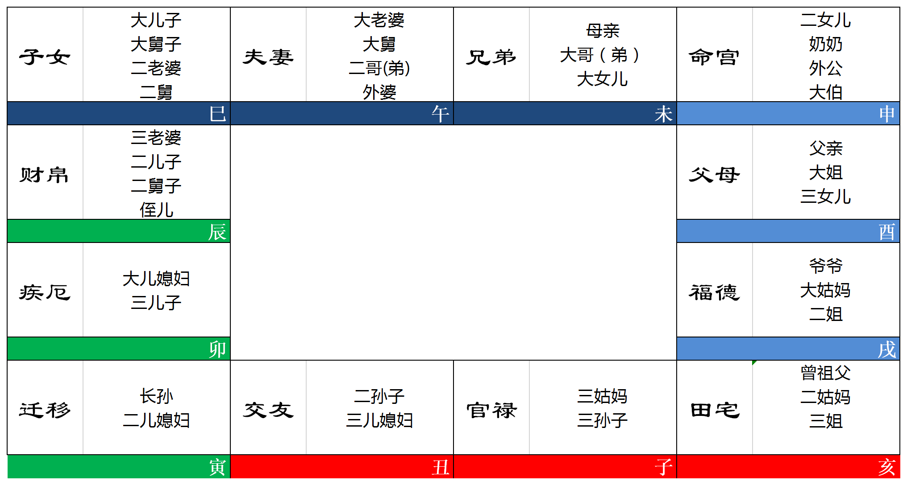

# 辅助工具

```
<font color="#67C23A">**禄**</font>
<font color="#800080">**权**</font>
<font color="#409EFF">**科**</font>
<font color="#FF0000">**忌**</font>

<font color="#F56C6C"> 红色提示色
```


# 飞星命盘基础

## 十天干化曜表

| 天干 | 化禄 | 化权 | 化科 | 化忌 |
| :--: | :--: | :--: | :--: | :--: |
|  甲  |  廉  |  破  |  武  |  阳  |
|  乙  |  机  |  梁  |  紫  |  阴  |
|  丙  |  同  |  机  |  昌  |  廉  |
|  丁  |  阴  |  同  |  机  |  巨  |
|  戊  |  贪  |  阴  |  右  |  机  |
|  己  |  武  |  贪  |  梁  |  曲  |
|  庚  |  阳  |  武  |  阴  |  同  |
|  辛  |  巨  |  阳  |  曲  |  昌  |
|  壬  |  梁  |  紫  |  左  |  武  |
|  癸  |  破  |  巨  |  阴  |  贪  |


## 十二宫扩展含义


**十二宫论六亲**



**十二宫论阳宅**


### 一、命宫

1. 太极点、命盘中枢。万变不离其“宗”的宗。

2. 偏向精神、意志，表现喜、怒、哀、乐的我，简言之为“我”。

3. 显象个性、天性、性情与思考。

   注：三性格宫（命、疾、福）之一，疾、命、福分别代表身、心、灵的我，命宫是那个“心”的我、我的心。

4. 大叔父（叔父）（父之兄）、祖母（父亲的母亲位）、外公位（母亲的父亲位）

5. 兄弟的读书位（兄之父）、夫之福、子之田、友之疾等等。

6. 小孩的房间（子之田）

7. 父亲的经济状况位（父之兄）

8. 配偶的嗜好兴趣位（夫之福）

9. 朋友的情绪位（友之疾），论人缘

   比如命宫有生年禄或命禄，我的性格也是相处时朋友能感受到的情绪，有禄则我为人随和好相处，换成命宫有生年忌则我为人固执、与人难相处。


### 二、兄弟宫

1. 观手足之情。
2. 财帛宫的田宅宫=<font color="#F56C6C">**现金**</font>的收藏宫，财库位（田和兄分别是第一二大财库）
3. 官禄的共宗六位，看事业大小的规模位。
4. 第2、3条加起来，所以**又称兄弟宫为“事业成就位”**
5. 显像领导统驭（得<font color="#800080">**权**</font>照交友）
6. 疾厄的第九位气数宫——身体运位，又称“体质”位。
7. 也是工资收入位（发工资一般是通过银行整笔划转，兄弟宫是储蓄存款位）。
8. 妈妈的命宫（父之夫）
9. 也是二伯(叔)父位(男左女右人伦排序)。
10. 婚姻对待位财帛(夫之夫)的田宅宫，即夫妻相处的地方，也就是主卧房、床位。
11. 是因结婚而来的岳(翁)位岳父或公公的命宫(配偶的父母宫，配偶的父亲)、大姨子位。
12. 看小孩的福份、嗜好位(子女的福德宫)。
13. 大哥(或大弟)、大女儿位。
14. 兄弟为田宅三方(田宅、兄弟、疾厄)之一，显像物质生活状况，也是收藏三宫守成三宫（主长久缘分）


### 三、夫妻宫

1. 看感情、婚姻。特指原配+泛指一生的异性缘和婚姻缘位。

2. 第一大限又叫"少小限"的命宫（主第二大限前的所有年岁）（梁派飞星）

   注：夫妻宫是福德三方（福、夫、迁）之一。

   夫妻主少小限的福分

   迁移主成年福分

   福德和福德之第六共宗位子女共同主晚年福分

3. 看因果福报中“福分财”（福之财）

4. 结婚成家——田宅的共宗六位。家和万事兴，看配偶脸上有没有笑容（<font color="#67C23A">**禄**</font>/<font color="#FF0000">**忌**</font>），家庭生活的质量标准位。

5. 厨房（疾之田，健康的收藏宫）

6. 出外的运气位——迁移的第九气数宫。

7. 看体型——疾厄的田宅宫，肉肉的收藏位。

8. 大舅（兄之兄）、二哥（或二弟）位。

9. 兄弟的或妈妈的经济状况（兄之兄）


### 四、子女宫

1. 看子嗣的缘分、多寡、贤愚。
2. 性（疾之福，身体的享受宫）。生殖系统。
3. 桃花宫、外遇位（逢廉贞贪狼）
4. 再婚对象位
5. 亲戚位（是夫妻宫的下一宫——因婚姻而来的关系位置）
6. 兄弟的配偶、二舅、大舅子（夫之兄）、长子位
7. 短途的驿马位（田之迁——离家在外位）
8. 意外、业力病（双忌以上）
9. 看小辈、下属、学生与我的关系
10. 合伙事业位（友之官）
11. 慈心、天赋、善缘、福报表现位。猫狗宠物。较属后天修行机缘、环境牵引的性向缘，也是德行位。慈悲位。
12. 晚年福分——福德的共宗六位。
13. 子女为交友三方(父母、交友、子女)之一，人际交往的小辈。
14. 住宅入门的玄关、庭院、大门外。

<font color="#F56C6C">**注**：再婚是以子女宫为“用”宫，但还是不能离开夫妻宫、家庭宫的“体”；如果体宫夫妻过分的差，再婚恐怕也依旧是不幸福。（夫为体，父田福迁命为用，体用进行凶化串连和吉化串连看婚姻格局，二婚加子女为用，三婚加财帛为用）</font>

​	

### 五、财帛宫

1. 手边的钱、与现金的缘分位(与贫富没有绝对关系)。
2. 行业、赚钱的状况
3. 个人的金钱观、价值观。也是最容易令人引发欲望的宫位，父母（德行修养宫）的共宗六位，钱能看出一个人的涵养修养品质。
4. 婚姻的对待关系（夫之夫），感情婚姻相处是否默契甜蜜位。
5. 父亲的健康状况、情绪位（父之疾）
6. 次子、二舅子、侄儿位（兄之子）
7. 客房(友之田)
8. 财+帛(衣帛、布匹)，一个人的衣着行为与穿衣品味。


### 六、疾厄宫

1. 命宫的共宗六位——肉体、身体，也是行为的促成位。
2. 看健康状况，胖瘦<font color="#67C23A">**禄**胖</font>，<font color="#800080">**权**壮</font>，<font color="#409EFF">**科**修长适中</font>，<font color="#FF0000">**忌**小巧</font>
3. 看习性反应及个人的活动量、肢体语言。有<font color="#67C23A">**禄**</font>懒，有<font color="#800080">**权**</font>活动量大，有<font color="#409EFF">**科**</font>举止斯文，有<font color="#FF0000">**忌**</font>比较勤劳、忙碌。
4. 显示与人相处的个性本质位（友之福），有<font color="#67C23A">**禄**</font>与人相处愉悦，有<font color="#FF0000">**忌**</font>与人相处冷漠。
5. 显示喜怒哀乐的情绪反应位，三性格宫（命疾福）之一，不必像命宫和福德那样经过思考，是身体条件反射直接反映出来的情绪位、肢体语言动作位。
6. 家运位（田宅的第九宫），家庭运、财产运气位。
7. 显示物质生活位。
8. 办公室、工作环境、工作地方(官之田)。
9. 父母的社会关系、地位、能力位(父之迁)。
10. 显示兄弟的金钱状况(兄之财)。
11. 三子、大儿媳妇位(子之夫)。


### 七、迁移宫

1. 形于外的外表、模样、**表象宫**。
2. 社交手腕、**情商EQ**、人生舞台的能力展现、领导统驭位。
3. 显象身份、地位、器宇。
4. 驿马位。非特定对象的广大人气位。
5. 因果里头人生因缘、际遇的果报位。
6. 人生经验、视野、判断、应变、智慧的学习位、成长历练位。人生的价值观位。
7. 阿赖耶意识里头的天份、才华、过去世的特殊经验，以及修行人善缘、天赋、智慧的提升位，和放下、自在位。
8. 与意外、灾难、因果病有关。
9. 兄弟或母亲的健康状况、情绪位(兄之疾)。
10. 配偶的金钱状况位(夫之财)。
11. 二儿媳妇位(财之夫)、长孙位(子之子)。
12. 成年运、寿限位(福德三方主果报)。
13. 庭院、门外、玄关。


### 八、交友宫

1. 婚姻状况的质量指标位(夫妻的共宗六位)。
2. 配偶的健康状况、情绪位(夫之疾)。
3. 兄弟的地位、能力、形象表现位(兄之迁)。
4. 有缘接触的人际状况位。人气位。
5. 竞争力、**考运位**。
6. 人性的情与义，待人处事的表现位。心胸器量位。
7. 父亲的工作(父之官)。
8. 显示子女的金钱状况宫位(子之财)。
9. 行善布施的积德位(福之田，收藏福份福报的地方)。
10. 家庭的佛堂、神龛位(福之田，精神信仰的地方)。


### 九、官禄宫

1. 运气位(九数为123456789，**9为阳之极，代表运气、气数**)。
2. 工作、行业，赚钱的方式。
3. 配偶的形象、能力、社会地位表现位(夫之迁)。
4. 婚外情(桃花星，夫之迁——婚姻之外的感情位，职场恋情)。
5. 显示子女的健康状况、情绪的宫位(子之疾)。
6. 祖坟(福之福，福德代表先天因果及自己身后归宿——坟)。
7. 书房、书桌(父之田，父母是读书位，读书的地方)。


### 十、田宅宫

1. 宗亲、家族、家世、出身背景。
2. 家庭、天伦、亲情。
3. 财富的收藏宫——财帛的共宗六位(含田地房产等动产、不动产、 有价证券、珠宝钻石、珍贵艺品、银行存款、现金等一切的有价物)。 简称财富、**财库位**。
4. 居住环境(含邻居相处)。物质生活。
5. 客厅。
6. 欢乐宫(天伦乐、男欢女爱，子之迁——性的表现位)。
7. 父母的嗜好、兴趣、福份位(父之福)。
8. 小孩的地位、能力、形象表现位(子之迁)。
9. 祖上、祖德位(父之福，父亲的爷爷)。


### 十一、福德宫

1. 因果位，果报位。福份+德行。
2. **秉性、嗜好、兴趣、享受位。**
3. 疾厄的共宗六位，看寿限、晚景。
4. 反应精神、感受喜怒哀乐的表现位。也主导健康与病痛(果报)。
5. 品味、内涵，以及修行人的善缘、天赋和放下、自在、智慧位(精神面的提升)。人生的自我价值观位。
6. 身后归属——悼场的哀荣场面，以及托后的棺、坟。
7. 金钱、欲望的表现宫(财之迁)，**看花钱的方式**。个人的物质偏好宫。
8. 祖父位(父之父，父亲的父亲)。
9. 饭厅(享受位)。
10. 配偶的工作(夫妻的官禄宫)。 感情的运气、气数位(夫妻的第九宫)。
11. 大姑妈位。


### 十二、父母宫

1. 特指父亲，泛指师长、长官、长辈缘、机关、大单位、大公司。
2. 修养内涵、气质、口头和书面表达能力位，形于色的表象位(相品宫)、谈吐位。
3. 学历、读圣贤书、做人、知识、常识的学习位(光明宫)。**引申为处理一切文件的文书宫**。
4. 名声、名誉位，奖状、奖牌、荣誉。
5. 夫(妻)家的家庭状况位(夫之田)。
6. 子女的工作(子之官)。
7. 迁移的共宗六位——社会的道德规范位、官司位。
8. 百善孝为先的积德位。
9. 父母者，庇荫于我，引申为机关。
10. 父母者，友之财，引申为银行、互助会、私人借贷等金钱往来位。


## 宫位分类

### 宫位分类之四个三方

1. 命三方(命宫、财帛、官禄)：红尘打拼，领固定薪水类的工作赚钱，不主富贵格局，“大富由天、小富由勤”的勤。

2. 田宅三方(田宅、兄弟、疾厄)：财库三方，物质生活位，人生果实收藏，田兄与迁福吉化或凶化主格局。

   ps：代表手头现金的财帛或存款工资的兄弟宫并不主财富层次，房子（田宅）在中国人的生活中才是资产拉开层次距离的硬货。

3. 福德三方（福德、迁移、夫妻）：福分+德行。因果业力显现于今生的福祸际遇，有点老天爷的意思，大富由天的"天"，同时也是今生的智慧、德行、因缘际会。

4. 交友三方（交友、父母、子女）：平、长、小辈人际位。得人助还是犯小人，爱热闹还是孤僻宅，我们在他人中照见自己的模样


四个三方环环相扣，互为一体两面第六共宗位。

红尘工作赚钱的果实，是体现在田宅三方，财要能入库，才为实；

能不能家道兴隆财富格局旺，是要看果报福分的；

福报需要敬上携友护幼来积累功德分；

而人际关系又常常由我们的红尘打拼混饭吃的模样和吃相决定。


### 宫位分类之按宫职分类

1. 守成宫、安定宫、收藏宫、长久缘分宫——田宅、兄弟、疾厄

   吉化时要入库才是实际利益。吉凶入此，**吉凶事的缘分时间都拉长（长久缘分、收藏）**。

2. 果报宫(论不吉叫业障宫)——

   迁移、福德为主，

   论健康迁、福、子，

   论偏财迁、福、夫，

   论才华慧根迁、福、夫、子。

3. 性格宫——三情绪宫命、疾、福，加两处世宫父、迁。

4. 表象宫——三情绪宫的对宫（三情绪宫的迁移宫)，是情绪的表现位，即迁、父、财。分别是命、疾、福的迁移宫，情绪心性性格意志的表现位，财帛较少用到。亮丽有名聪明开悟还是窘态外露，主要看父、迁，也是智商情商主聪明和智慧的宫。

5. 我宫他宫——他宫是人的宫位，父兄夫子友迁，余下是我宫，兄、迁也是我宫(兄弟论储蓄存款和事业成就和身体运时是我宫，论母亲、兄弟、大女儿时是他宫；迁移论社会地位、机遇和处世应对智慧是我宫，论大社会群众时是他宫)。

6. 三财宫——由小到大财、兄、田。

   小财<font color="#FF0000">**忌**</font>入大财辛苦积累财，

   大财<font color="#FF0000">**忌**</font>入小财则大钱变小钱的退财象，

   破财最厉害最快速是财宫有<font color="#FF0000">**忌出**</font>：<font color="#FF0000">**忌**</font>入父迁(表象宫)、<font color="#FF0000">**忌**</font>入对宫、自化<font color="#FF0000">**忌出**</font>，都算，出者不藏，消散消耗，要加强储蓄理财多点存隔夜粮意识和防止贸然冲动投资。


## 六组对宫

十二宫，分成六组对宫。每组对宫，成一条线，一共六条线，分别是：

1. 命宫和迁移这条线，叫命迁线(心性和际遇线，光明线之一)；
2. 兄弟和交友这条线，叫兄友线(成就和人际线)；
3. 夫妻和官禄这条线，叫夫官线 (感情和工作线)；
4. 子女和田宅这条线，叫子田线(子女和家庭线)；
5. 财帛和福德这条线，叫财福线(钱财和享受线)；
6. 疾厄和父母这条线，叫父疾线(健康和名誉，光明线之二)；


每条线的两对宫，有“<font color="#67C23A">**禄**</font><font color="#800080">**权**</font>->照对宫”和“<font color="#FF0000">**忌**</font>->冲对宫”的能量对待关系，当对宫是人的宫位时，<font color="#800080">**权**</font>也会冲对宫，照中有冲。<font color="#409EFF">**科**</font>的力度小，一般少用到。

①<font color="#67C23A">**禄**</font><font color="#800080">**权**</font>照对宫，就像大太阳温暖照耀对宫，让对宫感受到温暖、福份；

②<font color="#FF0000">**忌**</font>冲对宫，就像射箭到或汽车撞到对宫，让对宫有<font color="#FF0000">**忌出**</font>消散象。


 <font color="#67C23A">**禄**</font><font color="#800080">**权**</font><font color="#409EFF">**科**</font><font color="#FF0000">**忌**</font>能量“出”者不藏要表现出来的<u>五种形态</u>：

1. A宫化<font color="#67C23A">**禄**</font><font color="#800080">**权**</font><font color="#409EFF">**科**</font><font color="#FF0000">**忌**</font>入表象宫（迁移或父母）,就叫A宫<font color="#67C23A">**禄出**</font>、<font color="#800080">**权出**</font>、<font color="#409EFF">**科出**</font>、<font color="#FF0000">**忌出**</font>。；
2. A宫化<font color="#67C23A">**禄**</font><font color="#800080">**权**</font><font color="#409EFF">**科**</font><font color="#FF0000">**忌**</font>入对宫，就叫A宫<font color="#67C23A">**禄出**</font>、<font color="#800080">**权出**</font>、<font color="#409EFF">**科出**</font>、<font color="#FF0000">**忌出**</font>。
3. A宫自化<font color="#67C23A">**禄**</font><font color="#800080">**权**</font><font color="#409EFF">**科**</font><font color="#FF0000">**忌**</font>，就叫A宫<font color="#67C23A">**禄出**</font>、<font color="#800080">**权出**</font>、<font color="#409EFF">**科出**</font>、<font color="#FF0000">**忌出**</font>。
4. A宫对宫有<font color="#67C23A">**禄**</font><font color="#800080">**权**</font><font color="#409EFF">**科**</font><font color="#FF0000">**忌**</font>，就叫A宫<font color="#67C23A">**禄出**</font>、<font color="#800080">**权出**</font>、<font color="#409EFF">**科出**</font>、<font color="#FF0000">**忌出**</font>。
5. 本宫有生年<font color="#67C23A">**禄**</font><font color="#800080">**权**</font><font color="#409EFF">**科**</font><font color="#FF0000">**忌**</font>或命<font color="#67C23A">**禄**</font><font color="#800080">**权**</font><font color="#409EFF">**科**</font><font color="#FF0000">**忌**</font>，或本宫有他宫飞来的<font color="#67C23A">**禄**</font><font color="#800080">**权**</font><font color="#409EFF">**科**</font><font color="#FF0000">**忌**</font>，则等于对宫分别有<font color="#67C23A">**禄出**</font>、<font color="#800080">**权出**</font>、<font color="#409EFF">**科出**</font>、<font color="#FF0000">**忌出**</font>。


### 命迁线（心性和际遇线）

例1：迁移(社会机遇、地位，大社会中的处世应对情商智慧、社交手腕宫)坐生年禄或生年权，命禄或命权

命主处世圆融亲和周到(禄)或有社会地位能力(权)，照对宫-命宫(三情绪宫之一)，那我的社会关系好或有社会地位份量，自然会令我的情绪(命宫)比较快乐(禄照命宫)或比较积极(权照命宫)；


例2：迁移坐生年忌或命忌：冲对宫命宫，则我的处世笨拙耿直不会察言观色、社会际遇不佳、在社会上的角色不出采，就冲到了我的情绪，让我心里闷闷伐开心，同时迁移有忌=命宫的忌出，我情绪的忌出，我的情绪藏不住，比较耿直直率、冲动、老实憨厚不知变通、城府心机少短思少虑，影响社会机遇。


例3：


迁移有命权，有能干、易有社会地位的一面，权照命宫，我的情绪感应到了这个迁移的权，人就会自信、积极、努力起来。

同时迁移有命忌，处事应对的情商有耿直老实、笨蛋怯场、宅女、退缩怯场抗压性差、不亲和不圆融的一面。冲命宫，自然让我的情绪不太快乐。


### 兄友线（成就和人际线）


命宫化禄入交友，禄照兄弟宫(事业规模与成就位、储蓄存款与经济实力位)。

我对朋友包容少计较，人缘不错，尤其能处好同事、直接上司的关系(交友=官禄的父母，顶头上司)，自然让我创业能得人助。

同时，**交友有禄也=对宫兄弟有禄出**，为了人际应酬，愉快的把钱花出来，出手大方。

兄弟宫有禄出也=事业成就的表现位(兄弟的迁移)有禄，事业能亮丽形于外，出者不藏、要表现出来，工作优秀的一面要表现出来让人看到并称赞。


### 夫官线（感情与工作线）


官禄宫坐太阴生年忌，工作上亲力亲为，有与生俱来责任感，需多付出，冲夫妻宫，或者让夫妻宫有忌出，让情缘消散变淡渐行渐远。太阴忌和巨门忌是暗曜，也会增加夫妻间的心思太细腻、猜疑不信任。

同时，官禄宫也有命权：

即命宫戊天干化太阴权入官禄，命主自己也积极努力的工作，想在工作上有成绩、扩大局面，太阳权禄或太阴权禄(日月光华照大地)是具有行政管理能力的人可从政或当主管(需如日月光明正直)，权照和权冲夫妻，自己的工作上台阶了，对配偶的社会地位(官禄=夫妻的迁移，配偶的社会地位宫)有提携作用、同时也会有些强势压迫配偶，对感情产生控制欲。

### 子田线（子女和家庭线）


命宫壬天干化禄入田宅，或田宅坐命禄，照子女。

我对家人多包容少计较，与家人相处和谐，能享天伦之乐，财库宫坐命禄，出生家境不恶，物质生活不差，自己求财也较懒不积极，高格调星天梁禄易居高品质小区或与老人同住、家人多长寿(同梁贪三寿星)、能获赠老人房产祖业等。

禄照子女，也能福荫子女，或子女的迁移有禄，家境好能提携到子女后代的社会地位、子女处事亲和圆融情商高或我与亲戚常往来、亲戚中有社会地位较高者(子女宫也=亲戚位)。

### 财福线（钱财和享受线）


财帛宫坐天梁生年权，照福德。

工作赚钱积极、拓展，利升迁和创业，有权喜占权当领导，何况老大星之一(紫微、破军、天梁、太阳)，收入也不错，财事宫(命财官兄迁福)坐权也适合专业专技(有权，占权，是我不求人，人求于我)能高收入，比如这里天梁权代表的医疗、教育、监察审计等方面的专业技能。

照福德，有权有财自然令精神力更强大自信，但福德权出脾气大(出者不藏，性格上要把权代表的强势、控制欲表现出来)，要注意谦虚低调。


### 父疾线（健康和名誉线）


疾厄宫坐生年权、命禄，照父母。

疾厄宫是肉身、健康位。有权骨架大结实，有禄不爱动易胖，疾厄也是三性格情绪宫命疾福之一，脾气好(胖纸常心宽体胖)，令涵养位父母宫权出和禄出，谈吐有物(权出)愉悦亲和(禄出)，也权禄照父母，旺长辈、师长、领导。

疾厄也是办公场所、店面位，有权禄，办公点容易宽大明亮或在大单位大公司上班。

疾厄也是三物质生活位和守成位田兄疾之一，有权禄，物质生活不错，家运财产运好而禄权照父母(表象宫、名誉宫)，常多亮丽光明吉象。


## 十八星曜

| 星曜 | 五行                     | 封神榜人物 | 人物性格及特质                                               | 事物及风水                                                   | 行业                                                         | 人身                                                         | 疾病或意外                                                   | 性质                                 |
| :--- | :----------------------- | :--------- | :----------------------------------------------------------- | :----------------------------------------------------------- | :----------------------------------------------------------- | :----------------------------------------------------------- | :----------------------------------------------------------- | :----------------------------------- |
| 紫微 | 己土（阴土）             | 伯邑考     | 1.尊贵<br />2.解厄制化                                       | 1.珍奇古董、珠宝钻石、漫天星表。<br />2.进口高级轿车、高级家具、高楼大厦<br />3.精密、高贵、高价的物品。电脑 | 高级行业                                                     | 脾胃                                                         | 无化忌                                                       | 寿星                                 |
| 天机 | 乙木（阴木）             | 姜子牙     | 1.聪敏，智慧，思考，善缘。<br />2.化禄多变，多点子，不善实践。<br />3.化忌喜欢钻研，格局差，防钻牛角尖<br />4.迁徙，变动（思想，变化快） | 1.轴承、家庭五金、机车、一般进口轿车、轨道、小工厂、车库、汽车保养场、小机器<br />2.花草、矮木、盆栽 | 1.企划<br />2.禅定、冥想、哲学、名利、佛法                   | 主筋骨、精神、神经系统、手、趾、毛发。                       | 1.筋骨酸痛、失眠、神经衰弱、精神耗弱、精神病。<br />2.四肢、末梢行血。<br />3.天机又主思维、理解或记性，多忌容易造成数理障碍<br />4.天机+文曲：尿酸；<br />5.天机+武曲：坐骨神经；<br />6.天机+文昌or文曲：手足不仁或帕金森氏症（老年痴呆症）失眠、日夜颠倒，甚或忧郁、躁郁；<br />7.天机+巨门+文昌or文曲：晕眩、恍惚、自残、自杀。<br />8.天机+巨门or太阴：涉于迁移或子女两意外宫，所化容易产生机械故障而发生意外或车祸，+廉贞，容易有血光。 | 驿马星                               |
| 太阳 | 丙火（阳火）             | 比干       | 1.主父、夫、子。看男性亲属缘分<br />2.光明磊落、宽宏大量、博爱、日照天下、光明、无私。<br />3.忙碌奔波 | 1.能源、电力、变电所、发电机、大型电器设备。<br />2.石油、马达、引擎。 | 1.贸易、电话、传真。<br />2.资讯、视讯、电视、电讯网路       | 主头、心脏（人身主宰者）、眼（光明）                         | 1.头疼、晕眩、心脏病、血压、中风、栓塞、心血管疾病。<br />2.近视、眼花、闪光、白内障、青光眼等眼疾、视障 | 驿马星                               |
| 武曲 | 辛金（阴金）             | 周武王     | 刚正、坚硬、坚强、现实                                       | 金银制品、纸钱、硬币                                         | 1.银行、金融业、采购、会计、出纳、税收<br />2.军警武职、外科医生<br />3.经营金属类的轻重工业混合厂 | 主胸（乳房）肺、鼻子、牙齿、骨骼、结石、呼吸器官             | 1.久咳、肺结核、肺积水、肺炎<br />2.肺癌、骨癌或乳癌会廉贞、巨门忌尤显<br />3.骨质疏松、骨折、牙痛、牙周病<br />4.胆结石、肾结石、膀胱结石或输尿管结石。<br />5.会巨门（隐痛星，药罐子星）<br/>6.设武曲多忌串连于迁移或父母忌出两形于外宫，或多忌又逢忌入对宫的忌出及本宫自化忌出，则可能造成门牙的断裂或门牙不整。 | 正财星                               |
| 天同 | 壬水（阳水）             | 周文王     | 1.小孩子，温和，谦逊，童真，善良。<br />2.化禄主口福         | 1.流动的水。<br />2.大沟渠、池塘、自来水、食用水             | 1.大型综合医院、福利机构<br />2.服务业<br />3.卦理及方位学<br />4.餐饮业、俱乐部。 | 主泌尿系统壬水、消化系统福星、免疫系统、内分泌、耳。从胃部末端的幽门到肛门间的十二指肠、小肠、大肠、直肠、肛门。 | 1.大小肠、腹胀、腹泻、便秘、肠胃炎<br />2.肠癌会廉贞、巨门忌、厌食等毛病<br />3.膀胱、输尿管等问题。<br />4.因为天同是福星，如果串连呈多忌，容易发生大灾难或危险性高会廉贞忌的手术、意外。<br />5.天同会巨门忌主耳朵、听力及相关联的聋哑问题。<br/>6.大肠癌、直肠癌、腺体的癌症、淋巴癌：天同+廉贞+巨门 | 寿星、美食福星                       |
| 廉贞 | 丁火（阴火）             | 费仲       | 1.古书云：男浪荡，女贪淫近酒色、肉慾淫邪，娼妓、好赌、投机<br />2.有才华 | 1.毒品、香烟、水果（解毒）。<br />2.电脑、冰箱、洗衣机、冷气机、小家电。<br />3.犯罪、奸邪，是非多争<br />4.官非、诉讼、罚单 | 1.音乐、歌舞、技艺、酒廊、夜总会、特种营业、娱乐界。<br />2.军警，法律 | 主血液                                                       | 1.妇女病、花柳病。<br />2.意外、血光、手术、刀伤；<br />3.烫伤、发炎、中毒、瘤、癌；<br />4.自化禄，容易流血；<br />5.同宫星曜之自化权，容易瘀血黑青。<br />6.自化忌，容易内伤。 | 次桃花星、偏财星、邪淫星             |
| 天府 | 戊土（阳土）             | 姜太后     | 1.贤德、稳重、包容性强、保守<br />2.好面子摆场面、讲究衣着，女命可能爱裁缝、打毛线、逛百货公司 | 土地、银行金库。                                             | 畜牧、养殖，山产、土产譬如香菇、竹笋、地瓜、木耳、落花生、金针花。 | 主脾胃                                                       | 不化忌                                                       | 理财星                               |
| 太阴 | 癸水（阴水）             | 贾夫人     | 1.主母、妻、女。看女性亲属缘分<br />2.漂亮、乾淨、洁净温婉、冰清玉洁、贤妻良母，<br />3.主消极、灰暗思想<br />4.太阴忌，易有洁癖。<br />5.入田宅见忌，房子乾淨、重视金钱 | 1.化妆品、清洁用品。<br />2.服饰、装饰品、饰物家具、床<br />3.顶级名牌进口轿车、高级住宅<br />4.化学品。比如精油。 | 1.旅游、大饭店、出租业（套房、计程车、游览车）<br />2.整形、美容、美发、室内装潢 | 主女人的月事、月经。眼睛光明、皮肤。                         | 1.膀胱以上的泌尿系统问题。<br />2.女人月事不顺，痛经，皮肤病（+廉贞忌）<br />3.中邪、阴煞（+巨门忌）<br />4.眼疾，近视青光老花散光白内障（+太阳忌）等 | 田宅主、驿马星、暗曜                 |
| 贪狼 | 甲木（阳木）/癸水（阴水) | 妲己       | 1.贪财，贪色，贪吃喝玩乐、贪求知，完美主义思想。<br />2.主感情、酒、色。私生活不检点、桃花、偷腥<br />3.有才华 | 大树（甲木）、纸、木材、建材、原料、棺木                     | 1.教育、文教、文化工作者、文学、艺术、艺品、烹饪、绘画、巧艺<br />2.五术<br />3.建材、原料 | 主肝、肾腿、脚                                               | 1.腿疾、截肢、小儿麻痺<br />2.贪狼属肾，肾虚则容易耳鸣、掉髮、腰膝无力、腰痠背痛、精神不济、倒阳、冷感；<br />3.肝癌：贪狼+巨门+廉贞；<br />4.尿酸：贪狼+天机；<br />5.糖尿病：贪狼+廉贞；<br />6.尿毒洗肾：贪狼+廉贞+文曲<br/>7.妇科疾病：疾厄会子女，贪狼+廉贞(发炎)；<br />8.纵慾过度：性格宫位(命宫、疾厄、福德)坐或化忌串联贪狼or廉贞忌。若再串联太阴or巨门，容易有不良习惯。 | 桃花星、偏财星、寿星、才华星、邪淫曜 |
| 巨门 | 癸水（阴水）             | 马千金     | 1.伶牙利齿<br />2.猜忌、疑惑、是非<br />3.爱吃、胃口好       | 1.家门、门户、户口、户籍<br />2.邪术、鬼魅、神坛、小庙、公墓、坟堆、陋巷、破宅、三叉路口、暗沟、下水道、麻将牌<br />3.卡车、国产车非高级<br />4.零食。<br />5.化忌，主小人、是非、口舌、猜忌、疑惑、疑心暗鬼、邪念、意外、车祸、 | 1.化忌无执照的工作者、密医、乩童、符仙、地理师、江湖术士、金光党、窃盗、诈骗集团。<br />2.西药、小诊所<br />3.铁道、运输 | 主食道、胃                                                   | 1.瘤、癌、慢性病<br />2.药罐子久病吃药、中邪、阴气。<br />3.巨门品万物代表口与胃，多忌主口腔、语言障碍、聋哑会天同忌胃病。 | 暗曜                                 |
| 天相 | 壬水（阳水）             | 闻太师     | 忠臣、好面子、贵妇                                           | 瀑布、温泉、精致美食                                         | 1.服务业、商场<br />2.手相、面相、摸骨、宅相、坟相           | 主皮肤、泌尿、妇科                                           | 不化忌亥、子、丑位易发病                                     | 鸡婆星、和事佬、寿星                 |
| 天梁 | 戊土（阳土）             | 李天王     | 1.清高，爱面子<br />2.喜欢照顾人、荫庇人、口才好、成熟       | 1.药用植物、中药、中医会贪狼、专科医院<br />2.大树荫、大楼、别墅、高级住宅。老房子。<br />3.竹高风亮节、茶叶品味、兰花 | 1.官员、警政、调查局、军人、将官<br />2.股票、证券、奖券、保险业 | 脾胃                                                         | 无化忌                                                       | 荫星、寿星、中医星                   |
| 七杀 | 庚金（阳金）             | 黄飞虎     | 1.勇猛果决、勇敢<br />2.不服从上司，瞧不起上级，但对下属非常好 | 1.军队、火车、轮船、飞机场、火车站、军区<br />2.大型金融机构<br />3.恐怖类、蛇、蝎、蜈蚣、爬虫 | 1.军人、警察<br />2.重机械、大型五金、重工业、钢铁业         | 肺、呼吸系统                                                 | 意外撞击                                                     | 肃杀之星                             |
| 破军 | 癸水（阴水）             | 商纣王     | 平时能忍，但发起火来很吓人。                                 | 1.大海水，主水产、海产<br />2.仓库、货柜、货柜车、大拖车 <br />3.玩具、消耗品<br />4.市场、摊贩、夜市、闹区<br />5.贮藏室、垃圾堆脏乱、建筑工地。 | 1.运输、海运<br />2.批发、外贸<br />3.建筑业                 | 泌尿系统                                                     | 破军，文曲所在宫位串联多忌，注意水厄                         | 最大的偏财星                         |
| 文昌 | 辛金（阴金）             |            | 1.书生气，文书气质<br />2.变换快，主变动                     | 1.正统文学、文章、书籍。<br/>2.支票、契约、证件、礼品、纸、笔、文具。<br />3.科甲，功名。 | 护理工作、注射、手术                                         | 主支气管、声带、斑点。精神、神经系统                         | 1.容易支气管炎、声带沙哑；<br />2.会廉贞忌则容易上医院手术、注射。<br />3.肝斑、雀斑、老人斑有关。<br />4.天机+文昌：脑神经衰弱、或精神疾病。手足不仁、渐冻人、帕金森氏症：天机、文昌、文曲；<br />5.晕眩、恍惚、自残、自杀：天机、文昌、文曲、巨门或太阴。<br />6.记性差、低能、失眠、忧郁、老人痴呆、精神异常：天机、文昌、文曲，有忌出之象。<br />7.意外、车祸：天机、文昌、文曲、巨门、太阴、廉贞，迁移、子女、疾厄串联呈破，容易产生机械故障或恍神而发生意外、车祸。 | 驿马星时系星                         |
| 文曲 | 癸水（阴水）             |            | 1.文艺范、人缘好、广交际，<br />2.感情较多采多姿<br />3.格局好文曲科则口才佳，化忌则唠叨<br />4.变换快，主变动 | 偏门才艺、另类的文学、稗官野史、小说、杂志                   | 音乐、艺术                                                   | 主泌尿系统，精神、神经系统                                   | 1.记性差、失眠、忧、躁郁会天机忌；<br />2.口吃、唠叨：文曲+巨门；<br />3.脑神经：文昌、文曲（时系星）。<br />4.记性差、失眠、忧鬱、躁鬱、恍惚：文昌、文曲、天机；<br />5.尿毒洗肾：贪狼、廉贞、文曲、太阴。<br />6.膀胱以上的泌尿系统：太阴或文曲；<br />7.痛风：贪狼、天机、文曲；<br />8.手足不仁、渐冻人、帕金森氏症、失眠、日夜颠倒、忧郁、烦躁：天机、文昌、文曲。<br />9.晕眩、恍惚、自残、自杀：天机、文昌、文曲、巨门或太阴。<br />10.意外、车祸：天机、文昌、文曲、巨门、太阴、廉贞，迁移、子女、疾厄三外出宫串联多忌呈破，容易产生机械故障或恍神而发生意外、车祸。 | 驿马星时系星                         |
| 左辅 | 戊土（阳土）             |            | 乐于助人、圆巧                                               |                                                              | 秘书、参谋、幕僚、司机                                       |                                                              |                                                              |                                      |
| 右弼 | 癸水（阴水）             |            | 排难解纷、斡旋。善解、机智、传令                             |                                                              | 司机                                                         |                                                              |                                                              |                                      |


## 生年四化

<u>**生年四化**</u>，即先天、宿命、注定、<font color="#F56C6C">好坏都要去**被动**接受的</font>四化。

而命宫是命主的意志、心性、性格，<u>**命宫四化**</u>，是自己性格取象的后天选择，<font color="#F56C6C">好坏都是**主动**去自作和自受的</font>。


### 四化能量的特点

出生那一年的天干和自己命宫天干，分别化出的禄权科忌，是盘上两股能量比较强的天然象，又叫<font color="#67C23A">**扎实禄**</font>、<font color="#800080">**扎实权**</font>、<font color="#409EFF">**扎实科**</font>、<font color="#FF0000">**扎实忌**</font>。

禄权科忌法象大自然春生、夏长、秋收、冬藏四季能量，<font color="#67C23A">禄如春生；</font><font color="#800080">权如夏之热烈如火、茁壮生长；</font><font color="#409EFF">科如秋之收成后举行科举，万物见盛制成礼乐教化而生文明文化；</font><font color="#FF0000">忌如冬天的敛藏、蛰伏、收缩，埋头做苦功修炼内在，等待来年春天禄的希望。</font>


<font color="#67C23A">**禄**</font>

<font color="#67C23A">善缘、希望、机会 、愉悦、顺遂、逍遥，新、好、多、大的。</font>


<font color="#800080">**权**</font>

<font color="#800080">自信、主见、力量、积极、领导、权力、能力、胆识、谋略、行动、应变、开拓、果断、魄力、霸气、锐利、争斗、结实、强壮、大的、新的、多的、好的、专业、专技。</font>


<font color="#409EFF">**科**</font>

<font color="#409EFF">名声、科甲、转环、缓和、谦和、文质、理智、书香、斯文、秀气、小巧、精致、优美、优柔、犹豫、做作、矫饰、大小适中、慢条斯理、不急不徐、不多不少。</font>


<font color="#FF0000">**忌**</font>

1. 憨厚、拙朴、率真、耿直、忠贞、义气、惜情

2. 收藏、固守、守成、小器、安定、成果、结果

3. 执着、固执、烦恼、忧伤、欠债、劳碌

4. 小人、是非、仇恨、愤怒、痛苦、忍耐

5. 贪欲、痴迷、憎恨、妄念、邪思、自私

6. 窒碍、狭隘、小心眼、畏缩、阴暗、脏乱、破旧

7. 缩小的、老旧的


### 生年四化坐12宫的取象

可以把<font color="#67C23A">**生年禄**</font>、<font color="#800080">**生年权**</font>、<font color="#409EFF">**生年科**</font>、<font color="#FF0000">**生年忌**</font>，理解为老天爷、大太岁（出生那年的天干，叫大太岁，每个流年天干，叫小太岁）给我们的与生俱来的四件礼物：

<font color="#67C23A">**生年禄**</font>——与生俱来的<font color="#67C23A">**福气、吉祥、善缘**。</font>

<font color="#800080">**生年权**</font>——与生俱来的<font color="#800080">**能力、企图心、谋略、占权**。</font>

<font color="#409EFF">**生年科**</font>——与生俱来的<font color="#409EFF">**理智、文质、平和、有计划**。</font>

<font color="#FF0000">**生年忌**</font>——与生俱来的<font color="#FF0000">**功课、责任、付出、压力**。</font>


#### 生年禄

<font color="#67C23A">**禄能量的特点：**</font>

<font color="#67C23A">**善缘、希望、机会 、愉悦、顺遂、逍遥，新、好、多、大的。**</font>


<font color="#67C23A">**生年禄**</font>是与生俱来的<font color="#67C23A">**福气、吉祥、善缘**。</font>


##### 取象案例


如上图，兄弟宫生年禄，则可取象为：

- 兄弟或母亲是“我”之福，母缘佳(兄弟宫是妈妈、大哥或大弟、大女儿的命宫)
- 我经济状况也良好(兄弟宫是储蓄存款位)
- 体质良好(兄弟宫是身体运、体质位)
- 夫妻恩爱(兄弟宫是主卧室位)
- 配偶聪明会读书(兄弟宫是夫妻的父母宫、配偶的读书修养学识谈吐位)
- ...


生年禄可转忌，<font color="#F56C6C">**转忌不是忌**</font>，是把禄带到下一宫的通道、传输禄能量的工具，下一宫视同得到生年禄：


如上图，兄弟宫生年禄，转癸贪狼忌入命宫，命宫视同得到生年禄，**命宫贪狼禄**。则：

1. 兄弟手足、母亲、事业成就、经济收入、身体运，是我福（兄弟生年禄）
2. 【转忌】此福让我情绪开心(命宫是三情绪宫，命疾福之一)，也令我红尘打拼顺利如意(命宫是三红尘汲营作为宫，命财官之一)。


夫妻宫天梁生年禄，是出生年天干壬化来的禄，夫妻宫1禄。“我”有婚姻之福。转丙廉贞忌入兄弟，兄弟宫也视同得到了生年禄，兄弟宫1禄。

“我”因婚姻之福，而婚后事业易有成就或经济状况良好，兄弟宫也视同有生年禄，那个廉贞禄里有天梁禄的特点，比如“我”的创业易有偏财(廉贞是三偏财星之一)或从事廉贞代表的电子商务、电器、组织管理、法律、摄影绘画美术设计、歌舞演艺等，这些廉贞代表的行业里有天梁禄的公益、宗教、教育、医易等特点，或者既可以从事天梁也可以从事廉贞代表的行业，比如网络易学教育，网络是廉贞、易学教育是天梁，也经常开展天梁代表的公益活动。


##### 十二宫取象

| 宫位   | 解释取象                                                     |
| ------ | ------------------------------------------------------------ |
| 命宫   | 1.主福。一生少忧，衣食无虞。处世较平和。 <br />2.通情达理，随缘不固执。多好心情、好情绪，令人愉悦。也较随遇而安。（性格） <br />3.不记恨，好相处。人缘好(友之疾，有禄让朋友情绪愉快)。 <br />4.主婚姻、家庭乃至与父母、子女间的容易相处融洽(夫之福，婚恋的果报宫)。 <br />5.父母经济不虞匮乏(父之兄，父母的储蓄存款位)。 |
| 兄弟宫 | 1.兄弟平顺如意、兄弟是我福。 <br />2.兄弟好相处，手足情深。易兄弟多于姐妹。 <br />3.一生事业、金钱多顺少逆(成就位)，利于升迁、创业(会权尤显)。 <br />4.人气旺，不寂寞，身边不乏朋友(友之迁)。 <br />5.体质少病(身体运位)中气足。 <br />6.母缘佳。 <br />7.主卧房大、画眉乐、恩爱。<br /><font color="#F56C6C">注：兄弟宫也是经济状况和储蓄存款位，得禄则经济佳、周转容易。纵令山穷水尽也很快柳暗花明。</font> |
| 夫妻宫 | 1.异性缘佳、婚姻(异性)得福。 <br />2.配偶通情达理好相处。 <br />3.容易感情早动、早婚。 <br />4.或我多情，容易桃花(桃花星廉贞或贪狼)。禄为福，哪怕外遇也较少出纰漏。 <br />5.婚后较多如意。(婚姻旺我) <br />6.一生工作运较如意(禄照事业)。 <br />7.少小运平妥无碍<br />8.一生花用的金钱顺遂(福之财，福份财)。 <br />9.逢偏财星(破军、贪狼、廉贞)，投机、中奖。（福德三方） |
| 子女宫 | 1. 易得子、多生儿子。但防宠小孩。<br/>2. 有孩子福，小孩比较不会学坏，也不容易出败家子。<br/>3.小辈缘厚，喜欢小孩，也容易有忘年交。<br/>4. 比较多合伙机会，合伙容易赚钱(友之官=合伙事业)。<br/>5.宜向外求财，禄者为福，落于田宅之外(田之迁)。<br />6. 防桃花(桃花星)。<br/>7. 短途驿马。离家机会多或喜欢往外跑。(田之迁)<br/>8. 晚景好，有依靠，好情绪(子女——福德的共宗六位，晚运位)。<br/>9.亲戚多往来(亲戚位)。 |
| 财帛宫 | 1. 与钱有缘、财路好(但非必自己赚得)。<br/>2. 赚钱机会多或赚钱容易、收入好。<br/>3. 婚姻相处较好(夫之夫，婚姻的对待位)。<br/>4. 父母少病痛、好相处。(父之疾)<br/>5. 现金缘好，适合销售及业务工作，也可以从事现金生意。<br/>6. 禄喜权会，则机遇会更札实、拓展的空间更大。会科则财源绵长，会忌则辛苦多得。<br/>7. 宜分红薪水。不宜固定薪资。<br />8. 一生衣食无忧。 |
| 疾厄宫 | 1. 懒散、易胖。<br/>2. 少久病纠缠的折磨。<br/>3.本人好脾气、好相处、好商量(友之福，有禄则相处时让朋友情绪愉悦)<br />4. 物质生活较优渥、享受。生活空间也较舒适。<br/>5. 工作环境佳(官之田)。<br/>6. 父母开朗、外缘佳(父之迁)。<br/>7. 容易随遇而安，不够积极而耽误正事。<br/>8. 家运好，少操心。在家情绪好。（田宅的第九气数位）<br/>9. 与儿媳妇好相处(长媳位=子之夫) |
| 迁移宫 | 1.处世手段圆融、亲和、幽默、开朗、识大体，故外缘好、受欢迎。<br />2.善察言观色，容易攀缘。机会多、际遇佳，事多顺遂。加权能力好，可以长袖善舞，天梁尤甚。<br />3.容易逢凶化吉、遇难呈祥。多如愿顺遂、心想事成，也较能随遇而安。<br />4.驿马，出外缘好、出外机会多，宜向外求财。出外发达。<br />5.适合公关、业务工作。宜分红薪水，机遇总是比别人好，可以多收入。<br />6.晚运佳、寿相(迁移是第七大限命宫)。<br />7.众生缘好。好情绪。器量大。<br />8.格局差，则容易一味讨好而少是非分明、容易缺少见义勇为的魄力。也容易趋炎附势、阿谀奉承。<br />9. 果报宫，逢偏财星，投机、中奖。（福德三方）<br/>10. 会科则形象特佳，容易获声名。<br/><br/><font color="#F56C6C">注：迁移多禄容易逍遥忘志，流连忘返、耽误正事。</font> |
| 交友宫 | 1. 对人和善，人缘好。<br/>2. 获交友福，容易得到人际的帮助。多益友。<br/>3. 配偶好相处(夫之疾)。<br/>4. 配偶易胖体质。(夫之疾)。<br/>5. **考运好**，利于竞争。<br/>6. 经济好，喜欢掏钞票(**兄弟宫的禄出**，理财缺少严谨性)。<br/>7. 兄弟亲和、开朗、外缘好，也多如意(兄弟的迁移)。<br/>8. 父母事业平顺(父之官)。<br/>9. 防巧善阿谀。格局差防虚有其表。 |
| 官禄宫 | 1. 运气好，工作容易入手、工作机会多，也容易心想事成。（第九气数位）<br/>2. 接单机会也较稳当。职场多如意。<br/>3. 配偶开朗、外缘好(夫之迁)。<br/>4. 小孩健康好养(子之疾)。<br/>5. 防感情外向、婚外情(桃花星)(婚姻外之宫)。 |
| 田宅宫 | 1. 家庭福厚、家庭和乐、与家人好相处。物质生活优渥。<br/>2. 得祖荫、承祖业、祖地可发迹。<br/>3. 父母安逸、具寿相(父之福，父母的寿元位)。<br/>4. 逢偏财星，容易发富。<br/>5. 住宅环境好或房子大、房子舒适、房子值钱、地段好、新房子。不动产容易升值(偏财星尤显)。<br/>6. 子息旺，多生儿子。子孙也较有出息。<br/>7. 宗门兴旺、祖上有德。宗亲多往来。<br/>8. 可自家开店营利。也适合店家合一。<br/>9. 不动产缘好，容易早置产或得助置产。<br/>10. 逢偏财星，可从事不动产投资。<br/>11. 女命旺夫益子。 |
| 福德宫 | 1. 乐观、少计较。享受现成。容易自在、随遇而安。<br/>2. 兴趣广泛，但容易头热尾凉、博学而少专精，说多而做少，不够专注、坚持。<br/>3. 容易散漫、不积极、满足现状<br/>4. 福报好、安逸，常不求自得、容易心想事成，也能遇难呈祥或祸不临身。<br/>5. 寿相、晚景优。好情绪。器量大。<br/>6. 少恶疾和久病的折磨。<br/>7. 适合兴趣、才华、心灵、艺术、精神、文化等工作，也可从事休闲、旅游事业。可以寓乐趣于工作。<br/>8. 果报宫，逢偏财星，中奖、意外财，不劳而获。（福德三方） |
| 父母宫 | 1. 我对外和颜悦色、恭敬有礼。善表达、开明识大体、聪敏、脾气好。<br/>2. 长辈缘好、父母好沟通。<br/>3. 利于念书、考试、考公、考证。<br/>4. 获父母之荫，也容易上司拔擢。<br/>5. 配偶家的家境好。<br/>6. 子女事业顺利(子之官)。<br/>7. 学习缘分好，容易见多识广器量大。<br/>8. 容易阿谀谗媚、虚伪赞叹(会权尤显)。<br/>9. 加科，谦恭而得形象佳、好名声。<br/>10. 婚后可与对方长辈同住(夫之田)。 |


#### 生年权

<font color="#800080">**权能量的特点：**</font>

<font color="#800080">自信、主见、力量、积极、领导、权力、能力、胆识、谋略、行动、应变、开拓、果断、魄力、霸气、锐利、争斗、结实、强壮、大的、新的、多的、好的、专业、专技。</font>


<font color="#800080">**生年权**</font>是与生俱来的<font color="#800080">**能力、企图心、谋略、占权**。</font>


##### 取象案例

① **论吉时，权不能转忌，需追<u>同星曜</u>的禄后，**观察此权的发挥空间(权为能力，禄为机会、舞台，禄权相拱，<u>既有能力又有此能力的发挥空间</u>，吉事才扎实又华丽)，**再转忌，把权禄能量传输到下一宫。**


如上图，子女宫有天同生年权，合伙事业可壮大(子女=友之官，论为合伙事业)，追官禄宫化来同星曜的天同禄后，子女再挟天同权禄，转辛文昌忌入命宫。解释为：合伙工作从事天同代表的餐饮美食、悠闲、易学、医护等行业，能强盛和得乐。


② **论不吉时(一般用于论性格)**

权逢忌，于人际宫为争斗、不和；

于财事宫为格外辛劳；

于性格宫为憨胆冲动，

会加重不吉事的破坏程度。

**权忌也可以转忌到下一宫看影响到哪些人事物**：


如上图：夫妻戊天机忌入迁移，这是配偶的性格忌出，配偶处事耿直憨厚、临急少智慧、生气时甚至有点歇斯底里，逢迁移有生年权、“我”本人处事也比较强势霸道一点，那日常相处中就会与配偶有争斗激烈互不相让的时候。同时，这个权忌交战的冲突象在表象宫，两人不和的这一面， 还会被大家看到并指点议论。

迁移挟权忌转入官禄，这个与配偶相处不睦的坏心情，会影响到工作。


如上图，第1、2步：天干戊化太阴权入夫妻，即夫妻宫有太阴生年权，配偶是有主见、自信的能干之人，1权。

追第1、2步的父母宫(结婚而来的小家)、田宅(家庭、财富)同化乙太阴忌入夫妻，2忌。合计2忌1权。配偶承压家计责任，权忌同宫配偶就会比较辛劳一点，同时压力之下也让配偶有憨胆冲动的激烈性格不够平和。

第3步：这股2忌1权的激烈劲儿，转壬武曲忌入田宅(家庭成员、天伦亲情)，一方面是配偶比较现实、物质、顾家和守成勤俭持家，另一方面也让家庭成员承压配偶在金钱方面(武曲正财星，性格宫命疾福化武曲忌在钱方面比较精算、有城府)的管束，家庭成员觉得配偶原则性太强、太物质现实，性格过刚少了人情味。


##### 十二宫取象

| 宫位   | 解释取象                                                     |
| ------ | ------------------------------------------------------------ |
| 命宫   | 1.主观，有主见，自我，自信<br />2.容易自以为是，不虚心<br />3.性格刚强任性（权冲迁移，不能圆满）<br />4.格局好则可以掌权、可以开创<br />5.加忌则刚愎自用，秀才遇到的兵。<br />6.父母经济好(父之兄) |
| 兄弟宫 | 1.兄弟容易有主见，有成就<br />2.容易上有长兄<br />3.我也容易成就事业（事业成就位）<br />4.具有领导能力（权冲交友）<br />5.体质强（疾厄的第九气数位）<br />6.积极、开创、利于升迁、创业（事业成就位）<br />7.母亲能力强 |
| 夫妻宫 | 1.配偶主见性强，容易起争执<br />2.我工作运强（权照事业）<br />3.一生工作运较如意（权照事业）<br />4.少小运平妥无碍<br />5.逢偏财星（由大到小破贪廉），投机，中将（福之财，福分财）<br />6.一生金钱多顺遂（福德三方，福之财，福分财） |
| 子女宫 | 1.格局好，则子女主见强，易有成就<br />2.格局差，则子女个性强不好管教，管教需费神<br />3.子息缘旺<br />4.合伙容易有成（友之官，交友是合伙人，子女是合伙事业）<br />5.宜向外求财（田之迁，家外面）<br />6.晚景好（福德第六共宗位），生命力较强韧（子女宫=肾、性） |
| 财帛宫 | 1.有见地、积极、能力好（命三方）<br />2.收入好<br />3.适合业务的开拓、领导工作。利于升迁，也可以创业<br />4.不宜领固定薪水、适合分红薪水<br />5.父母身体硬朗（父之疾）<br />6.权喜禄会，则机遇会更加扎实、拓展的空间更大<br />7.宜专业、专技，能高薪、高职。 |
| 疾厄宫 | 1.身体结实、硬朗<br />2.抵抗力较强，小病少<br />3.比较活力、多动<br />4.个性比较干脆、爽快<br />5.容易跌撞伤、运动伤害<br />6.父亲能力强，果断容易有成就（父之迁）<br />7.加忌则为格外忙碌、操劳身体 |
| 迁移宫 | 1.积极、活力、开创、自信<br />2.果断、胆识、应变、聪敏、能力、谋略<br />3.反应敏捷、记性佳，容易见多识广，容易有成就<br />4.适合领导、开创工作，可以独当一面<br />5.适合专业、专技，利于升迁、创业<br />6.可以高薪或分红薪水<br />7.可获高职位、高社会地位<br />8.格局差则自负、不谦虚、结怨，不纳忠言<br />9.逢偏财星，投机、中奖（福德三方） |
| 交友宫 | 1.容易交上能力好、有成就的朋友<br />2.兄弟有地位、成就（兄之迁，兄弟的社会地位）<br />3.配偶身体硬朗（夫之疾）<br />4.长辈事业有成（父之官）<br />5.考运强，加忌容易棋逢对手。交友宫=竞争力位<br />6.格局好，交友成就我<br />7.格局差，容易被牵着鼻子走<br />8.容易趋炎附势，格局差容易虚有其表 |
| 官禄宫 | 1.积极、应变、活力、能力好（命三方）<br />2.收入好<br />3.适合业务的开拓、领导工作。利于升迁，也可以创业<br />4.拥有专业、专技尤佳<br />5.配偶能力强，能够独当一面<br />6.小孩身体健康 |
| 田宅宫 | 1.家世好或家族旺<br />2.本身容易开创财富，也容易创业（田三方，库宫）<br />3.家庭富积极、活力或家教严谨<br />4.房子大、不动产值钱或者地段好<br />5.也可以自家开店盈利或者出租<br />6.逢偏财星，容易发富，也可从事不动产行业 |
| 福德宫 | 1.积极、自信、企图、欲望<br />2.敢赚敢花、容易重物质生活<br />3.格局好、常心想事成。格局差，眼高手低<br />4.容易好大喜功、爱面子、造成奢华浪费。会禄，虚荣好胜。<br />5.拥专业、专技常大笔收入（权照财帛）<br />6.做生意走高格调（品质）、高价位、大手笔的做法<br />7.逢偏财星，投机，中奖（福德三方） |
| 父母宫 | 1.容易得理不饶人、傲慢、尖锐、不谦虚，个性太冲。加忌则容易草莽。（父母宫=修养宫、涵养宫、表达能力位。）<br />2.格局好则记性佳、利于读书、考试、考公、考证<br />3.宜多读圣贤书，则谈吐有物。仗义执言。或学习专业、专技，则具说服力，利于提升社会立足点。<br />4.父母主见高。子女也容易事业有成（子之官）<br />5.夫(妻)原生家庭的家境优渥。<br />6.加福德忌（福德忌出，脾气快直），防容易激动、易怒、秽言、无礼 |


#### 生年科

<font color="#409EFF">**科能量的特点：**</font>

<font color="#409EFF">名声、科甲、转环、缓和、谦和、文质、理智、书香、斯文、秀气、小巧、精致、优美、优柔、犹豫、做作、矫饰、大小适中、慢条斯理、不急不徐、不多不少。</font>


<font color="#409EFF">**生年科**</font>是与生俱来的<font color="#409EFF">**理智、文质、平和、有计划**。</font>


##### 取象案例

科能量不能单独转忌——禄科才能转忌、性格宫的科忌才能转忌。


① **飞星只有禄转忌和忌转忌，没有权转忌和科转忌（性格宫可以例外，性格宫命疾福可以权忌转忌）。**所以论吉时，科需追**同星曜**的禄后，才能转忌（才能将禄科或权科能量传输到下一宫）。


如上图，父母宫坐太阴权科，如果是论命主自己的谈吐表达能力，既有权的头头是道言之有物、又斯文谦和不致于给人咄咄逼人的感受（科缓解了权的强势）。

追合伙事业位-子女宫化来同星曜的太阴禄后，挟太阴禄权科转忌入命宫，命宫得到禄权科能量。我强而不锐的学识、谈吐能力，可以让我的合伙事业亮丽形于外、让我情绪高兴。


如上图，处事应对的情商宫-迁移宫坐禄科，为人亲和圆融、文质有礼，社会形象佳、外缘好。加天机星性，大众眼中的命主，是充满智慧的，遇事可与之商量请教讨主意。

转忌入交友（把禄科能量带到交友），这种会处事的风格当然利于人际关系。


② **论不吉时，性格宫的科忌**，可以转忌到下一宫看影响到哪些人事物：


如上图，兄弟宫坐科忌。如果是论母亲，兄弟宫是妈妈的命宫(妈妈的性格宫)，其母性格比较拖泥带水，磨叽，加星性既有天机科的智慧但也有巨门忌的言语不当。转忌入夫妻(把科忌能量带到夫妻)，妈妈这种性格会影响到她自己的感情和我的感情，比如我的配偶会嫌我妈妈絮絮叨叨嘴巴碎。


##### 十二宫取象

| 宫位   | 解释取象                                                     |
| ------ | ------------------------------------------------------------ |
| 命宫   | ① 命宫是12宫的太极点、枢纽，其坐象自然影响到其它各宫包括品性相貌。命宫坐生年科，长相或性格有斯文、秀气、文质彬彬的一面。<br />② 命宫也是三性格宫(命疾福)之一，较为温和讲理，少有暴躁戾气。<br />③ 做事喜欢做计划有目标感，有条不紊按既定节奏慢慢来实施完成。 |
| 兄弟宫 | ① 兄弟是手足兄弟、妈妈、密友的命宫，兄弟或妈妈或好基友好闺蜜比较文质温和。<br />② 兄弟宫是工资、储蓄存款、经济收入位，收入不多，但理财有计划、量入为出收支平衡。<br />③ 兄弟宫是事业成就位，创业野心一般，宜上班安稳。<br />④ 兄弟宫是身体运、体质、中气位，注重养生、保健、健康检查。 |
| 夫妻宫 | ① 配偶文质、秀气。<br />② 或配偶家世较单纯。<br />③ 容易藕断丝连的感情。 |
| 子女宫 | ① 小孩文质、秀气。<br />② 小孩较乖巧。                       |
| 财帛宫 | ① 收入不高，刚好够用。<br />② 小额周转容易。<br />③ 涓涓滴流，不无小补。<br />④ 适合上班族，拿稳定工薪。 |
| 疾厄宫 | ① 容易病得良医、良药，身体的贵人好。<br />② 少戾气、举止斯文。<br />③ 防优柔、扭捏。 |
| 迁移宫 | ① 高雅、文质、秀气、形象好。科，是礼教，迁移，是社会形象，展现于外的形象是彬彬有礼的好名声。<br />② 防矫柔造饰。 |
| 交友宫 | ① 所交朋友多谦和。君子之交象。<br />② 友情绵长、君子悠悠情。<br />③ 少不良嗜好的朋友。 |
| 官禄宫 | ① 贵人好(第九宫─运气位)。<br />② 平稳有余、但防魄力不足。<br />③ 宜上班安稳。适合文职或企划工作。<br />④ 防行事多思虑多犹豫，适合脑力工作者。 |
| 田宅宫 | ① 房子不大，但朴实有余。<br />② 家中书香气息，少有争嚷。<br />③ 物质生活恬淡。 |
| 福德宫 | ① 恬淡安逸、修心养性、平实无华。<br />② 个性平和、不疾不徐。内涵、品味、清静。<br />③ 临急贵人好。 |
| 父母宫 | ① 易遇到性格谦和、知书达理的文质长辈（父亲、老师、领导等）。<br />② 自己也谈吐斯文、平和、不急不徐、待人客气有礼有修养。喜读文科类。<br />③ 如果有向银行或私人的借贷行业，比较谨慎，小数额。<br />④ 配偶的原生家庭氛围比较民主讲理、有文化。 |


#### 生年忌

禄权科学一年，一忌学三年，飞星斗数很重视对忌能量的研究。忌=已心，意涵人性中的种种贪嗔痴慢疑业力。


<font color="#FF0000">**忌能量的特点**</font>

1. 憨厚、拙朴、率真、耿直、忠贞、义气、惜情

2. 收藏、固守、守成、小器、安定、成果、结果

3. 执着、固执、烦恼、忧伤、欠债、劳碌

4. 小人、是非、仇恨、愤怒、痛苦、忍耐

5. 贪欲、痴迷、憎恨、妄念、邪思、自私

6. 窒碍、狭隘、小心眼、畏缩、阴暗、脏乱、破旧

7. 缩小的、老旧的


##### 取象案例

<font color="#FF0000">**忌**</font>代表<font color="#FF0000">**功课、责任、付出、障碍、压力**。</font>

<font color="#FF0000">**生年忌**</font>，与生俱来的<font color="#FF0000">**功课、责任、付出、障碍、压力**。</font>生年忌需转忌到下一宫，看哪个宫也将视同有生年忌。


如上图，这张盘主出生于1977丁巳年，丁天干化巨门忌入父母宫，父母宫坐生年忌。

父母宫：读书学习位，父亲的命宫，贷款负债位等。

命宫：三情绪宫之一。

比如命主读书有障碍，转忌入命，命宫视同也有生年忌，命宫是情绪宫，因读书有障碍而情绪生苦感。

也可论父亲的命宫有生年忌，父亲性格比较固执己见不好沟通商量且父亲说话不婉转，转忌入命父亲还是苦过来的人，或父亲关心命主但沟通彼此不畅有代沟。还可论命主有贷款负债的压力，而心生苦感烦恼。


如上图，命主出生于1972壬子年，壬天干化武曲忌入田宅，即田宅坐生年忌。

命主有来自家庭、财富方面的责任和压力，这是此生的功课、付出，比较勤俭、守成、顾家，冲交友三方也有点自私。

另：田、兄、财、官等财事宫 ，坐生年忌(或命忌)，也容易是依靠自己独立打拼的职业妇女，可白手成家。

<font color="#F56C6C">生年忌需转忌一次，看此忌传输到了哪个宫？哪个宫也视同有生年忌。</font>

田宅挟此扎实忌(生年忌和命忌，叫两扎实忌)转入财帛，财帛2忌，财帛也视同有生年忌的能量，辛苦赚钱或赚辛苦钱，为了家庭责任而努力赚钱(命财官是红尘汲营作为三宫)。

同时这是：<font color="#F56C6C">大财位忌入小财位</font>(三财宫由大到小：田兄财)的不善现财、不善投资特别涉及房地产买卖，会大钱变小钱的<font color="#F56C6C">退财象</font>、财务退耗甚至导致生活开支都窘迫的不吉象。同时，田宅既坐正财星武曲生年忌，复转忌再入财宫，家庭氛围少温暖、比较阴沉，家庭成员间比较物质、计较财、少天伦亲情人情味。


##### 十二宫取象

| 宫位   | 解释取象                                                     |
| ------ | ------------------------------------------------------------ |
| 命宫   | 1.执着、固执、偏执、难以沟通，冲迁移，有点宅和闷，自闭隔离于大社会。<br />2.容易记恨、烦恼、生气；小心眼<br />3.陷入自己的死胡同而不自知，内耗<br />4.烦心劳苦<br />5.容易猜疑、疑心生暗鬼，是非不明<br /><font color="#F56C6C">注：忌入命为个性收敛于内，不能敞开心胸。遇到事情容易自我多思虑、烦恼；格局差者，容易焦躁、自闭。最爱得果报宫福德、**迁移**、夫妻、子女飞禄(因果之善)化同星曜的禄入命来会，可转成择善固执。</font> |
| 兄弟宫 | 1.收入不高或支出多<br />2.多为上班族或现金小生意者<br />3.守成、安定、顾家、内敛<br />4.事情亲自亲为、老板兼伙计<br />5.朋友不广交，喜欢内敛（冲交友）<br />6.女命容易是职业妇女或者白手起家<br />7.命格佳，则积沙成塔<br />8.容易像是长子似的为兄弟付出<br />9.兄弟较固执不好沟通或者手足情较薄、成就不高。母个性也较烦恼多忧。 |
| 夫妻宫 | 1.配偶性格固执，不易沟通，婚姻宜忍。或易受配偶病灾急难之累<br />2.我执着于情，容易遇人不淑，适合晚婚。<br />3.欠婚姻的债，防诸多波折<br />4.不利于桃花、婚外情，容易因此破财或者身败名裂<br />5.不适合投机、赌博，福分财不够（福德三方）<br />6.婚后适合单纯的小家庭<br />7.欠婚姻债，纵令离婚也必经托磨烦累<br />8.适合上班安稳或现金生意（冲官禄）<br /><font color="#F56C6C">注：凡福德三方（福迁夫）见忌者，福分不足，都不适合做投机生意与赌。</font> |
| 子女宫 | 1.小孩固执，不好沟通<br />2.欠子债，防小孩没出息、不听话<br />3.对子女教养不得要领，疼子太过<br />4.容易在家待不住<br />5.驿马、搬家、退财、去产、少理财计划，防人生多起伏、难守成、收入不稳定（田宅宫忌出消散、冲守成宫）<br />6.不动产少登记自己名下<br />7.容易沉迷色欲（桃花星廉贪）<br />8.防意外、病痛、防晚景差，宜修心养性、积德（福德共宗六位）<br /><font color="#F56C6C">注：纵欲促寿与利令智昏（色财多是非），故以子女和财帛两宫为修心养性位，有别于父母宫读善知识的所谓修养表现位。财帛宫为父母的共宗六位，故谈修养应以淡泊名利为先。凡交友三方多忌者，此人虽多情，但防处事少用智慧。</font> |
| 财帛宫 | 1.适合固定薪资或辛苦之得的现金生意（财事宫，财兄田官禄）<br />2.赚钱辛苦、赚辛苦钱<br />3.格局好，劳碌、操心、却爱赚钱<br />4.容易亲力亲为<br />5.女命容易为职业妇女<br />6.格局佳，小生意赚大钱、积沙成塔<br />7.父母勤快（父之疾）<br />8.容易见利忘义（父母宫、修养宫的共宗六位） |
| 疾厄宫 | 1.劳碌、不得闲。<br />2.尽本分、守成、内敛<br />3.加权，格外劳碌<br />4.不容易发胖、胖则容易病<br />5.父母耿直、厚道(父母的迁移宫)。<br />6.不容易发胖，胖则防病。<br />7.命格差，防宿疾久病，需持续的运动强身。<br />8.最好退而不休，闲则似病。<br />9.自我意识较浓，与人相处不够随缘、少顾及别人的感受(疾厄-交友的福德宫)。 |
| 迁移宫 | 1.耿直、憨厚、内向、腼腆、拙朴、胆怯、忘性、严肃、刻板、保守、少心机，应变能力差、临急容易慌乱。率真有余而毕竟吃亏不讨好。<br />2.无私、正直。加权，不平则鸣(包青天的命格想必是权忌坐迁移宫)。<br />3.不善察颜观色，容易实话实说、直来直往、城府浅而吃亏、不讨好。小器量。<br />4.不善装扮、不重外表。不爱繁华热闹。<br />5.拙驿马(容易出外，却又不容易早成就)。<br />6.宜闲事少理，独善其身。少能掌控大局。<br />7.不得赌、投机。人算不如天算，须一步一脚印。<br />8.不发少年人，大器也晚成。年轻宜上班安稳。<br />9.防耐性不足、意志力不坚(命宫有忌出，性格冲动少耐心)。<br />10.命格差，防眼界狭隘、固步自封。孤独少趣。或有嫉恶如仇等正义化身之偏狭个性。运限差，天不从人愿。<br />11.女命多安静守分(无才便是德)(多为传统妇女的个性)。<br />12.格局差，防意外、业力病。<br />13.修行：一身清静的阿罗汉果位。<br /><font color="#F56C6C">注：迁移见忌(生年忌或命忌)，年轻时多有抛心处世的热忱，而人生几经挫折之余，个性也容易转成独善其身的不问世事 ，或有遗世独立的无争名利。格局差者愤世嫉俗。设若迁移坐生年忌，而命三方(命财官)复见其一宫再飞忌入迁移而成双忌者，此格容易临急无智成无头苍蝇，格局打折扣。</font> |
| 交友宫 | ① 为人惜情、重义、仗义疏财、重守承诺。<br />② 散财、少蓄、理财不得要领，不容易存钱(冲兄弟─库位)。<br />③ 配偶劳碌不得闲，但防婚姻少趣(交友-夫妻的疾厄)。<br />④ 考运较差。也不利于竞争、升迁。交友宫=竞争力位。<br />⑤ 格局差，还防人生多起伏、难守成、收入不稳定，宜上班安定(冲兄弟-守成宫)。<br />⑥ 防体质不够健康(冲兄弟-体质位)。<br />⑦ 兄弟憨厚、耿直(交友-兄弟的迁移、兄弟的处事应对宫)。 |
| 官禄宫 | ① 工作忙碌或压力重、工作时间长。<br />② 专注、事易躬亲。老板兼伙计。<br />③ 上班安稳或现金生意(命三方-命财官见忌者，只宜辛苦之得的生意)。<br />④ 女命也易是依靠自己打拼的职业妇女。<br />⑤ 配偶耿直、憨厚，不善甜言蜜语。格局差，但防婚姻少情趣，甚或产生离心力的貌合神离(婚姻忌出)。<br />⑥ 烂婚外情(桃花星)(夫妻忌出而失情义，格局差，桃花容易破坏了婚姻)。<br />⑦ 小时候宜重拜父母，当人养、契、义子(冲夫妻宫-少小限命宫)。<br />⑧ 格局差则烦心、辛苦，格局好也是多劳之得。 |
| 田宅宫 | ① 生活的压力或责任心重，容易生钱财欲望。第一次置产也宜(容易)买二手屋。格局差，容易出身较差或家庭债。<br />② 房子小或旧，或环境不佳。或脏乱、采光差、空气不流通。应予改善，否则运气容易恶性循环。<br />③ 守成、俭约、顾家、内敛、勤快，辛苦起家。也能守祖业。勿投机(冲子女-福德共宗六位，少福少能捡到便宜)。<br />④ 宜上班族安定，或现金生意。<br />⑤ 格局佳，积沙成塔、小生意赚大钱。<br />⑥ 顾家不免存私心，较少人事交际往来(冲子女-亲戚位)。<br />⑦ 容易象长子或长子般的要承担家计责任。也可能子息缘弱(冲子女)、欠家庭债。<br />⑧ 父母辛苦不得志、或为有憾、欠安(田宅-父母的福德)。<br />⑨ 格局差，防子息少或子孙不肖。<br /><font color="#F56C6C">注：田宅为财帛的共宗六位，故田宅坐忌容易生金钱欲望。</font> |
| 福德宫 | ① 防重享受、不满足、敢花钱(财帛忌出)。少了金钱概念。<br />② 格局差，防执一弃万而不能顾全大局，或玩物丧志、沉迷嗜好而人生偏废、荒政。<br />③ 适合专业性的研发、设计等兴趣、专精、钻研的工作(会禄权显达)。<br />④ 很适合中介、技术、会计、顾问、代书等服务业(冲财帛，应避免囤货、压本、被倒账等风险)。<br />⑤ 少投机，远睹、毒、酒、色等不良嗜好，以免迷情妄欲，也防执着于爱恨、偏执喜乐自误前程。<br />⑥ 命格差，业力较重，容易杞人忧天、忧患太过。女命尤显。容易计较、小器量。<br />⑦ 命格不佳，命运容易乖违、颠沛等困顿。运限差时，容易出现业力病、破财。<br /><font color="#F56C6C">注：命疾福三宫为反应喜怒哀乐的情绪位。凡大限乃至以下的动盘(大限、流年、流月、流日叫动盘。原本命盘叫静盘)，常藉此三宫观其情绪状况，吉凶休咎知之过半矣。喜乐-禄，怒哀-忌。同理，上述三宫化禄于迁移、父母两形于外之宫，必属愉悦、好脾气；化忌于父母、迁移必见其激动或泄气之失。</font> |
| 父母宫 | ① 防脾气快直、快人快语，喜怒形于色、容易得罪人(疾厄忌出，情绪外露)。长辈缘差。狭隘的预设立场。小器量。<br />② 格局不佳，防忘性、没耐性、意志力不坚，人生变动多、难守成(疾厄-守成、收藏宫三宫田兄疾之一，父母有忌=疾厄有忌出，忌出主消散、不守成)。<br />③ 父母固执、不好沟通。防代沟。<br />④表情严肃、个性刻板、不婉转、实话直说。不善察言观色、不善表达。容易面恶心善。吃亏、不讨好。<br />⑤ 格局差，防不学无术、眼界狭隘、没气质、不知礼仪。容易激动。坏脾气。<br />⑥ 读书、考试需认真，一分耕耘一分收获。很难投机取巧。<br />⑦ 格局好，孝顺、爱念书。但容易是嘴巴不甜的孝子。格局差，欠父母债。<br />⑧ 需尽孝养之责、或帮父母分忧解劳。<br />⑨ 小心与人金钱往来被倒账(父母-交友的财帛)。<br />⑩ 容易房贷，也防户籍、税单、证件、契约、罚单、支票等文书问题。<br />⑪ 外家(夫或妻的原生家庭，父母=夫妻的田宅)生活辛劳。配偶容易象长子(或长女)似的要承担家计。<br />⑫ 婚后适合小家庭。 |


## 命宫四化+自化+X出

### 命宫四化

<u>**生年四化**</u>是先天，本来就有、就注定的——老天爷给的，好坏都被动接受。

<u>**命宫四化**</u>是后天，命主个性导致的——好坏都自作自受。


以夫妻宫坐生年四化和夫妻宫坐命宫四化，来举例说明：


如图，夫妻宫坐生年禄。

解释：

1. 与生俱来就有感情婚姻之福，一生异性缘和感情婚姻缘分佳，早恋早婚概率高。对象或配偶通情达理好商量。

2. 加破军星性，配偶做事干脆利落、开拓创新、行动力强。


如图，夫妻宫坐命禄。

解释：

1. 命主对异性或配偶包容少计较，这是命主后天个性导致的异性缘或婚姻缘比较好。

2. 加天机星性，命主对感情婚姻比较有智慧，聪明机巧，也善良（天机、天梁是两善曜）。


如上图，夫妻宫坐生年权。

解释：

1. 配偶有能力、主见强，相处要注意彼此忍让，否则多争执（配偶的命宫有权，权主要强好胜）。
2. 加巨门星性，配偶说话头头是道，巨门又主口舌纷争，更需要命主的包容。


如图，夫妻宫坐命权。

解释：

1. 这个是命主自己命宫，化权入夫妻，命主自己对配偶有掌控欲，想支配配偶。
2. 加天梁星性，命主对待配偶象个老师、长者、会照顾配偶，也原则性强，并需要配偶尊重自己（老大心态）（五大老大星——紫微天府破军武曲天梁）。


如图，夫妻宫坐生年科

解释：

1. 配偶斯文、秀气。

2. 加太阴星性，配偶温柔细腻。


如图，夫妻宫坐命科。

解释：

1. 命主自己对待配偶是文质、温和、讲理的民主式态度。

2. 加天梁星性，命主对配偶有点象清高慈祥照顾别人的长者似的，如父如兄般对待配偶。


如图，夫妻宫坐生年忌。

解释：

1. 生年忌是与生俱来不得不承受的债。欠感情婚姻的债，配偶也固执不好沟通商量，自己多付出而苦感严重，即使分手或离婚也需多拖磨烦累（需先把情债、钱债偿还，才能了缘）。
2. 加贪狼星性，配偶也比较执情或配偶易有不良嗜好。


如图，夫妻宫坐命忌。

解释：

1. 命主的性格宫（命宫）化忌入夫妻，命主自己的个性是用心于感情婚姻的，疼爱配偶，主动承担责任（不象生年忌在夫妻宫是被动承担），哪怕所遇非人，也能苦中得乐、乐此不疲。

2. 加太阳星性，太阳本为官禄主星、行政管理星，化忌则有损官禄，尤其夫妻有忌就会冲对宫官禄，所以命主时间精力用心于感情婚姻了，就会少花心思去打理工作，宜先立业后成家。


### 自化

自化禄权科忌：

**都爱现**，禄出、权出、科出、忌出，出者不藏，要表现出来，把禄权科忌表现出来，但又都不稳定，不用心，不坚持，少原则，少执性，易：虎头蛇尾，看起来是有禄权科忌的样子，但实际没多少禄权科忌的能量。

比如自化禄：无中生有，虚禄。

比如命宫自化权：爱表现，纸老虎。一个命宫有生年权的人，有能力，他不会说。一个命宫有自化权的人，他要把那个权、那个意见、那个自信，表达出来，表现欲，但他的能力实力是不如没说的那个生年权坐命的人的。

自化科：假斯文，娇柔造作。

自化忌：无执、无心，无意识，不用心不坚持没原则，好坏都消散也无所谓的假佛系（不是真的看空，非妙有真空）。不长生活教训、不断重复同样错误，在性格宫的好处是不记仇，事情过了就算了，在财事宫则求财理财工作做事半途而废不了了之。


### X出

禄权科忌快速流向对面，是“出”的一种（化禄权科忌在本宫即自化，或化禄权科忌入表象宫迁移、父母、对宫，都是出）.流出去了，流到对面去了；


## 672解释要点

**解释到位的关键：掌握宫位的含义和宫位所属分类+理解禄权科忌四化的逻辑。**


### 情绪宫（命疾福）

1. 四化入情绪宫

2. 情绪宫四化入各宫

   - 同样是忌入夫妻：
     - 命宫：心，为配偶付出多
     - 疾厄宫：身，会为了配偶忙前忙后，但缺少情趣
     - 福德宫：灵，最偏执的我，婚前择偶挑剔，婚后不满意

3. 情绪宫互化

   - 若互化忌：自我意识浓厚，封闭，狭隘，井底之娃（冲对宫迁——事业格局，父——知识修养，财——财路），因强烈的自我意识而导致坐井观天，井底之蛙，冲了事业格局、知识、财路等

   

   注：迁移与情绪宫之间的互相吉化，不全为吉。（如互化禄可能出现：懒、乐不思蜀、逍遥，需要辩证）


### 表象宫（父迁）

父迁——行于外的我的模样，别人对我的评价、智商情商、处事应对宫

1. 四化入表象宫
   - 
2. 表象宫四化入各宫
   - 表象宫化廉贞/贪狼禄入夫妻宫，表示善于搞好异性关系，说话风趣幽默有才华(廉/贪)，对异性有吸引力
3. 表象宫互化
   - 吉化（禄权）很机灵，很会察言观色、很会攀缘、处事能力强会来事儿
   - 凶化（忌）则笨，没有担当、没责任心、对未来没有规划、妈宝男妈宝女、情商智商低....


注：四化到表象宫为四化的“出”象，出者不藏，大家都能看到

比如福德忌出，有情绪就发就要散出去，如果逢生年权或者三性格宫的飞权，权忌主争斗....


### 收藏宫（田兄疾）

三，四化入收藏宫、收藏宫互化

- 任何宫位四化入收藏宫，好事坏事都会久一点，

  eg疾厄宫禄入田宅，缘分久，肉体长期在家

  eg疾厄宫忌入田宅，慢性病、老毛病，或者是个宅男宅女

  eg父母宫禄入田宅，与父母的缘分比较久，父母对我有助力，父母对我的房子有支持

  eg父母宫化忌入兄弟冲交友，读书读的久，所以不和朋友来往

- 收藏宫互化

  互化禄，物质生活比较好，能存钱

  互化忌，不收成，多动荡；大财小财等,小财变大财，积沙成塔(单忌可以，多忌不行)


### 命三方（命财官，红尘作为三宫）

四，四化入命三方、命三方四化入各宫

- 四化入命三方

  对我的工作赚钱有利还是不好

  eg兄弟宫化禄入财帛，妈妈/兄弟关照我赚钱

  eg交友禄入财帛，人气朋友能帮助我赚钱，有竞争力有人气

- 命三方四化入各宫

  工作赚钱在哪方面、擅长不擅长哪方面

  eg命三方化忌入父子田兄疾，红尘打拼时人际关系处理不好，则导致不收成、格局动荡、不安


### 田三方（收藏三宫）

五，四化入田三方、田三方四化入各宫


### 福三方（福迁夫）因果、善恶、业报、果报

六，四化入福三方、福三方四化入各宫

- 四化入福三方，善缘/恶缘

- 福三方四化入各宫，福因哪里/业因哪里，事半功倍/事倍功半

  福德怕忌出，福气寿命的消散


### 友三方（父友子）

七，四化入友三方、友三方四化入各宫

- 四化入友三方

  田宅化忌入迁移或友三方，容易搬家，越搬家越偏僻，越搬家物质生活越差

  田宅化禄入迁移或友三方，容易搬家，在人气旺的地段，愉快的搬家

- 友三方四化入各宫

  **借盘论六亲，只借起飞宫不借落点宫**，如父母宫化忌入官禄，表示我的爸爸对工作亲力亲为，但会因为工作影响到爸爸的感情婚姻（借了父母宫当父亲，官禄宫正常论）

  父母宫化禄入官禄，我的爸爸对我的工作有帮助

  父母宫化忌入官禄，我的爸爸用心于我的工作，经常过问我的工作

  交友宫化忌入田宅，我的朋友关心于我的财库，容易引狼入室（巨门太阴(暗曜)、廉贞贪狼(邪淫曜)更甚）

  交友宫化忌入田宅，我容易遇到的朋友是勤俭持家容易顾家也是自私的人，利益当前保护自己....


任何宫位化忌入友三方都会造成人际关系不好从而导致冲田三方导致不守成、少物质、多动荡


### 三财宫（田兄财）（也能带上官禄）

八，四化入三财宫、三财宫互化

- 四化入三财宫

  某个宫位化禄化权入三财宫，那个宫位代表的人事物是我的财源

  eg福德化禄入田宅，我可以靠我的兴趣来赚钱 

- 三财宫互化

  吉化则利滚利

  凶化则分大财位小财位，是破财还是辛苦积沙成塔(单忌)


### 天赋宫（迁移福德夫妻子女）（前世就会的，这辈子一学就会）

九，四化入天赋宫、天赋宫四化入各宫、天赋宫互化

天赋宫扎实禄权(生年四化或命宫四化)所在的星曜就代表自己的天赋


### 三方四化

**十：几个三方之间的互化**

1，命三方四化入田三方

红尘打拼三方 -> 财库三方

- 禄：工作赚钱顺利、长久（如果入的是疾厄宫，则赚钱轻松（疾厄不像其他两宫直接主财，而是赚钱的难易））
- 权：积极肯干有高收入
- 科：细水长流的收入，不多不少刚好够用
- 忌：很勤快很努力才能聚沙成塔，累积成富，自私、守成、内敛


2，命三方四化入福三方

有福/无福

心想事成/心想事不成

事半功倍/事倍功半

eg财帛禄入夫妻照官禄，工作赚钱福分财好让工作的机会多工作的表现好

eg财帛禄入迁移，赚钱是比较好看的，蒸蒸日上的，单位比较好

eg官禄禄入迁移，工作上是能抓住重点的，工作情商高，能蒸蒸日上，工作好了能给自己带来好的社会地位的

eg官禄禄入福德，工作让我情绪满意，让我心想事成的

**看自信来源看哪个宫位化权入三性格宫**


3，命三方四化入友三方

工作赚钱过程中人际关系如何，有没有人气

eg官禄忌入交友，工作上没人帮助，需要亲力亲为，适合做专业技术类，少和人打交道

eg官禄禄入交友，工作上有人气，有人和，适合多和人打交道


4，命三方四化入命三方

eg财帛禄入官禄，工作中创造好的收入，甚至扩大投入于工作

eg财帛忌入官禄，工作上钱来得辛苦、微薄


5，田三方四化入命三方

物质生活让我的红尘打拼顺利or不顺利

eg田宅禄入命，我有好的家庭或者财产之福

eg田宅忌入命，我对家庭有压力，我的物质方面、原生家庭方面不会给我一个好的帮助，需要我加倍努力


6，田三方四化入福三方

田宅兄弟 禄权入 福德迁移 则福分好家运旺 ，持续来财

田宅兄弟 忌入或忌出 福德迁移 则不适合赌博投资等，适合现金交易，**轻资产、文化的、娱乐的、文明的、教育的行业（九紫离火运适合行业）**


7，田三方四化入友三方、

吉化：适合人气人际来财、开店开公司，客源不断

凶化：忌入友三方冲田三方，破财


8，田三方四化入田三方

吉化：循环生财，家运越干越大

凶化：为了赚钱很累或累的少有所成（兄弟疾厄又是身体健康位）


9，福三方四化入命三方

果报、处事、性格、婚姻、异性助力、福分财 与 红尘打拼 的关系

吉化：果报、处事、性格、婚姻、异性助力、福分财 罩着 红尘打拼

凶化：果报、处事、性格、婚姻、异性助力、福分财 不罩着 红尘打拼


10，福三方四化入田三方

吉化：福德迁移 禄权入 田宅兄弟 来笔横财 （时来运转）


11，福三方四化入友三方

果报 有 好的 人际关系

果报差 无 好的 人际关系


12，福三方四化入福三方

果报之间的关系

吉化：迁移 福德 互化，福分好

凶化：福分少，冲命三方，红尘打拼会辛苦


13，友三方四化入命三方

吉化：人际 利于 我红尘打拼


14，友三方四化入田三方

人际 和 我的物质生活

也表示 人际 那个人 的物质生活


15，友三方四化入福三方

果报和人际的关系


16，友三方四化入友三方

人际之间的情况

eg 父友迁子  凶化串联到 巨门太阴忌  我的处事或我的朋友是暗戳戳的猜疑重的坏心眼的 ，如果忌多则小人多


# 论性格

心好命也好，富贵直到老。

心好命不好，天地终有保。

命好心不好，中途夭折了。

心命俱不好，贫困受烦恼 。

心乃命之源，最要存公道。

命乃行之本, 穷通难自料。

——袁树珊《心命歌》


## 三性格宫和两处世宫的化象

三性格宫——
命宫（心）、疾厄宫（身）、福德宫（灵）


两处世宫——

迁移宫（情商，智慧，EQ，社交手腕，社会资源）

父母宫（智商，聪明， IQ，修养，表达，谈吐、五官、长相）


1忌为执，2忌为病，3忌为破，4忌为败


1. 迁移坐单扎实忌者：

   耿直严肃、一板一眼、不怒而威；（命宫忌出，心性藏不住）

   <u>不喜喧嚣、内敛好静（宅男宅女）</u>。

   女命迁移坐忌， 多属传统妇女性格、隐忍内敛、逆来顺受，三从四德、无才便是德。

   忌是收缩、敛藏、笨拙。

   

2. 迁移坐双扎实忌者

   处世笨拙，厚道有余，多忘性、脑袋少根筋、抗压性差，或天真或幼稚、羞怯、胆小。 

   不善攀缘，内向孤僻、少人情世故（不会和亲戚来往、和领导相处、同事相处）、后知后觉，甚或足不出户 ( 宅男、 宅女 )、啃老族。

   <font color="#F56C6C">这里的上不得台面、害羞、宅的象，比起迁移坐1忌，更加严重</font>

   

3. 迁移坐单扎实忌复逢自化忌出者：

   自化忌出,忌出不藏，会把迁移宫坐扎实忌的忌象表现出来

   腼腆、忘性、胆怯畏生、小时候爱哭；

   少章法、少修边幅、某方面 EQ( 情商、 智慧 ) 不佳，难洞察先机，难自力成就大局面。 

   

4. 迁移坐双扎实忌复逢本宫自化忌出者：

   孤癖拙处、畏生怕难、抗压性差，其或浑噩瞻怯、临急慌乱;

   某方面 EQ 差、 脑袋空、找不到方向，难上台面 ( 小人物格局 )，应安安静静的过简单的生活。

   智慧宫坐双忌，遇事就容易"拎不清"，抓不住重点、要领、关键点。显性于外的社交手段和形象，有点笨笨的或者直直的。

   

5. 父母坐单扎实忌者：

   表情严肃（父母宫是五官、表情位）

   嘴不甜（表达能力位、谈吐位）

   不怒而威、喜怒形于色、有话直说（对宫疾厄有忌出，情绪忌出，有情绪要表现出来、肢体上也会表现出来）

   孝顺（父母宫是长辈位尤其是父亲）

   读书较勤快。 （父母宫是读书学习位，有忌不懒，禄虽聪明但懒不喜深入，不如忌的刻苦用心）

   

6. 父母坐双扎实忌者：

   容易不善表达或出言不逊、<u>出口成脏 ( 巨门忌 )、啰嗦唠叨（文曲忌）、硬邦邦（武曲忌）、歇斯底里发疯（天机忌）</u>

   想法较幼稚、不大爱读书

   少礼仪、不圆融、嘴不甜

   孝也愚孝

   也是难成就大局面（冲守成宫之一的疾厄）

   

7. 父母坐单扎实忌又逢本宫自化忌出者：

   快人快语、不重礼仪

   小时爱哭、少修边幅

   某方面 IQ( 智商 ) 不佳。 

   

8. 父母坐双扎实忌又逢本宫自化忌出者：

   拙于言辞、幼稚或粗俗

   浑噩、某方面 IQ 较差

   父母宫坐巨门生年忌或命忌，或父母宫是丁干化出巨门忌呈破者，话多如猫毛或言不得体、甚至言语粗鲁脏话骂人或喜欢沉默静静的两个极端。 

   

9. 凡迁移 EQ( 情商，智慧) 或父母IQ( 智商，聪明) 见破(1忌执、2忌病、3忌破、4忌败。父母或迁移有2忌以上隐约开始有破象。坐忌或互化忌)者：

   拎不清

   对未来没方向，头脑不灵光，多胆识不足、抗压性低、浑噩少志，不能独当大局，也容易造成工作不安定。

   最好习一技之长（应了忌的收缩之象，能量收缩为一技之长），不用攀缘他人、人求于我的易于谋生。否则还容易成啃老族或无业游民，妈宝男、女。 

   

10. 迁移和父母也是表象宫、光彩亮丽还是不光彩不亮丽宫。 

    凡任何一宫与迁移或父母两形于表宫所化相破（忌入或交忌）呈双忌 (或以上) 者，该宫必然有憾，具刑克意义。

    

    如上图，子女宫乙太阴忌入迁移宫，迁移宫有命忌（1忌）及子女宫飞来的忌（2忌），命主丁克家庭，无孩子。

    如果有孩子也是刑克，不和，冲命宫让命主情绪烦恼。

    

11. 迁移父母（处世宫、表达宫、修养谈吐宫）化权入交友三方（小范围熟人(朋友圈熟人)）或迁移（大社会人群(微博粉丝)）者：

    说话喜欢占上风、鸡婆多管闲事。容易出现恩人心态（我帮助过你，你得一直惦记着我）。

    父母宫，涵养、学识、修养、表达能力位，化权入上述人的宫位，修养谈吐方面喜欢干涉别人，多管闲事

    迁移化权入交友三方则是善于积极运作人事人脉

    

    如上图，父母戊太阴权入子女，喜欢自作热情的，干涉、掌控子女晚辈学生员工的事。

    

    如上图，换成迁移权入子女，迁移宫壬紫微权如子女宫，则更多的是擅长积极的运作社会资源人脉，推动帮助到子女晚辈学生员工的事儿。

    小结，虽然都是处事宫，但是迁移化权入人际宫，比父母化权入人际宫更能体现社会能力地位，也更有福，福报宫之一。而不仅仅是说话强势。

    

12. 父母坐单扎实禄者：

    和颜悦色、礼貌讨好。

    父母坐双扎实禄者：

    聪明可人、含和谈吐、嘴甜讨好受欢迎，但容易阿谀奉承。

     

13. 父母逢本宫自化禄出者： 

    嘴甜讨好、随缘附和，但容易有口无心。自化禄是说到做不到的信口开河， 没有信用。

    

14. 迁移坐单扎实禄者：

    阳光亲和、遇难呈祥、多遇贵人。

    迁移是社交手腕宫，情商宫，有禄自然 亲和周到，亲切圆融。 

    迁移也是果报宫，有禄则多福。 

    **福三方福迁夫坐或化的禄，也是真贵人，可解经济或疾病困顿。** 

    什么是**真贵人**？

    所谓的真贵人，都出自于因果上的福报，只有福报够的人，才能真正的逢凶化吉，遇难呈祥，或者因缘际会而后得遇扶摇真上。所以真正的贵人相助，绝不单纯出自于交友宫的化禄，更不是四化中化暴戾致祥和的化科而得于神功。

    **经济危机**：先以田宅（次以兄弟）与福德、迁移或夫妻三果报宫的两方互化，偏财曜的禄权，或两方于化禄、禄转忌及追禄、追权之间，是否构成多禄交吉或禄权交拱的串连，如果答案是的，那么再大的经济危机也就必然会出现曙光， 独受偏财曜力强作用大，而正财曜则力逊而聊胜于无。 

    **健康危机**：以疾厄与福德或迁移、子女（福德的共宗六位）三果报宫的两 方互化寿曜的禄权吉会，或两方于化禄、禄转忌及追禄、追权之间，是否构成多禄交吉或禄权交拱的寿曜串连，那么健康危机就必须会出现曙光， 化禄权的寿星为天同，天梁，与贪狼

    

    举个简单的例子：

    哪个宫坐扎实忌，看有没有果报宫(福迁夫子)飞同星曜的禄去解救（论健康子女才是果报宫，论财富不是）

    

    如上图，田宅双忌，财库收缩，家庭事务或财富有阻碍，这时果报宫飞同星曜的禄如田宅，果报上这个情况是可以缓解的，等到有相应的应期时间点（福德是动盘的田宅宫，或田宅是动盘的福德宫时）

    

15. 迁移，坐双扎实禄者： 

    圆融外向、八面玲珑、擅攀缘，

    厚福乐天、心想事成、贵人多，

    凡事都往好处想， 但防不豫则不立、不够积极。

    福报宫坐多禄，福厚当然容易逍遥不积极，宜多居安思危，需要福之享尽、则祸来临的人生无常。

    

16. 迁移逢本宫自化禄出者：

    虽也阳光亲和、随缘欢喜、老少咸宜，但容易阿谀逢迎、有口少心。 

    

17. 福德三方管辖人生的福报与业障。

    因此福德、迁移、夫妻三宫多坐禄者，性格较明朗阳光、人生容易混饭， 也较多心想事成。禄照红尘三方。

    

18. 福德三方多坐扎实权者，能力较强、好胜心重，也具领导欲。

    迁移有权：处世冷静果断有能力，有魄力，易有社地地位。 

    夫妻有权：工作表现能干，福份财旺。

    福德有权：好胜不服输爱面子，精神力强健。 

    

19. 福德三方多坐忌者则不免生窒碍。 

    譬如迁移坐忌，耿直严肃不讨好； 

    福德坐忌，重享受，恐玩物丧志； 

    夫妻坐忌，执于情，放不下娇妻当不了好汉，时间精力用在感情上冲官禄，自然荒废了工作，往往先成家后立业，其实宜先立业后心智更成熟的再成家。

    

20. 田宅三方(田宅、疾厄、兄弟)以福德三方(福德、迁移、夫妻)为其第六共宗位 (根本位)。

    财富的根本在果报。 

    故而福德三方佳，又能吉化串连(化禄转忌、追禄权、然后转忌，或者交禄，交禄权)于田宅三方，格局自高。

    以破军贪狼廉贞三偏财星以及天梁高格调星曜最优。


21. 迁移与疾厄交禄者 (A化禄转忌，逢B以忌星的同星曜化禄来会，则AB交禄)：

    除了爱溜搭、旅游而驿马较重外，也容易心想事成、遇难呈吉祥、 病得良医，但容易逍遥忘志、乐不思蜀而碍了积极与斗志。 

    

    如图分3步：

    迁移禄入命、（挟此禄）转武曲忌（传输到）入夫妻，逢疾厄宫化武曲忌入夫妻，构成武曲同星曜的禄忌。就叫迁疾交禄。

    或者哪个命盘，是疾厄化禄，转忌，逢迁移化来转忌星的同星禄，也叫迁疾交禄。

    交禄=交善缘，交禄的两个宫是好朋友，一起把落点宫（这里是夫妻宫）搞的旺旺的。

    

22. 迁移与福德交禄者：

    有福、乐天、阳光、逍遥、爱热闹、天从人愿、狗屎运好等

    容易凡事乐观少豫 ( 人不豫则不立 )、不积极与少责任心

    两果报宫交禄，福厚当然容易逍遥不积极，宜多居安思危，需要福之享尽则祸来临的人生无常。

    21、22 都少责任心，多逍遥爱玩。

    

    另外三性格宫（命疾福）坐禄或互化禄，也是懒而少责任心。 

    

    如图：比如疾厄宫化禄转忌，逢福德宫化同星曜的禄来会，这就是疾厄和福德宫交禄，两大性格宫交禄，性格懒

    （三性格宫坐扎实禄也有点懒）

    

23. 迁移坐扎实权者：

    果断、冷静、应变能力强、胆识大、不低头，格局差者呈霸气、自大、好面子。 

    

24. 迁移坐扎实权呈**禄权交拱**

    则： 处事机伶圆融、恩威并济，颇有大将之风。恩，禄。威，权。 

    恩：禄

    威：权

    

    如图，迁移宫坐太阴生年禄，会到同宫有天同生年权，这是非同星曜禄权，如果是同星曜的权禄相逢更加。这种就是再社会上及有能力（权）又处事不失亲和周到（禄）。

    

25. 疾厄坐单扎实忌者：

    勤快、不耐静、不胖 ( 非瘦 )。 

    

26. 疾厄坐双扎实忌者：

    非忙碌则不得闲、急性子、做事手脚利落，也容易瘦。 

    25、26都闲不住，多劳勤快，闲则易生病，故宜主动应象多勤快。

    

27. 疾厄坐单扎实禄者： 

    性格悠闲、身材丰腴 ( 非胖 )。

    性格随和好相处。 

    疾厄 (命主的情绪宫)=交友的福德宫，自己的情绪等于朋友的福祸，疾厄有禄则与人相处时，予人精神愉悦。 

    

28. 疾厄坐双扎实禄者：

    懒散、少积极、容易胖。 

    

29. 疾厄坐单扎实忌复逢本宫自化忌出者：

    不耐静、少耐性与团团转。 

    坐忌，然后自化忌出，出者不藏，要把肢体动作位有忌的闲不住，显露表现出来，就是团团转有点瞎忙了。

    

30. 疾厄坐双扎实忌复逢本宫自化忌出者：

    忙乱少章法、做事囫囵吞枣、性急不得闻，容易乱枪打鸟。 

    注 : 一般人可能会先思而后行的出去一趟就顺便办完几件事，而疾厄坐双忌复逢本宫自化忌出者，以其少了冷静思考 ( 忌出 ) 而可能团团转的多跑了几趟冤枉路。


