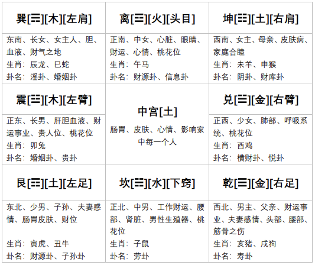

# 辅助工具

```
<font color="#67C23A">**禄**</font>
<font color="#800080">**权**</font>
<font color="#409EFF">**科**</font>
<font color="#FF0000">**忌**</font>

<font color="#F56C6C"> 红色提示色
```


# 梅花易数测算篇

## 阴阳五行八卦

### 阴阳

#### 认识阴阳


<font color="#F56C6C">**阳**</font>：凡是积极向上的事情都属阳，如天、太阳、上、君王、丈夫、昼等

<font color="#409EFF">**阴**</font>：凡是消极后退的事物都属阴，如地、月亮、下、臣子、妻子、夜等


#### 梅花中的阴阳


阴阳的转换与体现：<font color="#FF0000">动</font>与<font color="#409EFF">静</font>、<font color="#FF0000">主</font>与<font color="#409EFF">客</font>、<font color="#FF0000">阳</font>与<font color="#409EFF">阴</font>、<font color="#FF0000">旺</font>与<font color="#409EFF">衰</font>、<font color="#FF0000">外</font>与<font color="#409EFF">内</font>、<font color="#FF0000">上</font>与<font color="#409EFF">下</font>、本质<font color="#FF0000">好</font><font color="#409EFF">坏</font>等


### 五行


- 五行相生：金生水、水生木、木生火、火生土、土生金。

  表示生方与被生方有促进增长的作用；相反，生方与被生方耗泄。


- 五行相克：金克木、水克火、木克土、火克金、土克水

  表示一事物对另一事物的制约和克制作用。


### 五行反侮

五行反侮(wu)：

土旺木衰，木受土侮；

木旺金衰，金受木侮；(比如用美工刀去砍树，金克木但是现在克不动了)

水衰火旺，水受火侮；

土衰水旺，土受水侮；

金旺火衰，火受金侮。

**由于五行的旺衰太过而导致的逆克现象**。


如图，卦象中五个金一个火，本来是火克金，但是现在金太强了，火克不动，反而伤了自己的金


如图，卦象中五个土一个木，本来是木克土，但是现在土太强了，木克不动，反而伤了自己的木


###  八卦


**太极生两仪、两仪生四象、四象生八卦**


<font color="#FF0000">**乾三连，坤六断；**</font>

<font color="#FF0000">**离中虚，坎中满；**</font>

<font color="#FF0000">**震仰盂，艮覆碗；**</font>

<font color="#FF0000">**兑上缺，巽下断。**</font>


## 先天八卦（取数）


**伏羲先天八卦取数字：**

**乾一 兑二 离三 震四**

**巽五 坎六 艮七 坤八**


## 后天八卦（取方位与应期）


文王后天八卦取方位与应期


**八卦中的五行**


乾(阳)卦、兑(阴)卦五行属于金；

震(阳)卦、巽(阴)卦五行属于木；

艮(阳)卦、坤(阴)卦五行属于土；

坎卦五行属于水(阳)； 

离卦五行属于火(阴)。


## 起卦

### 起卦具体步骤 

以报数为例：8  2

1. 求出主卦（也叫本卦）

   将8作为上卦，2作为下卦，即可求出主卦

   

   

2. 求出变卦

   8+2=10，除以6的余数为4，为动爻，求得变卦：

   （主卦4爻如果是阳爻，变卦爻就变成阴爻）

   （主卦4爻如果是阴爻，变卦爻就变成阳爻）

   （除了动爻变化以外，变卦相对主卦其他爻不变）

   

   本卦：原因

   互卦：过程

   变卦：结果

   

3. 求出互卦

   主卦的3、4、5爻直接作为互卦的上卦

   主卦的2、3、4爻直接作为互卦的下卦

   

   

   

4. 明确体卦和用卦

   **不动为体**

   如果动爻在4、5、6爻（上），那用卦就是在上

   如果动爻在1、2、3爻（下），那用卦就是在下

   

### 起卦方式

#### 时间起卦法

以时的数字除以8找余数做**上卦**（余数为0取坤卦）

以分的数字除以8找余数做**下卦**（余数为0取坤卦）

时分的数字相加之和除以6做动爻（余数为0取六爻）


举例：

测事情取手机时间：13点15分

时的时间：13除以8的余数，为5->巽

分的时间：15除以8的余数，为7->艮

时+分的数字：13+15=28，除以6的余数，为4爻动


#### 随机报数起卦法

二位数：

以前位数字除以8找余数做**上卦**（余数为0取坤卦）

以后位数字除以8找余数做**下卦**（余数为0取坤卦）

两个数字相加之和除以6做动爻（余数为0取六爻）


举例：

测事情报数3、9
上卦：取前位数字（无余数）为3->离

下卦：取后位数字9除以8的余数为1->乾

动爻：3+9=12除以6的余数为0，取六爻


三位数：

以第一位数字除以8找余数 做上卦（余数为0取坤卦）

以第二位数字除以8找余数 做下卦（余数为0取坤卦）

三个数字相加除以6 做动爻（余数为0取六爻）


举例：

测事情报数2、6、1

上卦：取第一位数字为2->兑

下卦：取第二位数字为6->坎

动爻：2+6+1=9除以6的余数为 3爻动


#### 年月日时（阳历）起卦法

（如问今年运势如何这种以年为单位的问题、一年只会取一次卦的事情）

以年月日除以8找余数做上卦（余数为0取坤卦）

以年月日时除以8找余数做下卦（余数为0取坤卦）

以年月日时除以6找余数做动爻（余数为0取六爻）


举例：2023年4月9日13点30分，测事情

上卦：卯4+4+9=17除以8的余数为1，乾

下卦：卯4+4+9+未8=25除以8的余数为1，乾

动爻：4+4+9+8=25除以6的余数为1爻动


## 卦盘的解释——主互变


## 体用分辨


测算事情的不同，体用组合也不同，如：

- **测合作**:体为自己，用为合作方
- **测感情**:体为自己，用为对方
- **测财运**:体为财运，用为影响财运的因素
- **测疾病**:体为身体，用为影响疾病的因素
- **测考试**:体为考试能力，用为影响考试的因素
- **测事情**:体为事情，用为影响事情的因素
- **测失物**:体为自己，用为物品

**（不建议测疾病，有病去医院）**


## 体用生克——根本


**唯一一个同属性相互冲的卦就是坤艮，既是比克，又是相冲**


## 体用旺衰——（能量）


## 解卦步骤

解卦要一层一层叠加，尤其刚入门，
第一层体用生克，体用分清，然后看对待关系
第二层看旺衰，具体能量的展示，
第三层看八卦的万物类象，带入万物类象去解卦
第四层看库和空，有没有隐藏的能量和信息
第五层看卦意，整体卦名代表了什么意思
第六层看爻辞，一般不用，但如果信息不多可以当做一个侧面描述的叠加
第七层看神煞，神煞里有时候能共振一些有用信息


## 放生

旬空之处为方位，体用取数量，根据所求测事情来选择：
放生雀鸟(天神),以放生观音雀等为佳。化解牢狱，飞得高，看得远，有利于收集信息，增强测算灵感，经商者有利于提升业务及生意成交量，扩展人脉，提升人气财运。
麻雀、鸽子、观音雀（最好）
放生乌龟(玄武),化煞消灾，增福延寿。（巴西龟不算）
放生蛇类(地龙),解一些难缠的小人是非，口舌官司，有利于仕途升迁，腰疼腿疼等病痛，化解命带阴差阳错。
放生青蛙、蟾蜍(地藏王化身),有利于超度冤亲债主，阴气重，减少被骗、因小鬼偷钱而破财。
放生泥鳅、黄鳝(土龙),有利于钻营通关，用于转运!”泥鳅浪里跳龙门，渤海便翻身。”
放生黑鱼(水神),化解水路冤魂，淹死车祸等，减少意外的发生。
放生鲤鱼、链鱼等鱼类(化龙),鲤鱼跳龙门，利于学业、事业，特别是提升财运最好，用于转运。
放生田螺，繁殖快，有利旺丁，求子孙昌盛。
放生蚯蚓，能提升个人意志力，忍耐力，对戒色也有很大帮助。


## 断事情能不能成功


# 梅花易数万物类象

### 乾金


### 兑金


### 离火


### 震木


### 巽木


### 坎水


### 艮土


### 坤土


# 梅花易数化解篇

## 一、概念

1. 在天成象
   比如紫微和四柱所展现出来的垂象，即是天垂象，它有生辰带来，无法被改变。举个例子就像你出生的时候身上就带着个炸弹，这个是无法改变的事实.

2. 在地成形
   它是可以由人捕捉到的东西，相当于一种能量磁场的影响，即是风水和行运，比如说这第1点中的炸弹爆炸的威力，是可以进行计算和测量的。可以作为主要化解的部分。关于化解，需要掌握八宫的知识，在后文中会提到。比如说乾宫（西北方）放了一盆花，当这盆花枯萎了，财运就会收到影响，当我们把这盆花搬到别的宫或者直接扔掉，即可改变这个不好的能量磁场。 
3. 在人应事
   它指的是人的行为，就如第 2 点中说的扔花的这个行为，或者是上面炸弹的例子中， 引爆炸弹的行为，即是应事在人的表现。


## 二、原理


由于天垂象是无法改变的能量，所以我们只能改变行运（风水）和行为，当改变的行运能量加上行为的能量大于天垂象能量的时候，就可以达到改运或者化解的目的。

**梅花化解主要是从本卦和互卦进行化解**，因为变卦已经是结果了。本卦为事情的起因或者开始的状态，互卦是发展的过程，变卦是事情的结果或者最终的状态。 

<font color="#F56C6C">测感情</font>：本卦是刚追求阶段，互卦是交往阶段，变卦是感情的最终状态或者结果。 
<font color="#F56C6C">测谈判</font>：本卦是谈判开始阶段，互卦是谈判的过程，变卦是谈判的结果。


## 三、取像与分类

1. 取象

   人（行为） —— 阳 

   地（风水） —— 阴

2. 分类

   阴面磁场能量是大于阳面的磁场的，阴面的能量会影响到阳面的行为、思想和风水。
   好的磁场能量会对人有积极的影响，比如乐观、有干劲儿、思维活络、沟通顺畅等等。
   不好的磁场能量会对人产生消息的影响，比如消极、懒、脑子短路、产生误会等等。
   比如说家里一对的摆件，嘴对嘴摆放主口舌是非，比较好的摆放方式是并排摆放。（此处希望加入更多比较常见的例子）

   

   关于物件儿能量磁场大小： 

   开光的 > 未开光的 

   老旧的 > 新的 

   体积大的 > 体积小的 

   化解原则就是**大事大办，小事小办，无事不办。**

   

## 四、八宫

八宫为八卦方位所在宫位，需要以圆形发散方位来看。
比如说山水蒙卦问财运的化解方法，首先艮土克坎水，假如体卦是坎水，用“金”（ 金属制品）可以形成土生金，金生水的通关化解法。而化解的地方，就是我们要“立太极”的地方。

以下是常用的太极点：

1. 房子 
2. 卧室
3. 客厅
4. 书房/办公室
5. 工位/书桌

比如说乾位有东西阻挡了财运，需要看太极点的西北位（乾卦位），通常需要每个太极点都检查或者布局。但是从影响力来看，由上到下是从大到小。而太极点在方位上，只有第 5 点是卦主面前的位置为离位，其他方位按照八宫以此类推。其他 4 个太极点都需要取绝对地理位置上的方位。太极点中缺角代表该宫位能量不足而突角代表能量过剩，**在化解中一 般化缺不化突。**


缺角补角（无论什么方法都达不到 100%能量） 
例如：巽木=东南方缺角 用☴卦图，或者加数字（数量）。 

  		1. 先天数字 卦的类象 画 
  		1. 卦图（颜色 同五行）


> Tips：买罗盘的时候一定要买方的，圆的那种叫罗经，罗盘是看阳宅的，而罗经是看阴宅的。福禄寿喜财，皆从西北来。




## 五、思维转变

​	在梅花中分为<font color="#F56C6C">测算思维</font>和<font color="#F56C6C">环境思维</font>，解卦需要用测算思维，而化解需要用到的是环境思维，其中：

- <font color="#F56C6C">测算思维</font>：针对事情，比如情绪、关系、状态、吉凶。
- <font color="#F56C6C">环境思维</font>：针对宫位、物品与能量，比如乾代表西北、圆的、白色或金色。

上面说的能量指的是五行的月令能量（旺相囚休死）。

比如说火风鼎测财运，巽木生离火，离火是体，测算思维来看，是有收获的。环境思维的话，离火代表宫位，巽木代表物品，可以解释为在正南方（离宫）有 3～5 盆花

> Tips：在梅花卦中，动为物品，不动为宫。但是在论六亲或者居住关系的时候，上挂为物品，下卦为宫位。


宫位定像：

1. **不动为<font color="#F56C6C">体</font>，即为<font color="#F56C6C">宫</font>。克、生、比即为<font color="#F56C6C">作用物</font>。**
2. **受克、泄、耗者为<font color="#F56C6C">宫</font>。另一方为<font color="#F56C6C">作用物</font>。**

以上是两个不同的定宫概念，一般情况下以第一点定宫，需要<font color="#F56C6C">本卦</font>和<font color="#F56C6C">互卦</font>同参。

梅花卦盘可以用时间取动爻。化解完了以后可以再起一卦问问事情是否解决。
比如说之前有空，看空有没有补上；
之前耗泄，看看还有没有耗泄；
之前是山水蒙或者山风蛊，看看是否还有蒙或者蛊的能量。
总之就是检验上一个卦盘上对自己不利的部分有没有改善或者消失。

> Tips：时间是最符合动爻感觉，可以用时+分和 6 取余数动爻


配合卦盘五行生克辅助判断：

- **物生宫 —— 对应顺利**

  比如东南方放一个小鱼缸或者六瓶矿泉水，属于水（物）生木（宫），对应顺利。

- **宫生物 —— 对应消耗**

  对卦主来说是耗泄，流财。

- **宫克物 —— 对应获得**

  克者为妻财，对应着得财。比如乾位摆发财树，会利得财。

- **物克宫 —— 对应不顺**

  比如震位放了金属，金属物克到了震木宫。

举例：西北乾位是厨房，代表离火克着乾金，符合物克宫的象，此时可以在厨房里放五方财土（五个银行门口的土）或者铜铃。用五方财土的目的是用火生土，土生金的原理实现 通关的化解方法。


<font color="#F56C6C">**注意**：在化解的时候一定要考虑旺衰问题，比如说在乾宫已经缺角了，代表乾位能量不 足，此时再放草本植物，宫位克不动，会出现反侮的情况。一定要大对大，小对小，阴对阴， 阳对阳。多大的能量，办多大的事儿。在化解之前需要起卦接磁场能量去看哪些地方需要调整，在没有起卦之前调整不一定有用，比如说在乾宫放金蟾催财，也许你本身乾位能量就不缺，再补也是无济于事，此时就需要从卦盘去找其他宫位进行化解。</font>

> Tips：草本植物属木，但是会开花的，特别是艳丽的那种属火（如玫瑰），所以要注意植物摆放，另外，**中宫一定不要放绿植**， 特别是木本植物，会形成“困”局。


## 六、自我保护

​	在动风水之前，需要对自身进行保护，以免被不好的磁场能量干扰到自己正常的能量。 帮别人处理的时候也一样（别人作为执行人没有影响）。可以念金光咒或者护身咒。或者通过自己出生年的年干来找自己的一些护身物。

### 1. 天干

| 生年天干 | 护身物代表             |
| -------- | ---------------------- |
| 甲       | 龟甲、棍               |
| 乙       | 桃木棍                 |
| 丙       | 圆镜子                 |
| 丁       | 火机（符合丁的象就行） |
| 戊       | 大象                   |
| 己       | 貔貅                   |
| 庚       | 麒麟、狮子             |
| 辛       | 五帝钱                 |
| 壬       | 水晶                   |
| 癸       | 金蟾                   |

> Tips：护身物尽量开光

开光步骤：

1. 盐水泡一小时，然后用盐（最好海盐）搓。其原理是净化，因为盐属辛。金曰从革。 
2. 太阳晒三小时（或三天、三个月）。
3. 剑指对着物品念金光咒至少三遍，念三天。

<font color="#F56C6C">**注意：物品开光后不能碰水，不能沾污秽。如果碰水或者沾了污秽，需要重新开光。**</font>


开剑指步骤：


### 2. 地支

**甲戊庚牛羊，乙己鼠猴乡，丙丁猪鸡位，壬癸蛇兔藏，六辛逢虎马，此是贵人方。**

可以找对应的象放在房间里，也可以在房间里摆相应的阵。也可以用上述口诀催贵人，比如甲年生人，贵人属牛或者羊，其中属牛的为昼贵人，属羊的为夜贵人。假如是摆阵放家里面看家宅，需要在地支对应的方位摆对应的阵法。比如甲年生人可以摆牛阵或者羊阵。当然，阵法只是临时应急用，平时就找到对应的象放在相应位置上就可以了。

十二生肖/地支对应的阵法见下图：


### 3. 能量符

带在身上加强自身的能量，在对应宫位烧掉增强宫位能量。需要用红笔、黄裱纸。 在画到**罡符胆**的时候需要念诀：

1. 先四字头 —— 开天门
2. 一横 —— 塞鬼路
3. 一竖 —— 闭地府
4. 一横 —— 留人路
5. 一竖 —— 杀鬼卒
6. 一横 —— 破鬼肚


## 七、化解

### 1. 时间选择、库、空

#### 1.1 时间选择

拆补通关三种选择本宫的时间，拆的话也可以用**对宫（后天八卦取对宫，如拆离宫物品取坎宫时间）**的时间表：

乾宫 —— 19-23 点之间，戌日亥日，戌月亥月 
兑宫 —— 17-19 点之间，酉日，酉月 
离宫 —— 11-13 点之间，午日，午月 
震宫 —— 5-7 点之间，卯日，卯月 
巽宫 —— 7-11 点之间，辰日巳日，辰月巳月 
坎宫 —— 23-1 点之间，子日，子月 
艮宫 —— 1-5 点之间，丑日寅日，丑月寅月 
坤宫 —— 13-17 点之间，未日申日，未月申月


填空选择空亡的时间：

子丑坎水、艮土空 —— 选 23-3 点之间 
寅卯震木空 —— 选 3-7 点之间 
辰巳巽木空 —— 选 7-11 点之间 
午未离火、坤土空 —— 选 11-15 点之间 
申酉兑金空 —— 选 15-19 点之间 
戌亥乾金空 —— 选 19-23 点之间


#### 1.2 库和空


冲空选择空亡对宫的时间（后天八卦取兑宫），例如：戌亥乾金空，冲空选择辰巳时（7-11 点） 
库的时间选冲库的时间来开库，原理与冲空相同。 
时间选择里日月时，叠加越多，能量越大。 
冲=开和动。例如空的地方填实了之后没有动，那就需要冲空。


库和空

库=禁锢，房间，上锁，存放，储藏，不动，看得到摸不着等等，类似紫微天机忌
空=没有,外壳,空有其表,缺,阴性磁场,虚假.参考紫微里的地空+天空+旬空

> Tips： 空有时候也要结合八卦本身,如巽木空 想多了,或者空想,兑金空,说空话,乾金空,如果处旺地的话可以说看似有钱,其实是个空壳
>
> 测感情,如果遇到什么离火空,坎水空啥的,也代表虚情假意
>
> 在体空,可以延伸 空虚,心里没底,没有安全感,或者事情容易成空

> Tips：库的时间到了自然就开了，月库看月，日库看日，时库看时，当然除了时间也有别的开库方法，但一般用于开财库，所谓冲库

> Tips：库开了能来也能去,就跟你钱包打开,不是往里放钱就是往出拿钱


### 2. 拆

指**拆除**，就是把不好的能量或者物品拆掉，比如说乾宫有一盆枯萎的植物，将植物移除，兑宫有个空箱子，把空箱子去掉的过程，就叫拆。对体卦产生负面磁场的时候就可以使用拆（例如：克、耗、泄、库、空）。比如在东南方巽木位方了金蟾，就可以将金蟾移动到其他宫位。卦盘内也是一样的道理。主要是不让它产生不好的磁场能量输送。

**注意：拆除风水件，老物件的时候要念净天地神咒和盐水拖地。**


### 3. 补

指**补益**，就是为宫位增加能量，比如在乾宫放金蟾，或者五方财土。补益的时候可以用宫位一样的能量，也可以用生宫位的能量。当卦逢空、处囚死地（衰弱的状态）时， 表示卦主对所问事情状态无力，映射出磁场能量无力，此时需要在卦盘内定宫位，用生 宫位或同宫位的五行去补益宫位能量。

> Tips：在补益的时候如果想要起效快，可以念下面的补时口诀，其中红色部分可以改成需要催发的事情，比如感情。 适用于放风水物或者针对比较急，比较大的事情的时候念。主要为了更快的接磁场。

**昆仑九天，吾命通仙，放上此物，镇守凡间，<font color="#F56C6C">催财发财，催官发官。</font>急急如律令。**


### 4. 通关

通关是指用一个中间属性的能量，化解掉物和宫之间的相克能量。当体卦受克（衰 弱的状态），代表此事对卦主不利。需要在卦盘内定宫位，使用通关的手法使其五行流 通。比如说西北乾位有个厨房，形成了离火（物品）克乾金（宫位）的情况，可以用五 方财土形成火生土，土生金的通关局面从而达到化解目的。

> Tips：大事大办，小事小办，对应之事用对应之法对号入座（财对财，感情对感情，疾病对疾病）。大事小办没用， 小事大办过旺。<font color="#F56C6C">在化解时一定要收取佣金来置换磁场能量。如果有被冲的情况可以用盐水洗澡净化。</font>


## 八、综合运用

依据事情综合考虑化解办法。大事大办，小事小办，无事不办。拆、补、通关可以综合 灵活运用。使用的方式越多，共振越多，效果越好。

| 宫位 | 注意事项                                                     |
| ---- | ------------------------------------------------------------ |
| 乾宫 | 尽量不见水。比如乾宫是厕所（属水），代表流财。<br />这个宫位在家里是可以安床的，但是在公司不要有床（卧龙）。<br />这宫位适合放草本和木本植物（不要放绿箩，它和水晶的效果差不多，库库吸）。 |
| 兑宫 | 这个宫位如果有火（所有红色的，花卉）会形成火泽睽，容易有口舌，骂人，而且骂得贼难听。<br />也不易见水，会对宫位有耗泄，主损财。<br />如果兑宫有厕所可以用土来补兑宫的能量。<br />容易招阴。<br />兑卦的小人是口舌是非。 |
| 坤宫 | 缺角或者被克代表受窝囊气。<br />坤宫养植物容易把植物养枯萎。<br />坤宫可以补水，但是不能补多了，容易出阴事儿。特别容易招阴。<br />坤宫如果有厕所需要特别注意处理。 |
| 离宫 | 不要放金有关的东西，也不要放猫窝（猫是白虎象（兑卦），属金）或招财猫。 <br />可以用木去补离宫能量，离火主市场，所以可以招人气。<br />最好不要见水和金，水多了容易头疼。 |
| 巽宫 | 主思路，如果精神和思想有问题，巽宫很可能有问题。<br />精神上主要看巽宫和对宫。 当巽宫被克，精神面儿就容易出问题。所以巽宫不宜见金属。<br />巽宫可以见水，但是不能是脏水，脏水容易生活不检点。<br />这个宫位可以催桃花。 |
| 震宫 | 不能放金。主迁动。如果该宫位被金克容易动不了。<br />比如测升职能不能升或者换 工作能不能换，需要参考该宫位。<br />如果这个宫位有厕所，容易懒（山雷颐）。也容易出烂桃花。<br />厕所有山象，也有水象。 |
| 艮宫 | 厕所适合在这个宫位。<br />主房子，房间，也主小人。如果艮宫有问题容易有小人搞事情。<br />艮也主怀孕，如果婚后不宜怀孕可以查看艮宫情况。<br />艮卦的小人是阻挡。<br />如果厨房在这个宫位，身体容易长东西。<br />常年不用的东西可以放在艮宫，艮卦代表不动。所以适合用来做储藏室什么的。 |
| 坎宫 | 主欲望，下半身之事。<br />所以如果坎宫脏乱差，脑子里想的都是些乌七八糟的东西。<br />坎卦的小人是背地里搞事情。<br />坎宫比较适合放神像，神坛，需要祭拜的东西。<br />坎宫不要放一 些象意不好的画，不如说瀑布（下流）。也不要放落日图。适合放鱼缸（生肖马的人除外）。 <br />坎宫主流动，如果坎宫不好工作会比较累，主要是身累，离宫不好主心累。 |
| 中宫 | 是所有宫位里面能量最大的一个宫位。<br />如果要净化整个家里也是需要从中宫开始。<br />如果觉得家里又点“阴”，可以从中宫着手。<br />中宫有阴有阳，但是中宫的化解办法比较不太适合公开，<br />所以如果有需求的可以私下联系 DJ Se7en。 |

<font color="#F56C6C">**注意：家里九个宫位都不可放石头，特别是大石头，石头主“镇”，会镇住所在宫位。**</font>


## 九、六亲

六亲和宫位可以组卦，根据卦意去解释意思。比如说乾为父/男主，父亲/男主主到乾宫为得位，组成乾为天的卦象。但是如果父亲/男主住到了坤宫，则会形成天地否卦。其他六亲以此类推。乾宫心里年龄会比较大，坤宫会比较显老。

| 宫位 | 事项                                                         |
| ---- | ------------------------------------------------------------ |
| 乾宫 | 父亲住乾宫 乾为天卦正位,心高气傲,但是有干劲,<br/>母亲住乾宫,地天泰.虽然为泄,但是通泰之象,夫妻感情会好.夫妻一条心,坤土生乾金.<br/>儿子(长子)住乾宫=大壮卦 脾气大.莫名烦躁.毕竟金克木,长子在这里不利运势.损行动.做事不利.子在父位,心理年龄大.觉得自己是一家之主.<br/>长女住乾宫 风天小蓄卦 不爱说话,不利运势.心里乱想.想不开,思路受克.女孩不喜欢女性打扮,大概率偏中性打扮.<br/>次子(坎)住乾宫 需卦,感觉都需要自己,但是不动弹.<br/>中女二女儿(离) 住乾宫 火天大有,不亚于火烧天门,对于儿女财运好,但是损她爹.独立,女强人.<br/>不管大女儿二女儿住乾宫,都女强人,偏中性.<br/>小儿子(艮)住乾宫,山天大蓄, 大阻碍.<br/>不管谁住到乾宫都有这方面的宫性,这就是原始宫的能量.不管谁住乾宫都有一家之主的象,独立自强. |
| 兑宫 | 父亲住兑宫 履卦,担惊受怕,心慌,哆嗦.但整体运势还可以,毕竟比合<br/>母亲住兑宫,临卦,君王驾临,家里她是老大.但对于母亲流小财.<br/>长子住兑宫,归妹 容易性取向不正常.同性恋基本上10个里有八个.有点娘娘腔,或有点娘们.有时候厕所在正西也算,属相是酉鸡的也算.兑金克震,克的是缺陷,有缺陷之事.东宫太子,西宫娘娘.<br/>长女住兑宫,中孚,讲诚信,一讲诚信就损财,动不动还受气,<br/>次子住兑宫 水泽节卦,会节约.如果摊上桃花位有烂桃花.利财运<br/>中女住兑宫,睽卦,瞪眼,生气 吵架 骂人,靠嘴吃饭,律师,销售.<br/>小儿子住兑宫,损卦,不要住!尤其小孩,尤其命里有坎的,容易夭折的更不能住<br/>少女住兑宫,兑为泽,愉快,傻乐呵,傻白甜. |
| 坤宫 | 父亲住坤宫 否卦, 抑郁 郁闷,想不开,想不通.但脾气好.收敛,收进去了.<br/>母亲住坤宫 ,坤为地,不好,消极,受欺负,包容过度,十个母亲住坤宫八个难受,也容易招阴事.<br/>长子住坤宫 豫卦,得财,容易犹豫不决,,但是母亲难受.震巽都这个意思.直接克.尤其母亲身体有暗疾的<br/>长女住坤宫,风地观,时刻盯着人看,适合做金融,瞅准时机就下手,但母亲不舒服.看人家咋咋咋<br/>次子住坤宫,水地比卦,家人都捧着.愿意没事找事.<br/>中女住坤宫 晋卦,利考试,考试升职.人没有那么飘<br/>小儿子住坤宫,剥卦,坐不住,闲不住.震宫偏多动症,但这种偏闲不住<br/>少女住坤宫,萃卦,利考试,惹人爱,讨喜.宫生兑.说话好听,大家容易喜欢.<br/>坤宫有个象,别管谁住坤宫,谁显老.住乾宫心理年龄大,住坤宫显老. |
| 离宫 | 父亲住离宫,天火同人,有知己,有合作伙伴,易破耗,人际关系多花钱,易发火.无名火.说漂亮话 虚情假意<br/>母亲住离宫 明夷卦,受伤害,父母同住离宫,父亲越挣钱,母亲越难受,越旺越旺.<br/>长子住离宫 丰卦,泄,家里谁懒,泄一泄,也能动.一动就有丰收之像,泄为流通,一个宫位过旺就堵了不动了,这个时候要流通,泄一泄.虽然可能累点,但是有收获.运势挺好<br/>长女住离宫 家人卦,不孤独,不舒服,思路可以表达出来.<br/>次子住离宫 既济卦,得财,路路通.但是水火只要在一起,脾气时好时坏,不平静,要么干水火的工作.<br/>厨房在坎宫,次子脾气绝对不好.<br/>次女住离宫 离为火,如日中天,吉凶参半.执行力快.风风火火的.持久力不行.<br/>小儿子住离宫,山火贲,爱打扮,爱臭美.也爱活动,跑.三心二意.<br/>少女住离宫 泽火革,改变 变革,干着干着就变,干啥都坚持不下去,三分钟热度.损钱,爱说脏话. |
| 巽宫 | 父亲住巽宫,天风姤, 姤卦,不正之象.赚偏财,不正当的钱,不正常路子,在古代东为上首,住东不住西.<br/>母亲住巽宫 ,升卦,不太好,克坤土,1身体不舒服,暗疾.2招阴.容易消极.<br/>长子住巽宫 恒卦,鱼来撞网,坚持不懈.财运挺好,尤其适合开店的,门店的.复合鱼来撞网,如果上班的就是摸鱼了,不爱动.飘忽不定.<br/>长女住巽宫 巽为风,长女住利婚嫁,<br/>次子住巽宫 水风井 脑子聪明,虽然累,但是策划思路灵光.乏得慌.如果很脏,乱,就投机取巧,正事不干.<br/>次女住巽宫 火风鼎,感情代表三角恋,玩的比较花,有贵人帮助.活动家,交际好.天天想的吃喝玩乐.<br/>小儿子住巽宫,蛊卦,有时候也主孤寡,受克不好,难受,失眠<br/>少女住巽宫,泽风大过,克者得财.哪怕有损失,容易犯错,想法过大.大动作,也会导致大失败,大起大落. |
| 震宫 | 父亲住震,无妄卦,喜忧参半.<br/>母亲住震,地雷复,反反复复小毛病.母亲住震宫巽宫,身体都不大好,被克.<br/>长子住震 震为雷,不错,学生的时候主容易成体育生.<br/>长女住震 风雷益,长女脾气大,长女一股长子感觉.<br/>次子住震 水雷屯,干不出头,烂桃花.烂桃花也不容易发展下去.<br/>中女住震,火雷噬嗑 狠,受阻.办事果断.喜欢咬人.<br/>小儿子住震 山雷颐 主玩乐<br/>少女住震,泽雷随,随卦.说啥听啥,让干啥干啥.但整不好容易唱反调. |
| 艮宫 | 艮宫遇到讨债什么的,让父亲住艮卦=遁卦,找不着.有时候调大限的时候也会用<br/>母亲住艮宫,地山谦,谁母亲脾气大,可以住艮宫.<br/>除了母亲,其他不要住艮宫,艮宫有停止象.<br/>震卦住艮宫.雷山小过,老犯小错.多动症住艮宫可以治.不动,有好处是得财.<br/>如果自己没办法调整住的宫位,移当事人照片也可以<br/>长女住艮宫,风山渐,带斩字,凶,停,不爱说话.不愿意想,思路不动了.也得财,但不一定在家,克艮,不在家.艮=家庭.<br/>次子住艮宫 水山蹇, 拌脚之象.<br/>中女住艮宫,旅卦,在家待不住,小人多,赚的钱能给家里.离火生艮土.<br/>小儿子住艮宫,艮为山,停止,小孩子不能单独睡.<br/>少女入艮宫,咸卦,闲了. |
| 坎宫 | 坎宫本身属于凶险之宫.坎卦在下卦几乎无吉,容易铤而走险,犯险事.但也代表智慧.没智慧不敢铤而走险<br/>凶险,流动,智慧,投机取巧.<br/>乾卦父亲住这里,讼卦,官司口舌是非,流财破财.吵不完的诉讼之事.<br/>学习的孩子最好不要太生他,学校可以生他,宫位不要生他.吃饱了犯困,懒.<br/>比如厕所在震,水汽大,懒了.<br/>母亲在坎 师卦, 争吵,兴师动众.<br/>大儿子 雷水解卦 子卯刑,烂桃花多,也容易分手 刑也有分裂之意<br/>大女儿住坎宫,风水涣卦 想法多,涣卦,注意力不集中.心里想的多.在家里布集中性聚集性的东西.<br/>1是五行2是卦.<br/>二儿子中男坎水在坎宫 坎为水,出门就被坑.水中捞月.门前有坑.如果这个人八字里边非常非常喜水可以住.<br/>一个人土多,特别多,也可以<br/>摆的多不牛逼,共振多牛逼.<br/>中女在坎宫,火水未济,头 眼 学习,学历.皆不吉.朱雀投江,主消息夭折.没信儿了.鬼心眼不少,不用在正道上.<br/>小儿子到坎宫,山水蒙卦,学习容易蒙.出门就容易被骗，一个糖就忽悠跑了。<br/>小女儿在坎宫，泽水困，天天犯困，不愿意动弹 |


## 十、神咒


# 梅花易数四象篇

站到你阳台位置,正前方是朱雀,左青龙右白虎,后方玄武
青龙比白虎高,正常,如果白虎高不利男性利女主.
如果白虎位有白色高建筑,利女主事业.
青龙主延绵不绝,主源远流长.若断开主事业有损,中途被劫之象.
白虎延绵的话乱子不断,
女性做偏财类的,白虎位得高.
白虎方位,如果能看到银行,发如猛虎,利横财.(火贪铃贪)
朱雀=主平台,如果有高楼挡住了,有能力发挥不出来.
玄武=贵人,靠山,但不宜太近.你看到对面楼有人在阳台衣服裤子鞋都能看清,那就近,太近贵人变小人.
玄武也为人的底气.
阳台不能堵,尽量不要长时间晾衣服.破花盆破纸箱子.
老一辈都那样,但是老一辈都上班,铁饭碗,就没事,对于现在来说不行.


# 梅花易数头像占断风水

## 四象

太极生两仪，是宇宙根本力量的第一变。在这一变完成以后， 就产生了一个一级的"阴"和一级的"阳"。

然而这两个一级的"阴"和"阳"内部仍然存在阴阳的力量的作用，还是会继续演变。

这样的结果，一级的"阴"就产生了"阴中之阴"--老阴和"阴中之阳"--少阳;

一级的"阳"就产生了"阳中之阴"--少阴和"阳中之阳"--老阳。

**老阴、少阳、少阴、老阳是第二级的阴阳组合，统称为"四象"。**这个过程就叫做"两仪生四象"。

在中国传统文化中，青龙、 白虎、朱雀、玄武是四象的代表物，青龙代表木，白虎代表金，朱雀代表火，玄武代表水，它们也分别代表东、西、南、北四个方向。在二十八宿中，四象用来划分天上的星宿，也称四神、四灵。


1. 青龙

   一般代表阳男人、哥姐、主管、领导、贵人、思考能力、事业，为身体的左边，为左腿，拥有镇压的力量。有事业顺利得心应手，得贵人生扶。


2. 白虎

   白虎为阴，女人，下属、小人、压力、财富， 血光，为身体的右边，为右腿，一般白虎图不能压青龙，**即白虎的图不可多于青龙方。**

   **如果白虎， 青龙不协调就会阴阳失和，多犯小人，事业阻隔不顺，是非多。**

   白虎方为财方，为女人方。要想财运旺可选择白虎方为吉的，但白虎方如果过于多，也容易妻夺夫权，女人当家。

   要想有贵人生扶，发展事业追求官贵名气， 就要选择青龙势旺之格局。


3. 朱雀

   为南方，为头像的上部分，为头部，为子女，为前途，为学历文昌，为表现力，相对低陷一些， 要宽大，明亮， 上部分见水为朱雀水。


4. 玄武

   为图像的下半部分， 为健康，为祖上， 贵人， 靠山， 为信心， 为身体的下半部分，好像站在你身后的长者，做你的坚强后盾， 支持你，就像一个人后背墙位而座位背后摆放大型的高柜，以作靠山。


当然以上四像只是对图片的定位。其吉凶，一定要活学活用，既要合四像阴阳，也需合九宫生克，达到更精准的预测效果。


## 八宫颜色代表


### 乾卦白色代表

白色（金色）多的人性刚讲义气，爱交朋友， 图片白色的过多适合做建筑、钢铁、加工行业、技术工人、修理工、当兵等等，

图片中不宜有白色的光环， 异常的白色代表肺不好，也损伤四肢，白色发动必出凶事。

白色代表白虎，易静不易动。

白色旺白色多的图片交火流年流月会有成就， 需要参考旺衰组合。

男人的图片白色过多太刚会开支大，太少会优柔寡断，白色为体过重,遇微火练方成器。


乾为头部，这是从人身上最坚硬的部位得出的相同五行的归类法，乾为金为硬，人身体里最硬的组织为骨头，骨就是人体五行里的金行，而头骨无疑是骨头里面最坚硬的部分，所以乾为头，乾为中心，为枢纽，为帝王，为首脑，而人的头部除了坚硬的头骨这个金象上的吻合外，更包含了眼睛的视觉，耳朵的听觉，鼻子的 嗅觉，舌头的味觉，嘴唇的触觉， 神经反应的脑神经元桥，这些与 外界的交换感受都要在脑子里形成神经细胞，所以人的大脑为中枢神经处理中心， 这一点上，类同于乾为宇宙的中心北极星。

头部是乾，那么与头部相关的也是乾如镜子，帽子，头盔，太阳帽，也可以归属于乾金的引申强化方面得到的象意，古代多为铜镜，多为金属制品， 现代变通为玻璃制品的镜子，而食品中的牛头，羊头， 猪头，当用神卦旺相时测食品可变通为各类动物的头部，乾在宇宙中为北极星， 在太阳系中为太阳， 在地球上为天空。在地球表面为高山雪原，风景名胜区， 首都， 在人事上，为一把手，总统，做人做到当了总统了，富贵肯定来说都不是问题了，权力到了赖峰，名望也会到一个赖峰的，所以乾由官推导出贵，为巨富，豪门，贵族， 为有权势的人， 权势上的首脑人员，为乾，乾为首，目前的经济社会除了皇权，贵族，就是富翁，财富值高的人，现金钞票多的人，也可以代表乾卦，开公司的大老板， 企业的老总， 单位的一把手，银行的行长， 集团的老大，这些人，就是财富上的首脑人员，为乾由富足多金，引申出来，凡是经商暴富的个体户，当地的首富为乾，同行业最有钱的人为乾， 一单位中最有钱的老百姓也可以看成乾， 乾三阳金属，为贵重金属，黄金钥金，也等于人中的富人排行榜的上榜之人，为开金矿的老板，为世界 500 强上榜的公司， 都是乾。


### 坤卦艮卦黄色代表

黄色为主色的图片，土弱木旺脾胃虚弱土旺水弱肾不好容易腰疼，土旺的图片适合搞土建、工程、土产品、土旺有水搞建筑。

土旺的男人坚强， 干事干事业有动力，土旺的女性会有事业压力，生克区分图片中什么颜色该多些什么颜色该少些，

土的颜色分少黄、淡黄、老黄， 少黄淡黄颜色中含有金土生金为体用的有朋友相助， 事业有成，黄色为主色为坦诚，有木为人民服务，子女在外发展比较好，男女图片断法相反。土旺有红生出生地地基在高处。

黄色为主色圆腰廓鼻，眉清目秀，口才声重。为人忠孝至诚，度量宽厚，言必行、行必果。

头脑僵化，呆笨不明， 内向好静。是非常能信守承诺之人， 有相当强的亲和力。

务实的态度会为自己赢得大众的支持。具有精打细算的能力，以非常有自知之明的眼光衡量自己，并充分发挥自己的能力。

个性沉稳、工作投入，做事认真丝毫不马虎，天生具有组织能力。

但太务实的性格，比较迟缓， 比较保守，句句都是不顺耳的实言。不喜欢夸大其词，客观且凡事小心翼翼；

缺点是缺乏丰富想象力， 无法对事情做大胆之假设，或去追寻更大的梦想，但是严以律己， 自爱自重，颇受同事间及上司的喜爱，对于上级交付之任务，均能圆满达成。


### 震卦異卦绿色代表

绿色为主的头像为人正直，木旺金克损钱财。

木旺水生有贵人相助，图片中绿色树木旺盛旺子女，同时也会为子女操心，

图片中荷花为女儿荷骨朵儿代表儿子，绿色水木旺泌尿系统容易有问题会类风湿关节炎，严重的会偏瘫四肢麻木。

女性用的图片绿色多的人喜欢较真， 爱讲究， 容易挑刺， 情商低，转牛角尖谈恋爱直来直去，容易失恋受挫折。肝火旺盛。

为阳木，代表自然界高大的修长的树木， 如白杨树，松柏，原始森林，热带雨林的高大乔木，这些天然的高大树种是震.

震在人事上为长形的木柄，比如铁锹的木头部分，斧头的木柄，矛的木柄，所以，修长的木棍为震，震为木，树木有的会结果实，木果也归属于震， 如桂圆，荔枝等震为木， 人工种植的蔬菜，木类食品当然也是震，如白菜，豆角等。

震为阳，交在下，代表果实在下部，根部结果，所以，震果在地代表种植的庄稼为花生，土豆，红萄等地下结果的农产品，花生，土豆等为震。

木主仁， 仁义，仁慈的人，为好心人，慈祥的人，人品质上心好心直的人为震，木的口味为酸味，这是木的本质，木酸，因为蔬菜放久后自然发酵了，基本都带酸味， 这是由植物的本质的化学变化，对于人的味蕾来说，就是酸，人事上凡是做的食品为泡菜，酸菜，醋，酸汤，酸辣味的，都可以归于震， 比如著名的酸菜鱼，酸辣粉。

震为车，震跑的快的， 跳的快的，如兔子，狐狸， 这是自然界中机灵擅长跑的，都是震 ，震有大动不止，对比于人事上的事物， 为田径运动员，  人跑的再快， 也比不上机械，所以，车也为震为车，古代为马车，近代为汽车， 摩托车，凡是跑的快，要用到电的车，是震，陆地上的跑的快的是车，那么对应于水上跑的快的就是船， 天上跑的快的就是飞机， 同理，船，飞机也是震车为震，船为震，那么聚集了大量车子的车站，码头也为震，所以汽车站，出租车站，码头，飞机场也为震。


### 离卦红色代表

火多的图片女性容易肝火旺盛、妇科容易出现问题，容易熬夜。

红色火也分紫色和大红色、暗红色。

火为主色的人事业心强，女性会喜欢钱财迷心窍，火弱火少的图片女性挣钱少，工作进步慢。 

火旺确图片中火的颜色不清楚模糊看对应的宫位的六亲身体不好或者高血压心脏病，火太旺太多太少自己血压心脏都容易不好。

离卦在象数中属火，其义理代表了丽，象征了太阳和火，所以说这类人的火气非常重。他们是多阳少阴的，也可以说他们是太阳之人， 这类人的阳气很旺， 也就是火气旺。所以他们的外形特征往往是面色比较偏红、头偏小，他们还有一个特点就是眼睛非常厉害或出问题近视。这是因为在八卦中，离卦是在眼睛， 因此离卦人眼睛最厉害，什么东西只要他一扫心里就全明白了。

通常离火之人的思维是非常快的， 就像闪电般，是爆发式的。他们善于创新，什么事情总是想在前、做在前。

但是这类人的缺点也十分明显，就是有时候会过于自信。

离卦一般表示中年妇女， 也可引伸为中间层次， 中间人物。

离为文， 表示为文学， 艺术，医学等职业。

离为兵戈， 故引伸为军队， 法警等职业。

中女、美人、贵族、文人、学者、艺术家、演员、明星、 博士、判官、猎人、革命者、军人、美容师、引人注目之人、女主人公、多情者、幻想者、说假话者、抗上的人、被软禁的人、 中层干部、虚伪者、想法很多的人、编辑、画家、财务人员、银行职员、记者、作家、监查人员、纪检人员、警卫、侦察员、分析人员、战士等。


### 坎卦水（黑色）代表

黑色水的头像为人聪明， 适合从事旅游业、艺术专业水利、 体育、水产养殖、厨师、运输， 水旺水多女性用之体怕寒， 易有关键炎冷宫寒， 容易流产，脾胃虚，腰疼。如果水太少而受克泌尿系统有问题。

水多的男女有桃花，同样也有异性缘。他们的记忆能力较强，他们言行谈吐，都会三思而后行。 

水有两种类型， 流动水和静止水。

流动水型的人，比较积极、进取、主动、不安、急躁、繁忙。

静止水型的人，比较平静、冷静、 沈默、安宁、无争。  

水太多的人是比较聪明、狡猾、复杂、足智多谋。喜欢到处活动或旅游，喜欢有感性的生活。可能有太多的梦想，经常改变他们的主意。也倾向只关心自己， 对外面世界发生的事务，可没有兴趣。平时总是手脚发凉，肚子、腰部或膝关节怕冷，严重时手冷过肘、脚冷过膝，上半身发热、下半身发冷，衣服总比别人穿的多，冬季耐受不了寒冷。

管理上讲，头像水多人“政善治”，这样的人管理风格是柔性管理。上下级对他的管理一般都接受。如果过于柔性，就会让人感觉到他没有魄力，遭遇别人出难题， 不过头像水多人善于化解各种难题。由于不宜搞刚性管理。所以，在选择管理岗位时， 一定要有所选择。不过，现代企业多为刚性管理， 缺的恰恰是柔性管理，头像水多人可以充分发挥自己的柔性管理才能。

在创业选择上， 由于水多的人， 善于谋略，工于心计，有参谋家的素质。所以，适合从企划公司、健康咨询等产业开始。

加上头像水多人“事善能”，善于发挥才能、善于发挥效能， 一般起始创业时，都会小有成功。但是， 等到事业做到一定规模时， 由于做事不够魄力，不够狠，往往受到很大的制约。       

在处理纠纷时， 要想大事化小， 小事化了，选择他最适合不过啦。

水是最柔的，也是最有生命力的，最有战斗力的，往往能以柔克刚。 

头像水多人在事业上往往最容易走下坡路， 稍不努力，就会水往低处流。别人往高处走， 不喜欢低处， 而头像水多人偏偏流向人们不喜欢的低处， 表现出低态。如果从做人的角度看，让人容易接受， 并受人遵重，从事业追求上分析，会误入歧途或大倒退。

流动性强的职业、中年人物、冒险性职业、心狠手辣之人物等。

中年男子、思想家、创造发明者、数学家、书法家、逃亡者、亡命徒、盗贼、黑社会（黑帮势力）、印刷工人、水货或水产品工作者、送水工、贫困者、诈骗者、诱惑者、有犯罪历史者、 恶人、病人。多情轻浮者、酒鬼、劳务人员、劳苦者、失败破产者、蜗妇、姜、沉默者、思考者、受灾之人、中毒者、江湖之人、 船上工作人员、安全人员、自来水公司工人、冒险者、黑教、流亡者、尸体（死亡的人）、阴鬼。中等的、狠毒的、狡诈的、偷偷模模的、守信誉的、劳碌的、辛苦的、忍耐的。 从身体类象而言：肾脏、膀脱、泌尿系统、生殖器（性器官） 、血液、体液、 背脊骨、耳、腰（臀部）、肛门、血液循环系统、水份体液循环系统。


## 宫位颜色的相克与比合


如上图为颜色宫位相克


如上图为颜色宫位比合


### 金(白)色

- 金白色在木宫： 色克宫。入三伤长男， 入四伤长媳、长女，主癱狂、喘咳、筋骨疼痛、腰腿生痛。
- 金白色在火宫： 宫克色。主资财速退、家业空虚、子孙败绝。伤男，伤女。主肺疾，咳嗽、哮喘，妇人产膀、血崩。
- 金白色在土宫： 宫生色。家业兴隆，人丁旺盛。阴见阴， 初虽福，久破败。
- 金白色在金宫： 宫色比和。资财茂盛、六畜繁衍、人口平安、 多添男丁；形态不好尖煞反之多凶事， 财尾退散、损伤、田产虚耗、人丁衰败、寡妇当家、多生女儿，阴见阴，哭声吟吟，男孤女寡。


### 木绿色

- 木绿色在金宫： 宫克色。伤男， 伤女。人财退散、男女生痛 滞、咽喉病痛、心胃膨闷，或自缘、或吐血。寡妇，筋骨疼痛、腰腿之灾，瘦膀黄肿。
- 木绿色在木宫： 宫色比和。其家兴旺、广进田庄、子孙繁衍、人口平安、百事顺利。
- 木绿色在水宫： 宫生色。木水养根身茂盛， 主生五子，钱财旺。
- 木绿色在火宫：色生宫。田产兴旺、人口平安、资财茂盛、六畜盈栏。
- 木绿色在土宫： 色克宫。财物渐渐消退，脾胃损伤，噴嘱症，人多瘦弱、面黄，六畜不旺，田产不收。


### 水黑色

- 水黑色在金宫：宫生色。资财顺利。阴人主事，胡作非为，官司、口舌，阴症相随，妇人多病。
- 水黑色在木宫：色生宫。六畜亦旺、资财亦兴、田产盛
- 水黑色在水宫： 宫色比和。水太重，家业飘零，男早丧、子孙稀，水盅疾病、腹肿，子孙飘蓬，六畜死，田宅虚耗。
- 水黑色在火宫：色克宫。水火相煎，邪鬼为殃、盗贼火光、 六畜倒死、家业空虚、人口灾害。先伤中男中女，后死小儿老母， 眼目昏旺。火遭水克， 产膀肾；水来克火， 多主肾冷。因火被水克，火连心痛血崩疮；吐脓血。咽喉暗哑，伤妻损子。
- 水黑色在土宫：宫克色。六畜倒死、钱财不旺、田产不收、 官司盗贼、人财离散、百灾竞起。土克水，风狂灾，面色贏黄， 或瘦膀、腹肿， 或噴食、水盅灾， 人口逃移。伤妇女， 伤男子。从阴入阳，哭声忙忙，家业败。


### 火红色

- 火红色金宫： 色克宫。多伤家长， 官司刑狱，血光横死。先 伤少女，心痛、咳嗽、血光、肺膀之患， 面色黄干产膀死。金被火伤，口舌是非。
- 火红色木宫： 宫生色。木虽生火， 反招凶。主田宅退败， 盗 贼连连，件逆凶徒，上下不顺， 资财耗散，老幼不安。木能生火 反不生，身根受克祸频频， 官司口舌年年见， 酗酒行凶而且严重打死人。
- 火红色在水宫：宫克色。资财大散家业破，火光事去又复来。 人口灾害，官司叠见。火遭水克眼疾病，心痛吐血产难紧。水制火伤，瘦膀病吐脓。先伤中男、少男， 次亡家长。水火交战， 出寡妇。
- 火红色在土宫：色生宫。吉凶参半。


### 土咖啡色黄色

- 土咖啡色黄色在金宫： 色生宫。资财大旺， 六畜兴， 田产茂盛，子孙振振。
- 土咖啡色黄色在木宫：宫克色。伤妇女，伤男子。肿盅残，噴病盲，脸面黄色。脾土不和， 胃气冲心。风病勤动履， 耳聋兼聋瞎。博奕亡家，田园废尽，寒户遭瘟，乳痛疮毒。
- 土咖啡色黄色在水宫： 色克宫。家业飘零， 子孙亡败、六畜 倒死、田产虚耗。土克水宫，风病灾面色黄，瘦膀腹肿病难当。 失言暗哑噴食病， 水盅病生黄肿灾。脚痛腿疼难医治，耳聋伤肾病。
- 土咖啡色黄色在火宫： 宫生星。星宫相顺， 富贵资财，钱尾大旺，田蚕倍收，米谷盈仓。火能生，人口平安，后代儿孙旺。
- 土咖啡色黄色在土宫： 宫色比和。伤少男， 伤老母，疾病死亡。土多必主噴嘱、膨胀之灾，有残疾之病。


## 头像看流年流月


头像流年流月只需要将图片套入以上九宫图，看其生克形态，即知其流年财运事业婚恋情况！

2022 年看艮宫寅，2034年也看艮宫寅处， 以此流年为基础，加12或减12，就可以直接铁口直断流年！


## 一眼占断

还有两种情况，一个是阴阳，一个是64卦类象，就是所谓的一眼占断

### 阴阳头像论

| 阳（图片亮）                                                 | 阴（图片暗）                                                 |
| ------------------------------------------------------------ | ------------------------------------------------------------ |
| 生意盎然<br />生机勃勃<br />生龙活虎<br />欣欣向荣<br />龙腾虎跃<br />蒸蒸日上<br />生气勃勃<br />风华正茂 | 有气无力<br />昏昏欲睡<br />老气横秋<br />暮气沉沉<br />萎靡不振<br />日薄西山<br />半死不活<br />死气沉沉<br />人命危浅 |


### 64卦类象头像论


如上图头像，带着墨镜，可以直读山水蒙(把眼睛蒙住)，一是容易被蒙骗，二是容易迷茫，看不清方向


如上图，蒙着脸，蒙卦，不看不听不相信


# 梅花易数之拯救恋爱脑/焦虑

拯救恋爱脑方法:
忘不了前对象,有缘无份的,影响到正常生活的.
起卦,问,我怎么能忘记ta?,2我为什么忘记不了ta?
起完,看盘,谁克你,你就拆谁.如果没有,就造个象(造像需要放够卦象的时间 例如临离火就三个小时,坎水60分钟等等之类的.)然后再拆.体弱就补体.有象拆象,无象造象拆.如果神煞桃花共振,拆掉能量更大

拆的时候 :
**天圆地方 律令九章 吾今拆物,忘掉对方,急急如律令,敕!**
脑袋里想着对方的模样,想着他被扔出去的感觉.
**EMO的时候也是一个原理**


# 梅花易数之斩断是非（口舌/社交）

封百口

先写九个口字 然后外边画个井字把九个口包起来，最好是黄裱纸、红笔，然后每一个口放九粒米


然后开剑指 剑指着中间的口念：

```
天上雷公吼，
地下封百口，
天地赤口、年月赤口、日时赤口、家内家外诸亲百口、是非赤口，
掩收押在万丈深谭，
天地官符、四季官符，
掩收押在深郊旷野、万丈深坑之中，
永无动作，
天白虎、地白虎，
弟子手指四大名山，
一切白虎赶出南川，
金佛寺、山王天子，
案下收管，
千年不逢、万年不遇，
瑾请南斗六星、北斗七星，
急急如律令
```

共念7遍

念完团起来,出门找个土埋了

埋哪个方位看卦盘里**本卦**被生 被克 被泄的方向，以家宅为中宫（中心）,出门找那个方向埋了就行

所有一切口舌是非,人际交往是非,包括蜚廉,都可以用这个办法去化

封百口很柔和,说人话就是:住嘴,别逼逼
