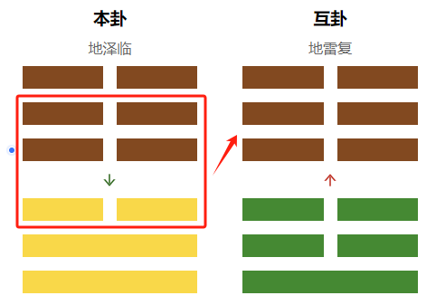
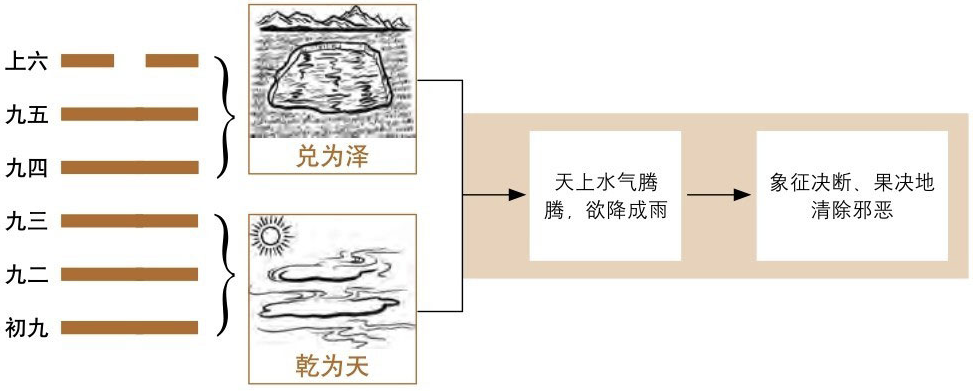
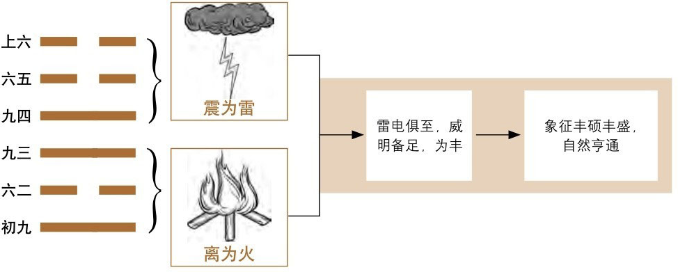
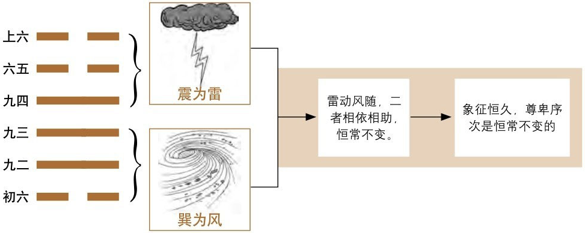
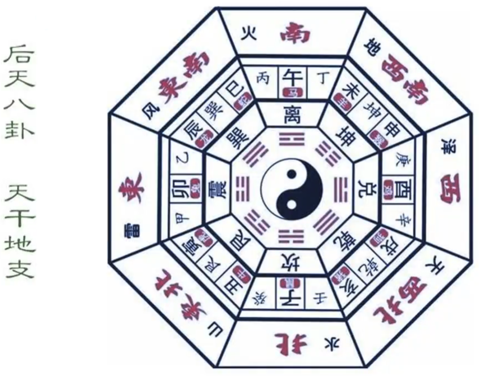
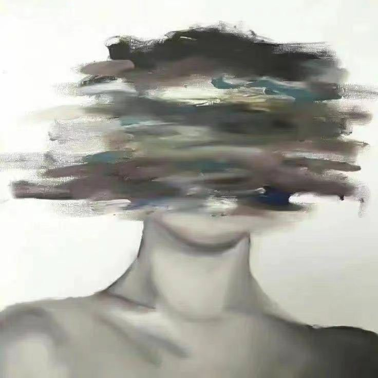

# 测算篇

## 一、基本概念

### 1. 阴阳

#### 1.1 认识阴阳

**阳**：凡是积极向上的事情都属阳，如天、太阳、上、君王、丈夫、昼等

**阴**：凡是消极后退的事物都属阴，如地、月亮、下、臣子、妻子、夜等

#### 1.2 梅花中的阴阳

阴阳的转换与体现：动与静、主与客、阳与阴、旺与衰、外与内、上与下、本质好坏等

### 2. 五行

#### 2.1 五行相生 && 相克

- 五行相生：金生水、水生木、木生火、火生土、土生金。

  表示生方与被生方有促进增长的作用；相反，生方与被生方耗泄。

- 五行相克：金克木、水克火、木克土、火克金、土克水

  表示一事物对另一事物的制约和克制作用。

#### 2.2 五行反侮(wu)

> Tips：五行反侮是指由于五行的旺衰太过而导致的逆克现象

土旺木衰，木受土侮；
木旺金衰，金受木侮；(比如用美工刀去砍树，金克木但是现在克不动了)
水衰火旺，水受火侮；
土衰水旺，土受水侮；
金旺火衰，火受金侮。

如上图，卦象中五个金一个火，本来是火克金，但是现在金太强了，火克不动，反而伤了自己的金

如图，卦象中五个土一个木，本来是木克土，但是现在土太强了，木克不动，反而伤了自己的木

###  3. 八卦

八卦构成：每卦分为上、中、下三爻。

其中**—**为阳爻， **- -**为阴爻，三个爻组成一卦共有八种方式，共为八卦。

**《八卦取象歌》**

**乾三连，坤六断；**

**离中虚，坎中满；**

**震仰盂，艮覆碗；**

**兑上缺，巽下断。**

**易有太极，始生两仪，两仪生四象，四象生八卦**

#### 3.1 先天八卦（取数）

**伏羲先天八卦取数字：**

**乾一 兑二 离三 震四**

**巽五 坎六 艮七 坤八**

#### 3.2 后天八卦（取方位与应期）

文王后天八卦取方位与应期

**乾(阳)卦、兑(阴)卦五行属于金；**

**震(阳)卦、巽(阴)卦五行属于木；**

**艮(阳)卦、坤(阴)卦五行属于土；**

**坎卦五行属于水(阳)；** 

**离卦五行属于火(阴)。**

## 二、起卦方式

### 1. 起卦具体步骤 

以报数为例：8  2

1. 求出主卦（也叫本卦）

   将8作为上卦，2作为下卦，即可求出主卦

   

   

2. 求出变卦

   8+2=10，除以6的余数为4，为动爻，求得变卦：

   （主卦4爻如果是阳爻，变卦爻就变成阴爻）

   （主卦4爻如果是阴爻，变卦爻就变成阳爻）

   （除了动爻变化以外，变卦相对主卦其他爻不变）

   

   

3. 求出互卦

   主卦的3、4、5爻直接作为互卦的上卦

   

   主卦的2、3、4爻直接作为互卦的下卦

   

   

   

4. 明确体卦和用卦

   > Tips：不动为体

   如果动爻在4、5、6爻（上），那用卦就是在上

   如果动爻在1、2、3爻（下），那用卦就是在下

   

### 2. 起卦方式

#### 2.1 时间起卦法

以时的数字除以8找余数做**上卦**（余数为0取坤卦）

以分的数字除以8找余数做**下卦**（余数为0取坤卦）

时分的数字相加之和除以6做动爻（余数为0取六爻）

举例：

测事情取手机时间：13点15分

时的时间：13除以8的余数，为5->巽

分的时间：15除以8的余数，为7->艮

时+分的数字：13+15=28，除以6的余数，为4爻动

#### 2.2 随机报数起卦法

二位数：

以前位数字除以8找余数做**上卦**（余数为0取坤卦）

以后位数字除以8找余数做**下卦**（余数为0取坤卦）

两个数字相加之和除以6做动爻（余数为0取六爻）

举例：

测事情报数3、9
上卦：取前位数字（无余数）为3->离

下卦：取后位数字9除以8的余数为1->乾

动爻：3+9=12除以6的余数为0，取六爻

三位数：

以第一位数字除以8找余数 做上卦（余数为0取坤卦）

以第二位数字除以8找余数 做下卦（余数为0取坤卦）

三个数字相加除以6 做动爻（余数为0取六爻）

举例：

测事情报数2、6、1

上卦：取第一位数字为2->兑

下卦：取第二位数字为6->坎

动爻：2+6+1=9除以6的余数为 3爻动

#### 2.3 年月日时（阳历）起卦法

（如问今年运势如何这种以年为单位的问题、一年只会取一次卦的事情）

以年月日除以8找余数做上卦（余数为0取坤卦）

以年月日时除以8找余数做下卦（余数为0取坤卦）

以年月日时除以6找余数做动爻（余数为0取六爻）

举例：2023年4月9日13点30分，测事情

上卦：卯4+4+9=17除以8的余数为1，乾

下卦：卯4+4+9+未8=25除以8的余数为1，乾

动爻：4+4+9+8=25除以6的余数为1爻动

## 三、认识卦盘

### 1. 主卦 && 互卦 && 变卦

主互变是古人看问题的三个步骤：

一切的事物都可以分成三个步骤来走。

**即:开始→过程→结果**

比如测感情：主卦是刚追求阶段，互卦是交往阶段，变卦是考虑结婚或者分手阶段。
比如测谈判：主卦是开始阶段，互卦是谈判阶段，变卦是谈判的结果。

同时主卦是一件事情的本质，互卦也是对主卦的修饰和补充，也是隐藏起来的细节

### 2. 体用分辨

梅花易数断卦，是以“体”和“用”为主来分析吉凶的。

是指事物或人物之间的关系，由于用卦的变化对体卦产生了**生、克、比和**的关系，以此来分析人事的成败，主互变卦反映运动变化的全过程。

**体**:为事物的主体，为自己，为测卦人，为所测之事的主流。
**用**:为他人，为对方，为事物外因对体的作用关系。

测算事情的不同，体用组合也不同，如：

- **测合作**:体为自己，用为合作方
- **测感情**:体为自己，用为对方
- **测财运**:体为财运，用为影响财运的因素
- **测疾病**:体为身体，用为影响疾病的因素
- **测考试**:体为考试能力，用为影响考试的因素
- **测事情**:体为事情，用为影响事情的因素
- **测失物**:体为自己，用为物品

**（不建议测疾病，有病去医院）**

### 3. 体用状态：生克比合

#### 3.1 概念

生：是一种外界或别人的帮助、助力、推动等类似的力量
克：是外界或别人的阻碍、阻挠、妨碍、把控等类似的力量
比合：是“我”和“外界”或“别人”一样的行为力量，类似于“合作”

> Tips：**体用是“我”和“外界”状态之间的对比关系，并非最终结果**

- 用生体——大吉(如体卦为离火，用卦为震木)
- 体用比合——中吉(如体为金，用也为金)
- 体克用——小吉(如体卦为良土，用卦为坎水)
- 体生用——小凶(如体卦为乾金，用卦为坎水)
- 用克体——大凶(如体卦为巽木，用卦为兑金)

#### 3.2 例子

##### 例1：测感情

体卦震木为我方，用卦巽木和乾金为对方。
**通过五行生克关系可以看出**：
刚开始谈恋爱的时候(本卦)双方关系比较好(比合)
中间关系(互卦)起了冲突(坤艮相冲)
最后(变卦)对方挺烦我(用克体)，要跟我闹分手。

> Tips：唯一一个同属性相互冲的卦就是坤艮，既是比克，又是相冲

##### 例2：测相亲

体卦离火为我方，用震木和兑金为对方。
**通过五行生克关系可以看出**：
刚开始见面的时候，对方对我是有好感的。(震木生离火)
相处着对方发现了我的缺点，比较反感和失望。(良土克坎水)
最后我还是能把控局面的，成不成我方完全可以把握(离火克兑金)

### 4. 能量状态：旺相休囚死

#### 4.1 概念

以月份为例:

- **旺**——大吉

  与月令同五行，即：同我我为旺

- **相**——中吉

  月令的五行生体/用卦，即：生我我为相

- **休**——小吉

  体卦/用卦的五行生月令，即：我生我为休

- **囚**——小凶

  体卦/用卦的五行克月令，即：我克我为囚

- **死**——大凶

  月令克体卦/用卦的五行，即：克我我为死

如：

春天(寅月、卯月)属木，木在春天当令而旺。
木能生火，所以火也沾光开始发展了，叫做“相”，辅助的意思。
木由水而生，这时候水就像老年人一样要退休，叫“生我者休”。
金克木，可是木最旺的时候，金气很弱，克制不了木，处于被动状态，好像成了“囚犯”，有劲无处使。
木克士，木最旺的时候，克士最有劲，土也就最倒霉，土“死”

#### 4.2 例子

##### 例1：测病情？(申金月)

体卦坎水为我方，用卦乾金和离火为病情。
通过五行生克和旺衰关系可以看出
开始阶段病情有利(用卦为旺金生体卦相水)
治疗阶段有些力不从心(体卦为囚火克制用卦旺金)
最后结果虽然有点小问题，但病情可以把控的(体卦为相水克制用卦囚火)

##### 例2：测考试(午火月)

体卦震木为考试能力
用卦乾金和离火为影响考试发挥的因素，
通过五行生克和旺衰关系可以看出
开始阶段没有很好的学习(用卦死金克体卦休木)
考试过程 只发挥出了一小部分(体卦囚水克用卦旺火)
最后考试结果通过不了(用卦死金克体卦休木)

### 5. 库 && 空

#### 5.1 天盘入库与出库（能量的隐藏与释放）

> Tips：天盘库=卦与地支(令)之间，所以产生了外部能量，可以理解为外部环境/第三方

库=禁锢，房间，上锁，存放，储藏，不动，看得到摸不着等等，能量被锁住了，类似紫微天机忌

> Tips：库类似于能量的锁，入库就表示把能量给锁住了，有能量，但是锁住了无法释放，出库则表示能量可以释放出来

> Tips：库的时间到了自然就开了，月库看月，日库看日，时库看时，当然除了时间也有别的开库方法，但一般用于开财库，所谓冲库

> Tips：库开了能来也能去,就跟你钱包打开,不是往里放钱就是往出拿钱

**入库**的含义:起到“限制”、“制止”、“封闭”的作用
**出库**的含义:起到“解除限制”、“解除制止”、“解除封闭”的作用。

**辰戌丑未为四墓库位**，其中：
丑为金库(乾兑)和未相冲
辰为水库(坎)和戌相冲
未为木库(震巽)和丑相冲
戌为火库(离)和辰相冲

#### 5.2 人盘入库（状态的隐藏与释放）

> Tips：人盘库=卦与卦之间，由于只是出现在卦盘中，所以它只有一个想法，没有能量

盘内入库的含义:
起到“限制”、“身旁”、“据为己有”的作用。
但只是对双方状态的描述，
并无实际能量隐藏的作用。

丑为金库(乾兑) —> 艮卦
未为木库(震巽) —> 坤卦

**艮土收金入库，坤土收木入库**

以下八种卦象即为人盘入库情况：

> 其中，**当人盘木库时，一般为ATM现象**，如：
>
> 
>
> 直读为：命主想收人家姑娘入库，姑娘还克命主，克者得财，命主是姑娘的ATM

#### 5.3 空

空=没有，外壳，空有其表，缺，阴性磁场，虚假等等，能量比死还要低，参考紫微里的地空+天空+旬空

> Tips： 空有时候也要结合八卦本身,如巽木空,想多了,或者空想;兑金空,说空话;乾金空,如果处旺地的话可以说看似有钱,其实是个空壳
>
> 测感情,如果遇到什么离火空,坎水空啥的,也代表虚情假意
>
> 在体空,可以延伸 空虚,心里没底,没有安全感,或者事情容易成空

根据上图八宫：

子丑空亡=坎卦、艮卦(子=坎，丑=艮)
寅卯空亡=震卦
辰巳空亡=巽卦(辰巳位于巽宫)
午未空亡=离卦、坤卦(午=离，未=坤)
申酉空亡=兑卦
戌亥空亡=乾卦(戌亥位于乾宫)

## 四、解卦步骤

解卦要一层一层叠加，尤其刚入门，
第一层体用生克，体用分清，然后看对待关系
第二层看旺衰，具体能量的展示，
第三层看八卦的**万物类象**，带入万物类象去解卦
第四层看库和空，有没有隐藏的能量和信息
第五层看卦意，整体卦名代表了什么意思
第六层看爻辞，一般不用，但如果信息不多可以当做一个侧面描述的叠加
第七层看神煞，神煞里有时候能共振一些有用信息

# 八卦万物类象篇

## 乾金☰

> **乾为天、为圆、为君、为父、为金。**
>
> 纯阳，五行属金，方位西北，数为一，金色，味辣。

关键词：**1.脑袋 2.圆形 3.首领/长辈/领导 4.贵重 5.坚硬 6.金属 7.权威**

- **性格**：
  - 积极面：性刚果绝、威严、豁达、重义气、正直、霸道、坚恒、威严、有创造性、所向披靡、老成。
  - 消极面：死板、主观、傲慢、愤怒、制裁、冷酷、压抑、专横。
- **人物**：
  - 代表上层人物：领导者、决定者、有权的人、富有者、当官的人、父亲、家长、执法者、管理者。
  - 若是过于傲慢专横不讲理者为恶人
  - 若是过于自谦者，则为乞丐、下人。
- **场所、建筑物**：皇宫、京城、省城、都市、博物馆、寺院、名胜古迹、政府机构；大会堂、广场、车站、人行横道、郊野、远处、学校楼。

- **人体**：头、大肠、胸部、肺、健壮之人或体寒骨瘦之人、骨、脑。

- **物象：**
  - 高档物：金玉珠宝、古董文物、金钱、首饰、玛瑙、钟表
  - 圆形物：钟表
  - 刚硬物：高级轿车、火车、飞机
  - 金属物：实心金属制品、机器
  - 其他：辛辣物、高大物、帽子、镜

## 兑金☱

> **兑为泽，为少女，为诬，为口舌，为折毁(申酉金之秋月，主肃杀)，为喜乐，为妾(阴爻附于二阳爻之上)，为雄辩。**
>
> 五行属阴金，其数为二，居西方，色白，味辛辣。

关键词：**1.嘴巴 2.缺口 3.破损 4.少女 5开心 6.动嘴/口舌/饮食**

- **性格：**
  - 积极面：喜悦、亲热和乐、温和、善言、音唱歌、活跃、温厚、重感情、感召力强
  - 消极面：吵架、毁谤、拍马屁、卑劣、奉承、色情、破坏性、口谗
- **人物：**
  - 少女
  - 与用口或说/唱有关的职业的人：老师、教授、解说员、翻译、外科牙科医生、饭店人员、口舌类小人、传销者、推销员
  - 欢乐性职业者：妓女、艺妓、非处女、性魅力者、
  - 破坏性职业者
  - 巫师
- **场所、建筑物**：
  - 为泽：沼泽地、坑洼地、凹池、水井、浅沟、湖泊地潭
  - 为口：音乐厅、饭馆、演出厅、门口、路口、山口、工会、公关部、交易所。
  - 为毁：垃圾站、废墟、井坑、旧屋宅、洞穴、巢穴、山洞、墓穴

- **人体：**口、舌、喉、牙齿、肺、气管、口角、肛门。

- **物象：**
  - 饮食用具：食品、盛水器具
  - 破损物/缺口物：开口瓶罐、修理品、无头之物、头有破损之物
  - 废弃物：废物，垃圾箱
  - 其他：刀剑玩具、乐器、玻璃制品、眼镜、金属饰品金属钱币、表

## 离火☲

> **离为火为日为电，为中女，为房、为文化场所、文凭、为甲胄、为干燥、为鳖、为蟹、为蚌、为外刚内柔**
>
> 两阳交居外，内包一阴爻居中，其数为三，五行属火，居南方，色红，味苦。

关键词：**1.眼镜 2.外刚内柔 3.漂亮 4.婚姻离火卦，六冲卦 离=离婚**

- **性格：**
  - 积极面：重礼、好美、聪明好学、知书达理
  - 消极面：性急、易冲动、内心空虚、外强中干
- **人物：**中女、文人、大腹人、目疾人、戴头盔者、士兵。
- **场所、建筑物**：
  - 为日：朝阳的土地、名胜地、圣地、寺庙、教堂、殿堂、大会堂、阳台
  - 为火：窑炉、冶炼厂、火小、喷火口、火灾场所、
  - 为电：电厂、印刷厂、医院、放射科、检验科、厨房、华丽的大厅
  - 为文化场所：学校、博物馆、展览馆、影剧院、证券交易所、银行、图书馆、书店；
  - 为甲胄：部队、军营、派出所、公安局、法院、检察院
  - 为房：场、仓库、空房屋、桥梁、立交桥、轿子、棚子、火车站、电车站；

- **人体：**眼目、心脏、血液、乳房、头面、小肠

- **物象：**
  - 为文化：文学艺术、美术字画
  - 为文凭：文件文章、文凭、书报杂志、证卷、合同、旗帜广告、奖状
  - 为电：电话、电报、发动机、红绿灯、微波炉、液化气灶
  - 为火：干肉、煎炒、烤箱、火柴、打火机、火炉、锅炉、
  - 为房

## 震木☳

> **震为雷，为龙、为长男、为苍竹、其于马也，为善鸣。**
>
> 数为四，五行属木，居东方，色碧青，味酸。

关键词：**1.足 2.雷 3.直 大 粗 4.响 5.行动**

- **性格：**
  - 积极面：多动少静、仁慈、直率。
  - 消极面：性急易怒、脾气大、暴躁、倔强。
- **人物：**长男、大男、乘务员、指挥员、当头的、行政人员。
- **场所、建筑物**：
  - 为苍竹：山林野地、林区、东向屋舍
  - 为善鸣：演凑会场、广播电台、邮电局、音像电器乐器店、歌舞厅、音乐茶座、杂技场、花店、闹市、噪声大之场所、喧哗地、游乐场所、大道、机场、发射场一战场靶场、军警公安部门。
- **人体：**足、头、腿部、肝脏、神经、筋、左肋、右肩臂。
- **物象：**
  - 为苍竹：树木、竹子、鲜花、蔬菜、多节物、嫩芽、青绿色物、茶货
  - 为善鸣：鞭炮，音响乐器，大车、飞机、飞船、火箭、大炮，闹钟

## 巽木☴

> **巽为木为风，为长女，为顺利，为长，为高，为进退，为多白眼，为利市三倍，为入，为基础不稳**
>
> 其数为五，五行属木，居东南方，色蓝，味酸。

关键词：**1.屁股 2.风(天空 草从) 4.柔软 5.思路(想法) 6.连接(线状都是巽木) 7.说的少 想得多**

- **性格：**
  - 积极面：柔和细心，仁慈直率，爱清洁，
  - 消极面：反复无定，心志不定，薄情，爱吃醋，说谎，疑惑隐伏，坚音、轻浮、烦躁、多欲等。
- **人物：**长女、僧尼、仙道之人，气功师、商人、教师、医生、技术人员、手艺人、科技工作者、作家、宗教人员、设计师、公关交际人员、造谣者，优柔寡断之人、产妇
- **场所、建筑物**：
  - 竹林草原，直而宽的道路、过道、长廊、寺观；
  - 各种线路，管道、通风、通气、出入通道；
  - 邮局、商店、码头、港口、机场、发射场、索道、升降机、传送带、工艺工厂、设计院。

- **人体：**头发、神经、气管、呼吸器官、食道、肠道、左肩、血管、胆、腰腿

- **物象：**木材、床、桌、绳子、邮件、标枪、管形物、皮带、气球、汽艇、帆船、飞机，草药，救生圈、索道、传送带。

## 坎水☵

> **坎为水、为沟读、为中男、为隐忧为娇柔、为血卦、为床、为月、为盗、为外柔内刚、为车、为智**
>
> 外柔而内刚，五行属水，居北方，色黑，味咸。数六

关键词：**1.水，2.曲折、劳累 3.智慧(脑子灵光 脑子活，衰的时候代表小聪明)4 肾**

- **性格**：
  - 积极面：外柔内刚、足智多谋
  - 消极面：多心计、城府深、奸诈、功于心计、多欲、多奉迎

- **人物**：中男、江湖之人、船上工作人员、思想家、发明家、数学家、书法家、心理学家、安全保安人员、自来水公司工人、劳苦者、劳务者、印刷工人、贫困者、水货商、冒险者、酒鬼病人、多情轻浮者、诱惑者、诈骗者、有犯罪历史者、失败破产者、中毒者、妇女、受灾者、流亡者。

- **场所、建筑物**：
  - 大川、江湖海河、溪涧泉水、湿泥泞地、水道。
  - 酒吧、冷饮店、浴所。
  - 澡池、鱼市、鱼塘；
  - 水厂、自来水公司、漆脂厂、冷库、水族馆、
  - 车站、车库、地下室、暗室、黑暗场所、牢狱。

- **人体：**肾脏、膀胱、泌尿系统、性器官、血液、耳、背、腰、免疫系统。

- **物象：**带核之物，油、盐、酒、酱、醋、饮料、波体物质、染料、涂料、汤药、汤、车、排水供水设备、潜水艇、黑色物、变形之物。

## 艮土☶

> **艮为山,为经路、为门、为小石、为狗、为寺庙、为坟地、为指、为节之木**
>
> 五行属土，居东北方，色黄，味甘，数为七。

关键词：**1.山(凸起的)2.停止，阻碍，阻挡 3.门，房子 4不会变通 慢性子 死心眼,执拗**

- **性格：**
  - 积极面：憨厚、诚实、守信用。
  - 消极面：固执、迟滞、死心眼儿。
- **人物**：小儿子、门卫、领头的、同性恋。
- **场所、建筑物**：山、土包、土墩、假山、丘陵、坟墓、堤坝、最高点、境界、山路、小路、矿山、采石场、阁、寺、房屋、门闩、贮藏室、宗庙、祠堂、帐蓬、影壁、城墙、围墙、大修、仓库、银行、车站、岗位、监狱。
- **人体：**鼻、背、脾胃、手背、关节、趾、皮、手脚、左足、乳房左下腹、肿瘤结石、气血不通。
- **物象：**场所，岩石、门、凳子、床、柜子、假山、坟墓、公墓、交叉点、最高点、矿山、采石厂、宝藏室、土包、大楼、仓库、停车场、监狱、房子、医院、学校、山路。

## 坤土☷

> **坤为地、为母、为方、为布为吝啬、为子母牛、为众、为阴虚能容之物、为方型之物、为锅、为布软弱无力的、勤劳忍耐、吝啬、优柔寡断、穷困、逆来顺受、思想狭小 。**
>
> 三个阴爻，其数为八，五行属土，居西南方，色黄，味甘。

关键词：**1.包容 谦让2本分老实 3女性 女性用品**

- **性格：**
  - 积极面：温厚柔顺、贞节勤俭、诚实、恭敬谦让、贞节、简约、守信诚实、
  - 消极面：吝啬、懦弱、小气、固执迟钝。感情暧昧不断改进、固执迟钝、邪恶

- **人物**：皇妃、大臣、大众、祖母、老母、后母、妻子。女主人、妇女、阴气盛之人、忠厚之人、大腹之人、农夫俗子、小气者、消极者、胆怯者、房地产者、泥瓦工、小人、尸体。

- **场所、建筑物**：城市、乡村田野、平原平地、郊外、牧场、庄稼地、原籍、老家故乡、操坪广场空地、平房农舍。旧屋粮库、贮藏室、农贸市场、市场、肉类加工厂、鸡窝猪舍兔笼等。

- **人体：**腹部、胃、肉、右肩、脾、肉、消化器官、女性生殖器、右肩、肌肉

- **物象**：城市居民点、国邦、田、土、窖、方形物、柔软之物、布帛丝棉、衣服被褥、妇女用品、文章、书报、纸张、箱包袋子、轿子大车、车轮、土中之物、陶器制品，石灰水泥、砖砂、五谷杂粮、牛肉野味、甘美之物、柄把。

# 六十四卦详解篇

## 乾☰

### 乾为天

> 凛凛皇者之象，自强不息之意

六冲卦不利感情，本互卦出现六冲卦，可以断为异地恋，但是变卦出现六冲卦，可以解释为走到头了

六冲卦利于行动

六冲卦测裁不裁员，裁

金多必有争吵之象

梅花中的物极必反：全是金 or 全是土

**运势**：地位提升，名利双收，凡事谦和为贵，应坚忍不拔，把握机会。

**事业**：春风得意，如日中天，但要提高警惕，修心养性，冷静处世。

**爱情**：常有矛盾，不可逞强，应多沟通迁就，刚柔并济，不以自我为中心。

**疾病**：病多为头脑、神经之病，应细心调养。若变卦有解仍为吉。

**经商**：十分顺利，有大展宏图的机会。不可操之过急，应审时度势而后动。

**诉讼**：自己一方有理，应该据理力争。

**出行**：一人独行，或伙伴分散。不宜独行，如果结伴而行则吉。

**人生**：个性鲜明，有主见，能感知“命运”的存在，适合进入政界。

### 天泽履

**运势**：反复不和。先劳后逸、始惊后安。不应急进，应反省并请教于长辈。

**事业**：起初不顺，受到威胁，不应逞强、急于求成。应提高警惕，量力而行。

**爱情**：两情相悦，但阻碍重重，不易成功。也有先苦后甜之象。

**疾病**：多为慢性病，糖尿病、肝病等。心腹疼痛，行动不得，可往西方求医。

**经商**：财运尚可，不要为小利而动摇计划，更不可贪得无厌，应全面了解信息。

**诉讼**：对方主动来侵犯我方，官司可能有头无尾，不了了之。

**出行**：当前的态度是举棋不定，利于远行，如果不是出远门则失利。

**人生**：为人活跃，喜欢游走。但信义方面有所欠缺。适合以文字工作进入仕途。

### 天火同人

**运势**：百事顺通、平安如意，应掌握时机，维持盛泰。寻求私利则有破败。

**事业**：与人合作会成功，应广泛建立人脉，克服门户之见，协调多方面的关系。

**爱情**：谦和相待，互敬互谅，定成美眷。无恋人者可多认识异性，广撒大网。

**疾病**：多为脑部、神经或呼吸系统之病，头痛腹痛，血气聚心，往东北方求医。

**经商**：应真诚合作、精诚团结。照顾各方面的利益，求大同，存小异。

**诉讼**：我方受到侵犯的可能性较大，不久之后将和解。

**出行**：有人同行，一路上和顺喜悦，没有什么可疑虑的。

**人生**：喜欢交友，多依靠师友相助。仕途上先有威望后有权势，权势生于威望。

### 天雷无妄

1.妄想 2.意外之灾(乾为用雷为体) 3.意外之财(问财：乾为体雷为用，问的事儿不成，有个其他的事儿成了)

**运势**：小凶。有空幻、虚妄、不切实际的想法。行为不检点会遭受灾祸。

**事业**：贵有自知之明，不抱非分之想，检点行为，遵循礼法可防意外灾祸。

**爱情**：有不顺、不和，有被伤害者欲分离之象。不可轻率或急于求成。

**疾病**：有虚惊，自愈能力较强，意气用事则凶。宜往西南方求医。

**经商**：摒弃投机心理，不可勉为其难，不可贪图暴利。

**诉讼**：多因死伤之事而争斗，适宜和解，但没有贵人出来相助。

**出行**：还没出门，不久后将有消息，虚惊无大事，不必担忧。

**人生**：标榜自我，喜欢评说是非。在仕途上易成为行政的一把手、正职主官。

### 天风姤

**运势**：风云际会、聚散随缘。阴长阳衰，男性要防因色招祸，注意桃色纠纷。

**事业**：阴阳不协调，潜伏危机，应提防小人的陷害。在恶势未成之前就制止。

**爱情**：互不满意，感情复杂，用情不专，有第三者出现，可能会离散。

**疾病**：多为外来感染或外伤，或泌尿系统之疾，有恶化的情况。

**经商**：改行、开业不吉，强行发展有危险，易受小人之害。应及早脱身。

**诉讼**：事关女人，有口舌之事，有惊阻，但不足为害。

**出行**：往北方有利，防女人勾引，内有女人阻碍，或有口舌。

**人生**：可创造很大财富，但过程复杂。女性开创事业能有大发展。

### 天水讼

**运势**：百事不顺，事与愿违，伤害频繁，小人加害。息事宁人为上策。

**事业**：起初顺利，有利可图，继而受挫，退让可化解矛盾或意外之灾。

**爱情**：是非频频，反复不定，有口舌之争、散离之象，应温和协调。

**疾病**：此卦为“游魂卦”，多病之象，病情严重，应往西北方求医。

**经商**：吃亏是福，和气生财。坚持互利的原则，尽量避免冲突。

**诉讼**：矛盾由言语口舌之事引起，不宜再起风波，应撤诉。

**出行**：不利，可能有口舌是非。若与公差之人同行则吉。

**人生**：年轻有为，自视较高，适合辅佐他人。也适合公检法的工作。

### 天山遁

快跑

**运势**：时运不佳，应退不应进，应韬光养晦，独善其身，勿管闲事。

**事业**：不可与人同流合污。应断然离去，暂避而发展个人实力，隐忍待机。

**爱情**：有别离之象。婚姻难合，虽成亦破。经济富裕后离婚的现象较多。

**疾病**：病情严重。多为经络不畅，肾精系统麻痹、疼痛，注意血气的调养。

**经商**：不应执意追求、盲目投入，应远离小人奸商，保存自己的实力。

**诉讼**：受到争斗之事牵连，如果逃移到远处，可大事化小，免罪。

**出行**：不宜动，动则有险。被同行人欺负，或同行人有灾。

**人生**：经济富裕。富裕后适合转移居住地区、变换工作、另择配偶等。

### 天地否

**运势**：百事不顺，损失较重，稍偏差则有灾害。遇事应忍，否极泰来。

**事业**：陷入逆境、衰退阶段，受小人干扰而不得志，应自保待机。

**爱情**：阴阳相背，是非很多，矛盾难调，易节外生枝，有离别之象。

**疾病**：病多在脑、肺、肾。凶兆，慎防癌症等绝症。可往东南方求医。

**经商**：处境不利。遇到强大的对手，应坚持守势，等待有利时机的到来。

**诉讼**：有不明之事，有口难言，或被人污蔑为小偷，日后会得理，吉。

**出行**：如果还没有出发则平安，已出发者有口舌是非，迟出发则吉。

**人生**：是辅佐型人才。性格上很孤独、孤苦、寂寞。动则生，不动则死。

## 兑☱

### 泽天夬

**运势**：先吉后凶。鸿运当头，但危险将至。不可轻举妄动，应随时警惕。

**事业**：表面刚强兴盛，但危险已孕育。不可莽撞，应柔缓地去除小人。

**爱情**：决裂之象。夕阳虽好，却近黄昏。多为男性摒弃女性之象。

**疾病**：病情严重，应速治疗。多为胃、头和恶性瘤之病。宜往东南方求医。

**经商**：改行、开业者不利。难关重重，有失败破财之害。

**诉讼**：宜急不宜缓，对我方有利。

**出行**：恐有失脱，作事反复多忧，宜守旧。

**人生**：好动，古怪，心性难成熟。如遇坐享其成之事，多无善终。

### 兑为泽

**运势**：六冲卦，不顺。两泽相依，令人怡悦，但有喜有忧。

**事业**：善长人际关系，能团结他人，获得援助。应保持谦虚，不可过分自信。

**爱情**：和悦，也会娇蛮、任性、斗嘴，不可意气用事，随和自律为吉。

**疾病**：多为与女色或口舌有关之病，可治。但久病则难愈。宜往东南方求医。

**经商**：改行、开业吉利。交易中可获利丰厚，但有反复之象。

**诉讼**：不是大事，只是有来往是非，有人解说后会和解。

**出行**：虽有失脱，一失一喜，有人同行则会有口舌。

**人生**：善于文化工作和语言表达。性格灵动温和，柔美内秀。

### 泽火革

**运势**：不稳定，事情多有变动，应决心改革。去旧立新，弃腐朽而生新机。

**事业**：正处在转折的关键时刻，应顺应形势，时机成熟后立即变革。

**爱情**：多事之秋，去者难返，迎新为吉。易有外遇或婚外情，容易离婚。

**疾病**：病大难治，病情多变，须转换求医或手术治疗。应往南方或北方求医。

**经商**：改行、开业皆吉。适合乱中求财。应大胆求新，适时改变方向。

**诉讼**：我方被动，有姓名中有草字头的人说合，可以和解。

**出行**：与一人同往，须防此人，否则有连累。

**人生**：性格叛逆，不认可主流意识，有革命精神。追求不平凡的人物。

### 泽雷随

**运势**：有去旧迎新之吉象，与他人沟通协商为吉。三心二意或独立单行则凶。

**事业**：向人学习，择善而从，谦虚随和，会受到器重。但不可趋炎附势。

**爱情**：双方情投意合，重于情欲，依赖心重，感情深厚。

**疾病**：有头疾，咽喉痛，四肢沉重，饮食不安，须长期治疗，宜往西南方求医。

**经商**：顺利。在与他人的合作下能达到预期目的。应多从大处、长远考虑。

**诉讼**：没有大的纷争，但如果不快速处理，将有变化。

**出行**：应随时准备出发。若寻人，其行止不定，要费力寻找。

**人生**：有赌徒心理。喜欢流浪走动，性格优柔寡断，摇摆于两种意见之间。

### 泽风大过

**运势**：力弱不支，负担过重，势将摧折。大凶。变化是突发的，应慎重行动。

**事业**：危机四伏，此时不应作决策。不可轻举妄动、优柔寡断。

**爱情**：困难重重，双方眼光都很高。他人介绍的姻缘难成，偶遇之人易成。

**疾病**：大凶。女性得此卦多为妇科病、肿瘤等。宜往西南方求医。

**经商**：处于不利地步，操之过急，发展过快，应收缩调整。不可刚愎自用。

**诉讼**：有内贼为患，有姓名中有木的人劝解则吉，但仍然不能了断。

**出行**：外忧内，内忧外，不久将有消息，可能有人相约。

**人生**：仕途上追求一帆风顺。家庭的支撑对仕途有助，否则会发展艰难。

### 泽水困

**运势**：在最困难之时，四处无援，事事难有进展，只能静待时机。

**事业**：境况很差，被小人欺，劳而无功。若采取不正当的手段，会愈陷愈深。

**爱情**：婚恋难成气候。家中重担多由女方承担，或丈夫有外遇，或夫妇不和。

**疾病**：多为口腔、泌尿系统之病。行走不便，坐卧不安，宜往西南方求医。

**经商**：受小人阻碍而不得志，四处碰壁，有破产的可能。应泰然处之。

**诉讼**：有人在狱中之象，或纷争难解，双方僵持。

**出行**：略有阻隔无妨，宜向西北方去。防财失。

**人生**：性格静若止水。有冒险精神，在困难之中见气节，容易被人利用。

### 泽山咸

姻缘卦，一拍即合

测工作：清闲、容易失业

**运势**：主吉象，求财、与人共事皆吉。但不要为不正当感情而意乱情迷。

**事业**：人际关系好，善于交际。总有两条路可同时走。应以诚待人。

**爱情**：正常恋情为吉。但欲望难以控制，不名正言顺的两性关系会带来混乱。

**疾病**：多为泌尿系统之症。寒多热少，内热外冷，应往西南方求医。

**经商**：有利可图。但不可强求，应以诚待人，加强合作，静待发展。

**诉讼**：宜和解，有带病的美人参与此事。姓名中有口字的人是贵人。

**出行**：有相识的人阻隔，可能有小口舌，可与买卖人同行。

**人生**：常被夹在中间，左右为难，在官运、财运、感情上都易有这种纠纷。

### 泽地萃

风水涣的反义词，主聚集

鲤鱼跃龙门精英荟萃，精英卦

贵人卦，开口就有人帮，需要开口，类似天魁天越

通过嘴吧口才来招揽人才

考试之象，考试面试等

**运势**：吉运昌盛，得信于人，得长辈照顾，但应小心财务上的纠纷。

**事业**：兴旺发达，蒸蒸日上，但人多则竞争激烈，盛则必衰，切勿骄傲。

**爱情**：吉象。可达成愿望。家庭融洽如意，相亲相爱。

**疾病**：多为胸部与腹部之疾。应速诊治，应往东南方求医方。

**经商**：改行、开业适合，可按计划进行。稳妥前进，有备无患。

**诉讼**：姓名有草字头之人是贵人，军人对我方不利，最终是我强他弱。

**出行**：不宜动，动必有口舌，中途会有军人、官员侵害，主破财。

**人生**：祖业败落，从艰难中起步，自视清高，迷茫孤傲，宗教信仰为佛教。

## 离☲

### 火天大有

**运势**：得时得运，隆盛昌荣。但物极必反，有盛极而衰的预兆，不得不慎。

**事业**：已有成就，应戒惧谨慎，大而不盈，满而不溢。得意忘形将有损失。

**爱情**：有情人终成眷属。对女性来说，可供选择者多，以慎重为好。

**疾病**：服药疗效不大。寒热往来，头痛眼昏，胸痛，可往东南方求医。

**经商**：兴隆昌盛，如能克勤克俭，注意动向，适时转轨，可以长久。

**诉讼**：大事可成，小事则有头无尾。以姓名中有“木”的人为贵人。

**出行**：出行到西方则吉。若寻人，到西方可以遇到。

**人生**：在与财富不相关的领域上难有成功。比如农业、水利、教育。

### 火泽睽

**运势**：处于矛盾、对应状态。气运不通，势行低落，处变不惊可转危为安。

**事业**：小事可成，小事积累可成大事。成于协力合作，败于众志相异。

**爱情**：不和睦。若相互怀疑，可能有第三者介入。深藏不露则无大碍。

**疾病**：易有诊断错误，失先机，应尽快转换医治方法。可往东南方求医。

**经商**：多阻碍，难成，成也有损。应求大同而存小异，避免纠纷。

**诉讼**：双方反目成仇，意见相悖，宜和解。

**出行**：动则利，回则难，利于二人同行。若寻人，难寻。

**人生**：走仕途易成事业。在台上则挥洒自如，在台下则心里不平衡。

### 离为火

执行力高，干事儿快

容易吵架

一把火烧完拉倒

**运势**：六冲卦，大吉大凶之象。外表极盛，但可能为虚假之象，内情多不实。

**事业**：已达到顶点，耀眼靓丽。但盛极而衰，应居安知危，寻求依托，求助他人。

**爱情**：热情奔放，相互依附，但不应性急，否则会弄巧反拙。请他人搭桥为吉。

**疾病**：情绪浮动，虚火旺，急病有解，久病则凶。宜往西北方求医。

**经商**：不可投机取巧、急于求成。应忧深虑远，与他人合作，或依附强势者。

**诉讼**：我方发动，则会有凶险，宜找姓名中有木的人调停。

**出行**：在外多凶险。若寻人，不宜去寻，若有消息皆为虚假。

**人生**：在事业上无法依靠家人，多为独立自主。仕途上一旦有发展就会衔阶较高。

### 火雷噬嗑

1.有困难，但是可以快速解决 2.咀嚼、争吵等 3.下狠心去解决 4.法律法规被监管（尤其下卦）

有困难快速解决困难，没困难会遇到困难

**运势**：吉凶未定，是个状况卦，偏小凶。百事被阻，去除阻碍才可成功。

**事业**：阻力很大，应联合各种力量，或采取强硬手段，一鼓作气排除障碍。

**爱情**：初时多是非，有被阻隔或横刀夺爱之象，应勇往直前，大胆出手。

**疾病**：病情严重，可能有神经、心脏、足部之症。应往西北方求医。

**经商**：处境不利，应头脑冷静，明察形势，不得徇私情，更不得触犯刑律。

**诉讼**：有外面市、县的公事，外人的言辞不可信。

**出行**：将出门而还没出门，与姓名中有草字头人的同行可免口舌。

**人生**：适合从事公检法行业，从事其他行业易因财务纠纷引起诉讼是非。

### 火风鼎

**运势**：去旧立新，改过迁善之象。适合找人共事或合伙，但不应迟滞。

**事业**：利于创业，可得上辈提拔，主吉象。适合变革，可以迅速进行。

**爱情**：吉中带凶，外表平稳，但可能有第三者介入，且不易被发现。

**疾病**：病情有变，但可无碍。去医院治疗的效果不明显。

**经商**：利于开业，可顺利开展活动，遇到困难也能够克服。

**诉讼**：因小是非而引起矛盾，宜找第三个人劝和，可和解。

**出行**：途中与人同行，可能有忧虑，三个人中有一个人不合。

**人生**：仕途比商场更利于发展。多信奉佛教，但不如祭拜祖先。

### 火水未济

二婚之象，二次之象

**运势**：凶中带小吉、初衰后盛之象。气运不通，百事不如愿，阴阳不调和。

**事业**：运气不佳，处于关键时刻。但因为“未完成”，所以前途无量。

**爱情**：开始时不能沟通，背对而处，格格不入。应该慢慢接受对方。

**疾病**：容易得慢性疾病。病情很不稳定，似有危险，应往东北方求医。

**经商**：改行、开业为吉。初时不佳，前景不明确，有渐渐好转之象。

**诉讼**：事情头绪杂乱，矛盾难解，我方克对方，最终会和解。

**出行**：有四人同行，先失后得，虽有口舌但无妨。

**人生**：自己闯荡，获得财富没有过程只有结果，适合长期投资。

### 火山旅

**运势**：小吉。变动不定，只能坚守信心，从小处着手，多参考他人意见。

**事业**：事情多变，虽不现凶象，但令人烦心。应先图生存，先易后难。

**爱情**：小矛盾多，意见不一。不确定因素多，游戏心态重。容易离婚。

**疾病**：情况变化不定，有病情转移之象，应速求医，不可拖延。

**经商**：障碍多，意料之外之事会随时发生。不可冒险，应从小买卖做起。

**诉讼**：即使我方有理也应和解，若不和则有灾。

**出行**：情况反覆，一会东一会西，两人同行则不可求财，否则易有损失。

**人生**：不安分，思想灵动，很有活力。喜欢走动，但容易疲惫孤独。

### 火地晋

晋升

**运势**：事业繁荣，声誉渐高，于人、事、物都有利，有加官晋爵之兆。

**事业**：非常顺利，不断上升，阻力很小。不可犹豫，更忌优柔寡断。

**爱情**：可能会偶遇某人，应柔顺而求，不可蛮横或清高挑剔。适合早婚。

**疾病**：久病者凶，近病无妨。寒热头痛，上热下浮，可到西南方求医。

**经商**：行情好，但也会遇到困难，应迎难而上，因势利导，克敌制胜。

**诉讼**：二人官司，内外不和，我方不可动，终能得理。

**出行**：二人同行，将出行而未出行，中途遇到另一个人则有恐。

**人生**：有精神追求，适合求学，能因学问成就事业。为官多为虚职，无实权。

## 震☳

### 雷天大壮

**运势**：声势浩大，行动迅速，积极冲动，但物极必反，容易犯错，一般为凶。

**事业**：即将进退维谷，谋略重于勇气，不可逞强妄动，注意防范小人。

**爱情**：看似可成，实则空虚。不可高傲，忌血气方刚。否则将自取其辱。

**疾病**：健壮者遇此卦不利。多为呼吸道疾病，可不药而愈。宜往东北方求医。

**经商**：形势大好，但易反遭不测。不可逞强妄动，应做好衰退的准备。

**诉讼**：我方有大惊，遇贵人可相助。

**出行**：有惊阻，防失脱。若寻人，二人同行，不久将至，有惊恐。

**人生**：利于在文化行业发展，适合同一时间内在多各领域展开事业。

### 雷泽归妹

**运势**：初时有悦，不久反凶，祸出百端，愿望受阻，有违常理，不可强行。

**事业**：百事难保，多有不测之祸，正直反而有困难，也有色情破财之兆。

**爱情**：有女追男之象，但多为悲剧。不可违背原则。不可强求，宁可晚婚。

**疾病**：易反复，会恶化。多为肝病、肿瘤、骨髓之病。宜向东南方求医。

**经商**：开拓新的市场即将成功。在商业活动中注意与他人的合作。

**诉讼**：事情可能与女人有关，暗昧不清晰，宜和解。

**出行**：女人不动则无事，如果遇阻隔，在未申日可动。

**人生**：要注重追随权贵之人。仕途上难成魁首，有封号也是傀儡。

### 雷火丰

短期卦，快

舔狗卦

**运势**：吉中带小凶。雷电交加，声势壮大，运势极强，注意物极必反。

**事业**：鼎盛时期，但注意衰败之兆，应防微杜渐，保持当前状况的延长。

**爱情**：情投意合则速成，得意忘形则有失。如果一方自持或动摇则不利。

**疾病**：多为急性病，注意心脏病或意外伤害，可往东南方求医。

**经商**：改行、开业者吉。利于短期投资，但若有不慎，可能在一夜间破产。

**诉讼**：先吉后凶，小事变大，多反复。若拖延很长时间才见官，会难以摆脱。

**出行**：有阻隔，为他人所误，不可急动。

**人生**：人生平淡无奇。成功多为爆发，持续时间不长，而后恢复平淡。

### 震为雷

**运势**：六冲卦，大好大坏之象。有变动、动荡、不安、有惊无险之象。

**事业**：在转折的关头，面临危险，在突发事件中应泰然处之，以便迅速复原。

**爱情**：有虚无实，是非多杂。常有变动争吵，可能出现变故，应冷静处理。

**疾病**：多为神经系统或急性肝病，病情反复，血气攻上，宜往西南方求医。

**经商**：处于变动中。变动中容易获得权力或财富，但稳定后容易消失。

**诉讼**：口舌争辩中可能有惊扰，事态多反复。

**出行**：身难动，有二三人在途遇同伴，可以平安而归。

**人生**：聪明好动、活跃而暴躁。容易打架或伤害他人，婚姻中容易吵闹。

### 雷风恒

**运势**：此卦是状况卦，吉凶未定。不论吉或凶都会长久地持续下去。

**事业**：不可急于求成，不应变动或着手新事物，应持之以恒，守静而勿动。

**爱情**：可成，且有顺利如意、长久幸福之象。初婚者有口舌，久婚则较安稳。

**疾病**：有慢性病，不易在短期内治愈，内服药效果较好。宜往西北方求医。

**经商**：不得改变常理常道，坚持慎重选择的方向，勿追随潮流。

**诉讼**：争讼之事由口舌引起，有惊无害。

**出行**：不利，有口舌是非，破财。需要有贵人和解。

**人生**：性格温和不敏捷。持之以恒才能成功，但多会在中间出现变化导致失败。

### 雷水解

紫微解神：有啥解啥，问困难解困难，问感情解散感情，问啥解啥

横看的话主要是别扭

内卦是想，不一定行动

外卦是行动

**运势**：冰冻三尺非一日之寒，事出有因，到了可解决的时候。应快速处理。

**事业**：元气初复，准备就绪应立即行动，争取主动，不可拖延。

**爱情**：开花结果之兆。初有困难，但难关已过。不用犹豫，坚持可成。

**疾病**：久病可治愈，近病则危。肾脏、心脏容易出问题。宜往西北方求医。

**经商**：开业者吉，有很大的展望。行动快速才可摆脱险境。

**诉讼**：事情即将有眉目，丑未之日能见分晓。

**出行**：欲归不归，似有灾，或相识之人相留。

**人生**：能解决具体问题，但缺乏整体目光。适合开拓性的工作，以及副职。

### 雷山小过

小的过错

类似贪狼化忌：想得到的多，实际得到的少

**运势**：小有不顺，或被打压，忌冲动犯上。应做小事，不应做大事。

**事业**：行动应谨慎小心，步步为营，知退守则吉。不可冒险或钻营。

**爱情**：相处有障碍，常生口角，有去外地之象。虽可成功但最终又不和。

**疾病**：病在神经，行动不变，食物不落，心痛腹痛，宜向往东南方求医。

**经商**：改行、开业不利。应稍试探便收敛。不应大规模行动，应逐步发展。

**诉讼**：有人作梗，宜和解，和解则没有损失。

**出行**：会忧疑，破财后方能行动；或者在外有阻，事情反复。

**人生**：具有两面、多变性格。仕途上寻求靠山，会当秘书。

### 雷地豫

青龙得位：干就完事儿了

**运势**：万物欣畅，如意安泰，但不能因繁华而怠惰，或沉醉于声色中。

**事业**：十分顺利，但不可放松警惕，陷于懒散享乐。不可玩物丧志。

**爱情**：天赐良缘，一帆风顺，女大于男。但不可掉以轻心，更不可玩弄感情。

**疾病**：肝脏、腹内之疾。气急咳喽，咽喉痛，骨节疼痛，宜往东南方求医。

**经商**：时运已到，应大胆行动，即使发生挫折，也可化险为夷。

**诉讼**：有头无尾，不见官，只破财，事情可能导致有人受牵连。

**出行**：还没出门则有人来访，有好事，不需要疑虑。

**人生**：好动，不安分，适合从事电脑、司机等手脚小动的行业。

## 巽☴

### 风天小畜

**运势**：有阻止、反复难调之意，应忍耐，有节制，蓄养实力，静待时机。

**事业**：应耐心而积极地积存力量，不可冒险行动。对于所得应满足，适可而止。

**爱情**：不融洽或有观点分歧，或遭受长辈反对，或有第三者插足，要耐心应对。

**疾病**：少有疾病，身体健壮。若重病则难治，慢性病较危险，宜往南方求医。

**经商**：已有基础，但已失去，要慎重。争取合作，戒除贪心，适可而止。

**诉讼**：败诉的可能性很大，因为有阴险小人从中作梗。

**出行**：受到风雨的阻碍，出门将较为不利。若寻人，可能有两人到来。

**人生**：适合在幕后，多为偏职副职，适宜于在大人物之后工作。宜亲近佛教。

### 风泽中孚

**运势**：泽水相应而起波浪，为共鸣之象。诚信则吉，利于他乡财路。

**事业**：不可以孤傲的性格自我封闭。真诚守信，和悦谦虚，可亡羊补牢。

**爱情**：结局吉，双方以诚相待可成良缘。男性得此卦有左右逢源之象。

**疾病**：小凶之象，腰部、下腹部容易得病。可往东南方求医。

**经商**：讲究信义，保质保量则吉，甚至冒险犯难也不会出问题。

**诉讼**：飞来之事，宜速速处理，如果延迟则有损伤。

**出行**：会遇到其他人，凡事方便、顺利。

**人生**：适合在政法、医院工作，多为中级干部，执掌过渡性的权力。

### 风火家人

合伙卦

感情的话人多

**运势**：风助火势，火助风威，可与家人协力发展事业，与他人合作也易成。

**事业**：成功与否与家庭支持密切相关。应严格治家，防止“后院起火”。

**爱情**：大吉之象，终成美眷。妻子是家道的根本，择妻应慎重。

**疾病**：若为腹部之病不严重，若为心脏病则危重，可往东南方求医。

**经商**：以治家的方式来经商，集中权力，严宽结合，以严为主。

**诉讼**：我方得理，不过有疑虑，但最终没有妨碍。

**出行**：与姓名中有木的人同行，事情与女人有关，钱财上反复。

**人生**：起步较晚。仕途应由“齐家”开始，结婚生子后才可有所发展。

### 风雷益

损上益下

**运势**：强风配快雷，声威增长，正当吉运，可得贵人之助而成功。

**事业**：勇敢前进，大胆投入，勇于支持他人事业，施善于人，会相得益彰。

**爱情**：相成相益，可成良缘。有喜悦之象、发达之意。

**疾病**：足或胃部疾病，有小血光但无碍，可治愈。应往东南方求医。

**经商**：改行、开业有利可图。勿追求小利，让利于人则获丰厚利润。

**诉讼**：与粮食田地等事物有关，处理不好有牢狱之灾。

**出行**：三人同行，往东南方无险，财不旺。

**人生**：无论男女都有阳刚之气，喜欢争权称王。善于维护自身权益。

### 巽为风

**运势**：六冲卦，大好大坏之象。多波折，游离不定，应随机应变。

**事业**：谦虚处世，会受到同辈欢迎和上级重视。但不可懦弱和虚伪。

**爱情**：时好时坏，轻飘不实，把戏不少，风波已生，不可轻率。

**疾病**：久病则凶，且病情多变。多为糖尿病、胃肠病等，宜往西南方求医。

**经商**：开业可行，但不可急。易有变动。应以谦逊的态度行事。

**诉讼**：能和能散，是当前的形势。宜和解，和解则会有贵人。

**出行**：若无口舌，便有虚惊。宜二人同行，应速出行，不利北方。

**人生**：性格飘忽不定，不愿深入思考，容易接受随风而来的新思潮。

### 风水涣

**运势**：有冰雪消解之意。初有小损失，但终可解困。忌任性、放纵、散慢。

**事业**：人心不齐，要去除私心，牺牲小我。不可介入争端，应力求重获安定。

**爱情**：因小障碍、外在因素而离散，但情缘仍在，可能复合。

**疾病**：病不稳定，有险象，但有解。起初体弱多病，多为逐渐康复之象。

**经商**：起初有损失和波折，但可渐入佳境。目标准确则有利，可适当冒险。

**诉讼**：宜缓不宜急，有第八个人和解，或不成事。

**出行**：身已动又回。若寻人，之前有信息则不可确定，而后有信息可速动。

**人生**：有强烈的权利欲望，有领导才能。做事情容易有所成就。

### 风山渐

慢

欲速则不达

渐渐变好的一个过程，很慢

在变卦也主斩，斩断

**运势**：逐渐顺利，光明开运之象。应打牢根基，循序渐进为吉。

**事业**：欲速则不达。忌急躁冒进，应脚踏实地，小心谨慎，态度谦和。

**爱情**：不可操之过急。慢慢交往、循序发展可成就良缘。也有再娶之象。

**疾病**：此卦为“归魂卦”，常有耳鸣、心神涣散之象，应往东南方求医。

**经商**：改行、开业吉，渐进有利，过急不利，不可盲目乐观或停步不前。

**诉讼**：一波未平，一波又起。宜进不宜退，退则输，进则胜。

**出行**：有消息将至，三人中有一人先去。

**人生**：做事讲技巧，重名声。若有优秀的技术和创新，能获得声誉或权力。

### 风地观

问人：善于观察的人

**运势**：阴长阳消，正道衰微，万物难行。处于变化中，应观望时势之利弊。

**事业**：不应轻率行动。不可陷入近视行为中。多培养预见性，注意人心动向。

**爱情**：不顺利，外表看好，内则虚浮，漂动不定。应经受住考验，从长计议。

**疾病**：寒热头痛，或牙疾，病情怪异且变动，不能轻下结论。可往南方求医。

**经商**：形势不稳定，处于变动时期，应随时观察动向，做好退却的准备。

**诉讼**：得贵人的助力，贵人为姓名中带草字头的人。

**出行**：不宜独行，应结伴而行。最好有三四个人结伴。

**人生**：隔山观火之人，易从事文化工作。要成就事业适合于到处走走看看。

## 坎☵

### 水天需

**运势**：不应冒险前进，投机急取反而失利。应待时而行，大器晚成。

**事业**：不可轻举妄动，应审时度势，保持冷静，积蓄实力，等待时机。

**爱情**：初始时为多事之秋，不如意。应耐心等待，逐渐培养感情。

**疾病**：此卦为“游魂卦”，多为长期之病，病情拖延，疗效不明显。

**经商**：情况困难，应以极大的耐心创造条件，观时待变。切莫功亏一篑。

**诉讼**：案情可能与女人有关，眼下还没有清晰的头绪。

**出行**：有贵人和合，也有得财禄之喜。若寻人，在近处，不久会遇见。

**人生**：能力够用，但并不十分突出。事业达到巅峰也不会成为顶级人才。

### 水泽节

**运势**：状况卦，吉凶未定。有志不能伸，应和悦，并有节制。

**事业**：不可冒进，应适当节制。节制必须有限度，过于节制会适得其反。

**爱情**：多留意自己的言行举止，是否过份或放纵。男得此卦多有桃花。

**疾病**：心脑血管、颈椎关节易出问题。病情有拖延之象，可往西北方求医。

**经商**：改行、开业应缓，计划周详才可行。投资要有节制，适可而止。

**诉讼**：应防女人。我方控诉对方，时间长了容易和解。

**出行**：出行者还在路上，未归。未出行者宜静不宜动。

**人生**：中意于仕途。人生呈阶段性特征，一段时间亨通，一段时间阻塞。

### 水火既济

先凶后吉，得先遇到凶才能变成好的

**运势**：吉中带凶之象。百事有成，应保持初吉之成果，退守为吉，骄惰为凶。

**事业**：大功已成。保住这种势头是关键。盛极将衰，应思患预防，防微杜渐。

**爱情**：初时多为出双入对，形影不离，久后则易生变，甚至离散。

**疾病**：阴入阳体，相互抗衡，日轻夜重，需尽快处理。可往西北方求医。

**经商**：改行、开业不利。虽然形势有利，收益较多，但危机可能随时出现。

**诉讼**：有小人侵犯，但最终不过是一场虚惊。

**出行**：宜出行但不宜求财，往东北方有利，宜与人同行。

**人生**：年轻时灿烂辉煌，晚年孤独寂寞。财富机遇好坏参半。

### 水雷屯

**运势**：身处困境，多有困惑，欲进难进，应坚守不出，试图解决困难。

**事业**：万事开头难，应小心翼翼，修心养性，观察时机，静以待变。

**爱情**：感情发展受阻，多波折，双方都不妥协。多为男性得利、女性失利。

**疾病**：病在手足、肠胃、泌尿生殖系统或神经系统，应往东北方求医。

**经商**：创业初期，步履维艰，若无法打开出路，应退守保全，等待机会。

**诉讼**：有阻碍，为凶象。如果对方借钱给我方，吉。

**出行**：二人同行，中途有阻。需防口舌。

**人生**：多出生在社会底层。适合晚婚。不应久居家中，或信仰宗教。

### 水风井

**运势**：井为静而不能移之物。难以进取，缺乏冲劲，不如守之泰然。

**事业**：处境平稳。不应贸然前进或后退，应真诚奉献，充实个人实力。

**爱情**：情况不妙，有破裂或分而再合之象，不必过急，应慢慢发展。

**疾病**：病在肾、膀胱等泌尿生殖器官。多为旧病复发。宜往西方求医。

**经商**：有破损之象。利于守业、小交易，但不可大作为或改行。

**诉讼**：因田土之事而纷争，不可贸然发动攻势。

**出行**：动则不远，远则必然难动，近则有利。若寻人，暂无音信。

**人生**：性格安静、警惕。适合在家乡发展，离开家乡则事业难成。

### 坎为水

**运势**：大凶之象。危机重重，应忍辱负重，保持平和，吃得苦中苦。

**事业**：陷入重重艰难中，不可冒险，应镇定自若，运用智慧，静观待变。

**爱情**：自身和外界的困扰和压力都很大。有私奔或分裂之忧，应慎重行事。

**疾病**：久病者凶，近病者速医可救。病在泌尿生殖系统。可向东南方求医。

**经商**：十分不利，甚至面临破产，应保持冷静，不轻举妄动，先求自保。

**诉讼**：因田地或盗贼之事起争讼，须反复二三次争辩，我方有理。

**出行**：有艰险不安之象。若寻人，可到南方坑坝河川之处。

**人生**：要靠自己去打拼，适合农业、水力、养殖等行业，财富会不断聚积。

### 水山蹇

小人，关键时候绊你一下

不顺畅，路不好走

**运势**：衰运，进退维谷，如跛足者举步维艰。应明哲保身，不妄动。

**事业**：开头难，不可冒险，应坚持下去，以柔克刚，候时待机。

**爱情**：困境重重，情缘有破，舍弃难定。不可武断。

**疾病**：病危，有疏忽医治之现象。多为足疾，可向南方求医。

**经商**：改行、开业不吉。有是非、损耗之象。应交结贤人，坚守正道。

**诉讼**：步履艰难，不宜见官，只宜回避。

**出行**：动则有阻，或者路费不够用。若寻人，难以找到。

**人生**：学业对事业影响很大，有经商的天赋，能积累巨大的财富。

### 水地比

比肩卦，有兄弟朋友来帮忙，萃卦的升级版本

**运势**：应速战速决，不可迟疑。适合做短平快的事情。与人相亲为吉。

**事业**：有亲密的伙伴相助，相互扶持，应注意择友，多与贤良者交往。

**爱情**：婚恋跟随世风。两相情悦，彼此忠诚，有桃花但不影响感情。

**疾病**：阴气紧密侵入阳体，久病则难医，近病速解可救。宜往东方求医。

**经商**：与他人合作会有丰厚利润。唯利是图、贪心不足会导致严重损失。

**诉讼**：局面较为平稳，宜和解，只需两日便见分晓。

**出行**：内忧外吉，中途有相识人说话，且志趣相投，路也不远。

**人生**：性格乐观，缺乏长远的计划，心思和行动都快，容易追风，有投机心理。

## 艮☶

### 山天大畜

**运势**：应脚踏实地、务实行事。不可好高骛远，气盛凌人，目空一切。

**事业**：应适可而止，有所畏惧，保守面对阻力，不可贪图小利或冒险。

**爱情**：日久生情。虽有阻碍，但终有望。如果气盛凌人则会遭到破败。

**疾病**：病为缓慢形成，有思想负担，心腹浮肿，日轻夜重，往东北方求医。

**经商**：有获大利之象。应循序渐进，保守行事，深思熟虑，忌贪心不足。

**诉讼**：多因田土之争而争讼，事情有头无尾，可能要破财。

**出行**：有一人出来阻拦，迟一些时间可出行。若寻人，会有二人同归。

**人生**：喜欢反复酝酿，幻想不切实际的东西，思考多，行动少。

### 山泽损

**运势**：损益相间，损中有益，益中有损。塞翁失马，焉之非福。

**事业**：开拓事业必有投入，应力求损益得当。应有节度，投入适度。

**爱情**：不应斤斤计较，应从大处着眼。女得此卦易有损失。

**疾病**：身体衰弱，元气已动，病情虽重，但积极治疗可愈。往东南方求医。

**经商**：改行、开业可行。勿自我封闭。不必计较利润多少，获利即可。

**诉讼**：为争斗事，先损他人，破财后有理。

**出行**：虽有同行之人，也不可去，防途中有人侵袭。

**人生**：个人利益为上。内心有侵犯性。只能侵占别人，不能被别人侵占。

### 山火贲

表面光鲜亮丽，实则多华少实，表里不一，外强中干

**运势**：外表好看，内在空虚。落日灿烂，但光明力量渐消，阴暗的力量扩大。

**事业**：好务虚名，不切实际，或半途而废。应收敛自重，追求实质性的内容。

**爱情**：不可自视太高，或过高估计对方，不要为表面现象欺骗，而忽略内涵。

**疾病**：多为非器质性疾病，与情绪有关。头痛手脚无力，可到东南方求医。

**经商**：起初会小有收获，但不可为开始的小利而忽略了长远的目标。

**诉讼**：我方开始占优势，中途开始产生麻烦，最后难以和解。

**出行**：将要出门而还没动身，左顾右盼，举棋不定。

**人生**：善于修饰自己。适宜于艺术性行业，或做不动产投资。

### 山雷颐

1。吃喝玩乐、放松  2.如果上下卦都比较旺，有上进心只是休息一下   3.问事儿能不能成则需要找人帮忙  4.开房  5.这事儿虚

**运势**：小吉带凶。须慎言，注重细节。任性非为，欠缺周详考虑则有害。

**事业**：不能依赖他人，不可粗心大意，应自食其力，慎言敏行，不贪功。

**爱情**：容易自恋，应加强修养，不傲气凌人。有阻碍时要改进言行，重估利弊。

**疾病**：饮食引起的病症。久病者有险。寒热水痛，服药无效，可往东北方求医。

**经商**：不可急于求成，循序渐进，不断追求新方向，必要时可适当冒险。

**诉讼**：事情有头无尾，是我方起诉对方，最终不了了之。

**出行**：一往一来，事多疑虑，要动而不动，在途中会有相遇之事。

**人生**：注重保健、生命质量。性格小心谨慎，常有怀疑态度，容易颐指气使。

### 山风蛊

**运势**：积弊已深，不能进展，气运杂乱，艰难迷惑。应大胆改革，除旧布新。

**事业**：多事之秋，运气不佳，事业衰落，应找出弊端，大胆求变，不惜冒险。

**爱情**：多有障碍艰难。朽木不可为雕，当弃则弃，再婚、另觅新侣为吉。

**疾病**：心腹疼痛，寒热往来，或风劳气急及疮瘤，多为慢性病，宜往北方求医。

**经商**：备受困扰，不应继续走老路。应当机立断，另外找寻出路。

**诉讼**：事关三五个人，开始是对方帮我，后来我侵犯对方，可找姓张的人和解。

**出行**：如果是三人同行，将有矛盾、口舌是非。若寻人，宜急不宜缓。

**人生**：煽动他人、著书立说能成就事业。仕途上没有大发展。

### 山水蒙

1.启蒙，学习卦（能量强）

2.朦胧（能量衰）

**运势**：初时迷惑，不知方向，应忍耐，多听他人，尤其是长辈的意见。

**事业**：初始阶段，混乱无序，胆小、不果断，应接受教育，避免好高骛远。

**爱情**：矛盾多现，难以沟通，缺乏勇气。应注意对方品德，宽容理解。

**疾病**：病情不明，反复难治。应做好长期抗战的准备。可往西北方求医。

**经商**：应小心谨慎，不可急功近利、贸然行事，更不宜为他人作担保。

**诉讼**：案情纠结很久，事态不明朗，难以结案。

**出行**：不宜出去，否则破财且有是非。如果要找人，寻找方向很难定。

**人生**：应终生学习，求知不止。从事不断读书学习的行业会受益匪浅。

### 艮为山

动的事儿不动，不动的事儿稳定

**运势**：六冲卦，大好大坏之象。百事有阻，应知退，量力而为。

**事业**：不可依赖，应进行调整，停止行动。强行逞能为凶。

**爱情**：有对峙、单恋、难合之势，双方各有阻挠，关系停滞不前。

**疾病**：多为鼻、口、动脉硬化、胃胆之疾。难治。应往东北方求医。

**经商**：改行、开业不吉。应安静退守，不受外界干扰，静待时机。

**诉讼**：可能有姓张的人从中作梗，慎防。

**出行**：去不成，若去则有险。

**人生**：清高孤傲、适合艺术行业。年轻时有为，中晚年退隐思想严重。

### 山地剥

前方有阻

剥夺剥落之象

问财：剥别人的财/别人剥你的财

去旧生新之意

**运势**：动荡严重、变化剧烈，厄运缠身，正义被损。大凶象。应重新部署。

**事业**：时运不佳，大势已去，不可抱持野心，应暂停行动，谨慎隐忍。

**爱情**：不顺利，有生离死别之苦。男防桃色纠纷，女防争风吃醋。

**疾病**：有病情恶化之象。手术治疗的效果好。可往东南方求医。

**经商**：进入不景气时期，需要进行整顿，等待时机，东山再起。

**诉讼**：因钱财而产生争斗，若见官则事散，不见官则小心打斗之事。

**出行**：三人同行，不和睦，互相之间多猜疑。若寻人，可向东南方找。

**人生**：喜好炫耀，适合当老板。周围没有剥削的对象时，就会剥削自己。

## 坤☷

### 地天泰

**运势**：百事吉祥。但应求内实，不求外虚。避免过于活跃，防止乐极生悲。

**事业**：非常顺利，应坚持由小而大、循序渐进原则，居安思危，不因循守旧。

**爱情**：情投意合，良缘缔结。不可任性、放肆妄为，否则会转为冷漠无情。

**疾病**：久病不利，下腹部易有病。心中热结，饮食不进，应往东南方求医。

**经商**：全凭自己闯荡创业。善于积累、固守财产，也易吝啬。

**诉讼**：是三人的事，或因小孩引起，宜和解，不宜打官司。

**出行**：已经动身，有三个人同行，不久之后会相见。

**人生**：适合文化艺术类工作。无法借助家族力量，仕途上不易有大作为。

### 地泽临

**运势**：运势渐增，百事亨通，上下安合，前途有望，仕途有成，不应急进。

**事业**：是成功的极好时机，但时运会转瞬即逝，务必抓紧。

**爱情**：加紧进行，全力以赴。在准备充分的情况下不必再犹豫。

**疾病**：夜梦颠倒，狂言妄语，或因酒得病，心腹疼痛，应向东南方求医。

**经商**：十分顺利，但须随时注意动向，防止出现意外，尤其注意人际关系。

**诉讼**：事关三个人，本来想告对方，结果反而是自己受伤，宜和解。

**出行**：三人同行，应该有一人到别处去，自己有疑虑，但不为患。

**人生**：聪明又保守，适合搞文化艺术，无官运。偏好佛教，有灵气，很敏感。

### 地火明夷

红鸾+擎羊：容易受伤

日落地下：下坡路、反向路

**运势**：运气极差，主大凶象。君子被小人伤，贤臣被昏君伤，应忍耐自重。

**事业**：处境不利，应表面柔顺，内心明察，隐忍行志，当离则离，避免灾祸。

**爱情**：未被对方接受，有被背叛抛弃之象。应全面分析对方，注意大节。

**疾病**：有不安、凶险之象。若为眼疾有失明之象。可往南方或北方求医。

**经商**：应韬光养晦。适合在西方文化背景下的机构、行业从事工作。

**诉讼**：处于罗网中，上了法庭也难脱罪责。

**出行**：到中途有阻，急则安，动则险。可问他人。

**人生**：外表忠厚，内心火爆。性格怪异。晚上思想活跃，白天爱打瞌睡。

### 地雷复

当做陀螺+铃星来看

反复，到最后复苏

复仇

小人

**运势**：春回大地，一阳来复，万事苏伸，即将好转。但初时不应急进。

**事业**：已过难关，但不可操之过急，要冷静思考，一旦有反复，应暂行退让。

**爱情**：顺利，但不可性急，性急则败，缓可得利，应冷静考虑。

**疾病**：为慢性病，可治但不易好，会反复发作，应疗养。可向东方求医。

**经商**：可大胆投资，不要因小挫折而退缩。还可以打入外地，开发新市场。

**诉讼**：事关五个人，没有大的纷争，讨论个三五次就可了结。

**出行**：走到半途后折回，回来后可能又要出门。

**人生**：在仕途上能有所作为。这主要得益于反复，越反复越有利于事业。

### 地风升

**运势**：状况卦，吉凶未定，偏小吉。开运之象，可做计划，但尚不可执行。

**事业**：积小成大，拼搏得益。不断发展，逐步上升，但不可冒进。

**爱情**：应逐步培养情感，不应过急，慢慢追求。

**疾病**：多为腹、胆之病。病重，近日内会有不利变化。宜往西北方求医。

**经商**：从小处着手，逐渐开拓，稳重为好，不可冒失。

**诉讼**：宜进不宜退，最终不会有大害，防姓名中有草字头者之害。

**出行**：欲动不动，很久以后才会得行。利北方，宜进不宜退。

**人生**：仕途没有发展，多为百姓。财运一般，婚姻非常好。

### 地水师

行动格，主打仗，干架

测学业：名牌大学

专注

测人：太强势

**运势**：养兵聚众、出师攻伐则彼此有伤。忌独断专行，应提防潜在敌人。

**事业**：阻力很大，应谨小慎微，与他人密切合作，不贪功。忌盲目冒险。

**爱情**：外柔顺而内险恶，易有不和，求婚难成，应防多角关系、口舌冲突。

**疾病**：虽非绝症，但病况严重，需尽快找出原因。宜往南方或北方求医。

**经商**：已有积蓄，可做大事，但易卷入商战。加强沟通可摆脱困境。

**诉讼**：若有贵人参与则吉，先有忧，后有财。

**出行**：行人已在途中。若寻人，会有公事阻隔，较难相见。

**人生**：好为人师，适合当老师、律师、军人。与人竞争容易获得成功。

### 地山谦

问人问感情：这个人城府深

**运势**：吉利平安。谦受益，谦者前途大利；满招损，骄者横行招败。

**事业**：尚未被器重，不必有意表现，谦虚学习，埋头苦乾，终会被发现。

**爱情**：重视家庭的稳定。以谦恭之态相处，可获良缘，反之则失利。

**疾病**：腹部与头部之疾，或旧病复发。病留连难脱，宜往东南方求医。

**经商**：较顺利，但不会获暴利，须逐步积累，要小心谨慎，诚心与人合作。

**诉讼**：纷争包括两三人在内，宜息事宁人。

**出行**：有阻碍但无灾害，虽有口舌但没有严重的后果。

**人生**：有文化修养，但明谦暗争，不适合文字工作，适合经商、仕途。

### 坤为地

很包容、漫长、慢、兼容万物

很消极、受窝囊

**运势**：不应急进，应退守幕后，含蓄温和、持之以恒、以静制动。

**事业**：获得支持、与人合作则吉。不可冒险急进或独断专行。适合当副手。

**爱情**：进展缓慢，欲速则不达，急则有失，缓则易成。

**疾病**：多为慢性病。阳气为元气，过弱，所以抵抗力弱。宜向东南方求医。

**经商**：机遇不佳，不应冒险，应固守本分，稳健保守，小心为上。

**诉讼**：会因田土之事产生争执，为有始无终之象，宜和解。

**出行**：出行者未归，可能将有音信，如果是官事，有走失的可能。

**人生**：仕途上难有发展，适合从事文化类工作。有宗教倾向，易信仰女神。

# 修行技法篇

## 一、金光神咒

> Tips：被动技能，提升能量值上限，类似蓝条

> Tips：修习金光神咒时，需要观想头顶有金色万丈照耀在自己身上(体有金光、覆映吾身)，在自己身上化为金色的外衣(形状不限)，需要时随念出现，不需要时就收入体内

## 二、净天地神咒

## 三、剑指

> Tips：开剑指第15步的时候 手掌握成剑指状时 观想天上万丈金光照到剑指上，同时用丹田发力念：剑开

> Tips：每次用剑指的时候开一遍

## 四、金光水

**操作步骤**

1. 先开右手剑指

   开剑指第15步的时候 手掌握成剑指状时 观想天上万丈金光照到剑指上，同时用丹田发力念：剑开

2. 左手掐三山诀，右手剑指

   

3. 准备一碗水

4. 开始修炼

   每天午时之前（包括午时）右手先开剑指，开后左手持三山诀，把小碗架在三山诀上,右手剑指对着碗中的水，念一遍金光咒，在水中虚空画一遍金光篆，一共49遍咒，49遍篆，边念边观想万丈金光照到碗里，越来越浓厚，最后功毕把碗里的水喝掉。

   

金光篆：

从1开始画，由内到外，然后2345是✓的顺序

## 五、道家四灵防护法

> Tips：被动技能，提升防护能力，类似护盾值

任何的修行者都要注视防范外道邪魔的干扰，这干扰里有的是自身的习气和业障所化现，也有的是真的外界干扰，所以历代都有很多防御的法门，比如漫天华盖法，28宿护身法，大小金光法等等。现在介绍一种最常使用的，方法简单有效，不仅专业的灵修者可以使用，就算是一般人也一样可以使用:

**在每次静修前，左手大指点卯诀，念咒语“青龙孟章侍吾左”.**

**再点酉诀，念咒语“白虎监兵卫吾右”.**

**再点午诀，念咒语“朱雀灵光导吾前”.**

**最后点子诀，念咒语“玄武持明从吾后，翁，翁，翁”.**

**最后收法时，双手合十，默念“护体灵光速归身，固若金汤卫真人”三遍**

**即可收回护体灵光，自由活动了。**

在念咒语时，要同时观想四灵神兽分别从所属方向飞来身边守护住自己的前后左右，四种颜色的灵光充满周围的空间。如此护身法修持完毕，接下来就可以再去修习其他的法门了。如果是一般的人只想用来做一下护身，到现在就可以去做其他的事情啦，只要时刻保持这个意念就可以了。

## 六、五雷总摄符

> Tips：该符咒可以对他人进行使用

> Tips：练习雷法或祝由最好的方位为东方。

**步骤：**

1. 开剑指
2. 观想：自己即是五雷使者，五部雷神从天上、地下而来环列自己身前，雷气电光布满全身，然后叩齿五次，吸气五口吹入手中，存想电光火光万丈。
3. 开始画咒：先写一个雷字，再在雷字下从左下至左上，再至右上右下画圆圈。画的过程中，默念一雷、二雷、三雷、四雷、五雷、六雷，最后吐气入符。
4. 画完符之后开始念咒： 电母雷公，速降神通，随我除病(痛)，轰轰轰轰轰，吾奉太上老君急急如律令。

以下两符咒均为**五雷总摄符**，原则：大事大办，小事小办。

## 七、五雷护身法

> Tips：自我护身使用。应急使用。

**使用场景**：

1. 看卦时遇到邪门的事情
2. 走夜路、去陌生的地方、去阴森的地方等

**步骤**：

1. 开剑指

2. 观想：自己即是五雷使者，五部雷神从天上、地下而来环列自己身前，雷气电光布满全身，然后叩齿五次，吸气五口吹入手中，存想电光火光万丈。

3. 开始画咒：在左手手心先写一个雷字，再在雷字周围画五个圆圈。画的过程中念咒，最后吐气入符。

4. 将雷符捏住（方拳握法，阳五雷；握固法，阴五雷。）

   方拳握法：大拇指把其余四指的指甲遮起来（藏甲）

   

5. 一般会出现麻、打哆嗦、打寒颤、手臂手心、一股气沿着脊柱冲脑门等现象

咒语：

天雷令、地雷令、五雷原是辅合星
天雷神、地雷神、五百蛮雷紧随身
左雷神、右雷将、雷祖即来护吾护身
五雷五雷、步步相随，吾身披金甲，头戴紫金盔
五雷一道，五雷相威，逢天天开，逢地地裂，顺我者生，逆我者亡
谨请南斗六星、北斗七星。吾奉太上老君急急如律令！

# 八卦风水篇

## 一、概念

- 在天成象——命理、流年

  举个例子来说明在天成象的话就是，比如紫微和四柱所展现出来的垂象，即是天垂象，它有生辰带来，无法被改变。举个例子就像你出生的时候身上就带着个炸弹，这个是无法改变的事实.

- 在地成形——可捕捉到的（**化解**）

  它是可以由人捕捉到的东西，相当于一种能量磁场的影响，即是风水和行运，比如说这第1点中的炸弹爆炸的威力，是可以进行计算和测量的。可以作为主要化解的部分。关于化解，需要掌握八宫的知识，在后文中会提到。比如说乾宫（西北方）放了一盆花，当这盆花枯萎了，财运就会受到影响，当我们把这盆花搬到别的宫或者直接扔掉，即可改变这个不好的能量磁场。 

- 在人应事——所发生的事情

  它指的是人的行为，就如第 2 点中说的扔花的这个行为就是"在人应事"，或者是上面炸弹的例子中， 引爆炸弹的行为，即是应事在人的表现。

天地人三盘组成人生，其中天地人各占1/3的能量，我们一旦利用好`地+人`的组合便能实现`2/3 > 1/3`的效果

## 二、原理

由于天垂象是无法改变的能量，所以我们只能改变行运（风水）和行为，当改变的行运能量加上行为的能量大于天垂象能量的时候，就可以达到改运或者化解的目的。

> Tips：**梅花化解主要是从本卦和互卦进行化解**，因为变卦已经是结果了。本卦为事情的起因或者开始的状态，互卦是发展的过程，变卦是事情的结果或者最终的状态。 
>
> 测感情：本卦是刚追求阶段，互卦是交往阶段，变卦是感情的最终状态或者结果。 
> 测谈判：本卦是谈判开始阶段，互卦是谈判的过程，变卦是谈判的结果。
>
> ...

## 三、取像与分类

> Tips：阴面的能量永远是大于阳面的能量的，如果能把阴面的能量改变，就会间接的影响到阳面的行为
> 比如阿飘是无法直接伤害到人的，但是阿飘会改变环境的磁场，从而间接的影响到人的行为

- 取象
  - 人（行为） —— 阳 
  - 地（风水） —— 阴
- 分类
  - 阴面磁场能量是大于阳面的磁场的，阴面的能量会影响到阳面的行为、思想。
  - 好的磁场能量会对人有积极的影响，比如乐观、有干劲儿、思维活络、沟通顺畅等等。
  - 不好的磁场能量会对人产生消息的影响，比如消极、懒、脑子短路、产生误会等等。

比如说家里放一对的摆件，如果是嘴对嘴摆放，则主口舌是非，比较好的摆放方式是并排摆放。其原理就是物件改变了周围磁场环境，即改变了阴面的能量，从而影响到了人阳面的行为。

> *注：关于物件儿能量磁场大小： 
> 开光的 > 未开光的 
> 老旧的 > 新的 
> 体积大的 > 体积小的 
> 化解原则就是**大事大办，小事小办，无事不办。**

## 四、八宫

八宫为八卦方位所在宫位，需要以圆形发散方位来看。

> Tips：优先补六亲相关的位置

> Tips：买罗盘的时候一定要买方的，圆的那种叫罗经，罗盘是看阳宅的，而罗经是看阴宅的。**福禄寿喜财，皆从西北来。**

比如说山水蒙卦问财运的化解方法，首先艮土克坎水，这里先以坎水为体卦，如图：

则需要用“金”（ 金属制品）可以形成土生金，金生水的通关化解法。而化解的地方，就是我们要“立太极”的地方。

以下是常用的太极点：
1.房子 
2.卧室
3.客厅
4.书房/办公室
5.工位/书桌

比如说乾位有东西阻挡了财运，需要看太极点的西北位（乾卦位），通常需要每个太极点都检查或者布局。但是从影响力来看，由上到下是从大到小。而太极点在方位上，只有第 5 点是卦主面前的位置为离位，其他方位按照八宫以此类推。其他 4 个太极点都需要取绝对地理位置上的方位。太极点中缺角代表该宫位能量不足而突角代表能量过剩，**在化解中一 般化缺不化突。**

缺角补角（无论什么方法都达不到 100%能量） 
例如：巽木=东南方缺角 用☴**卦图**，或者加数字（数量）。 
1.先天数字 卦的类象 画
2.卦图(颜色 同五行)

## 五、思维转变

### 1. 测算思维 && 环境思维

​	在梅花中分为测算思维和环境思维，解卦需要用测算思维，而化解需要用到的是环境思维，其中：

- 测算思维：针对事情，比如情绪、关系、状态、吉凶。
- 环境思维：针对宫位、物品与能量，比如乾代表西北、圆的、白色或金色。

上面说的能量指的是五行的月令能量（旺相囚休死）。

比如火风鼎测财运，这里假设体卦为离火，如图：

则分别从测算思维和环境思维进行解卦：

- 测算思维：巽木生离火，离火是体，财运不错。
- 环境思维：离宫或者巽宫，正南方，有3~5盆植物

> Tips：在梅花卦中，不动为宫，动为物品。
> 但是在论六亲或者居住关系的时候，上卦为物品，下卦为宫位。比如男主人住坤宫，就是天地否。

### 2. 宫位定像

1. **不动为体，即为宫。克、生、比即为作用物。**
2. **受克、泄耗者为宫。另一方为作用物。**
2. **六亲关系宫位 (原始宫)**

以上是两个不同的定宫概念，一般情况下以第一点定宫，需要本卦和互卦同参。

> Tips：对于**不动为宫**的理解：即A克B，A生B 中的B为宫，A为作用物。

比如天雷无妄测运势，这里假设震木为体，如图：

- 测算思维：由于体卦震木受克，被克，所以运势不佳。
- 环境思维：震木受克，取震木为宫，则乾金为作用物，需要拆掉震木宫中的乾金物象。

> Tips：我们可以随机抽取64卦中的一卦，然后以时间[（时+分）/6]取余数作为动爻分辨体用，然后化解完了以后再起一卦问问事情是否解决。
>
> 比如说之前有空，看空有没有补上；
> 之前耗泄，看看还有没有耗泄;
> 之前是山水蒙或者山风蛊，看看是否还有蒙或者蛊的能量。
> 总之就是检验上一个卦盘上对自己不利的部分有没有改善或者消失。

### 3. 八宫环境思维

配合卦盘五行生克辅助判断：

- **物生宫 —— 对应顺利**

  比如东南方（宫）放一个小鱼缸或者六瓶矿泉水，属于水（物）生木（宫），对应顺利。

- **宫生物 —— 对应消耗**

  对卦主来说是耗泄，流财。

- **宫克物 —— 对应获得**

  克者为妻财，对应着得财。比如乾位摆发财树，会利得财。

- **物克宫 —— 对应不顺**

  比如震位放了金属，金属物克到了震木宫。

举例：西北乾位是厨房，代表离火克着乾金，符合物克宫的象，此时可以在厨房里放五方财土（五个银行门口的土）或者再加一个铜铃。用五方财土的目的是用火生土，土生金的原理实现通关的化解方法。

**注意**：在化解的时候一定要考虑旺衰问题，比如说在乾宫已经缺角了，代表乾位能量不 足，此时再放草本植物，宫位克不动，会出现反侮的情况。一定要大对大，小对小，阴对阴， 阳对阳。多大的能量，办多大的事儿。在化解之前需要起卦接磁场能量去看哪些地方需要调整，在没有起卦之前调整不一定有用，比如说在乾宫放金蟾催财，也许你本身乾位能量就不缺，再补也是无济于事，此时就需要从卦盘去找其他宫位进行化解。

> Tips：草本植物属木，但是会开花的，特别是艳丽的那种属火（如玫瑰），所以要注意植物摆放.

## 六、自我保护

​	在动风水之前，需要对自身进行保护，以免被不好的磁场能量干扰到自己正常的能量。 帮别人处理的时候也一样（别人作为执行人没有影响）。可以念金光咒或者护身咒。或者通过自己出生年的年干来找自己的一些护身物。

### 1. 年干

> Tips：护身物尽量开光

| 生年天干 | 护身物代表                                                   |
| -------- | ------------------------------------------------------------ |
| 甲（4）  | 龟甲、棍                                                     |
| 乙（5）  | 桃木棍                                                       |
| 丙（6）  | 圆镜子                                                       |
| 丁（7）  | 火机（符合丁的象就行）                                       |
| 戊（8）  | 大象                                                         |
| 己（9）  | 貔貅（别买手串、貔貅本身就是光进不出的象,手串会把屁股给掏开，破宫） |
| 庚（0）  | 麒麟、狮子                                                   |
| 辛（1）  | 五帝钱                                                       |
| 壬（2）  | 水晶                                                         |
| 癸（3）  | 金蟾                                                         |

开光步骤：

1. 盐水泡一小时，然后用盐（最好海盐）搓。其原理是净化，因为盐属辛金。金曰从革。 
2. 太阳晒三小时（或三天、三个月）。
3. 剑指对着物品念金光咒至少三遍，念三天。

**注意：物品开光后不能碰水，不能沾污秽。如果碰水或者沾了污秽，需要重新开光。**

### 2. 地支

>**甲戊庚牛羊，**
>**乙己鼠猴乡，**
>**丙丁猪鸡位，**
>**壬癸蛇兔藏，**
>**六辛逢虎马，**
>**此是贵人方。**

可以找对应的象放在房间里，也可以在房间里摆相应的阵。

也可以用上述口诀催贵人。

比如甲年生人，贵人属牛或者羊，其中属牛的为昼贵人，属羊的为夜贵人。

比如甲年生人可以在家里/卧室摆牛的摆件/画册或者羊的摆件/画册（甚至写一个字也行）。

比如甲年生人可以在办公桌西南角放一个羊的摆件（未）

比如丁年生人可以在手心里用**剑指**写一个猪或者写一个鸡，也可以写一个亥或者写一个酉（不需要摆东西）

假如是摆阵放家里面看家宅，需要在地支对应的方位摆对应的阵法。当然，阵法只是临时应急用，平时就找到对应的象放在相应位置上就可以了。

十二生肖/地支对应的阵法见下图：

### 3. 能量符

带在身上加强自身的能量，在对应宫位烧掉增强宫位能量。需要用红笔、黄裱纸。 

在画到**罡符胆**的时候需要念诀：

>**先四字头 —— 开天门**
>**一横 —— 塞鬼路**
>**一竖 —— 闭地府**
>**一横 —— 留人路**
>**一竖 —— 杀鬼卒**
>**一横 —— 破鬼肚**

## 七、化解

> **在化解时一定要收取佣金来置换磁场能量。如果有被冲的情况可以用盐水洗澡净化。**

### 1. 时间选择

#### 1.1 拆、补、通关时间选择

>Tips：时间选择里的日月时，叠加的越多，能量越大，当然本身短时间的事情化解，就不需要考虑月了，能量可以通过别的方法来找补。

> Tips：拆的话也可以用对宫的时间表

拆、补、通关三种选择本宫所代表的时间。例如坤宫选择时间：未时申时、未日申日、未月申月。

#### 1.2 填空亡时间选择

> Tips：填空选择空亡的时间，冲空选择空亡对宫的时间，例如:戌亥乾金空,选19-23点

| 空亡时间 |  空亡八卦  | 选择填空亡的时间 |
| :------: | :--------: | :--------------: |
|   子丑   | 坎水、艮土 |    23:00~3:00    |
|   寅卯   |    震木    |    3:00~7:00     |
|   辰巳   |    巽木    |    7:00~11:00    |
|   午未   | 离火、坤土 |   11:00~15:00    |
|   申酉   |    兑金    |   15:00~19:00    |
|   戌亥   |    乾金    |   19:00~23:00    |

#### 1.3 冲空与冲库

> Tips：冲空选择空亡对宫的时间（后天八卦取对宫），例如：戌亥乾金空，冲空选择辰巳时（7:00~11:00） 
>
> 库的时间选冲库的时间来开库，原理与冲空相同。 
>
> 时间选择里日月时，叠加越多，能量越大。 
>
> 冲=开和动。例如空的地方填实了之后没有动，那就需要冲空。

**辰戌丑未为四墓库位**，其中：

- 丑为金库(乾兑)和未相冲
- 辰为水库(坎)和戌相冲
- 未为木库(震巽)和丑相冲
- 戌为火库(离)和辰相冲

### 2. 拆

> **注意：拆除风水件或者老物件的时候要念净天地神咒和盐水拖地。**

>扔的时候，风水物或者年代久远的，可以扔到桥中或者从桥中扔下，桥是斩断磁场最快的，扔完再扔两个硬币，念:恩恩怨怨，钱币了断。
>
>但是关于比如佛牌，古曼童，狐仙什么的带灵性磁场的东西，最好还是送观里或者庙里。

指**拆除**，就是把不好的能量或者物品拆掉，比如说乾宫有一盆枯萎的植物，将植物移除，兑宫有个空箱子，把空箱子去掉的过程，就叫拆。

对体卦产生负面磁场的时候就可以使用拆（例如：克、耗、泄、库、空）。比如在东南方巽木位方了金蟾，就可以将金蟾移动到其他宫位。

卦盘内也是一样的道理。在挂盘内定象，找到病灶，拆掉象，不让其继续进行不好的磁场能量输送。

### 3. 补

指**补益**，就是为宫位增加能量，比如在乾宫放金蟾，或者五方财土。补益的时候可以用宫位一样的能量，也可以用生宫位的能量。当卦逢空、处囚死地（衰弱的状态）时， 表示卦主对所问事情状态无力，映射出磁场能量无力，此时需要在卦盘内定宫位，用生宫位或同宫位的五行去补益宫位能量。

​	在补益的时候如果想要起效快，可以念下面的补时口诀，其中红色部分可以改成需要催发的事情，比如催感情发感情等。 适用于放风水物或者针对比较急，比较大的事情的时候念。主要为了更快的接磁场。

>**昆仑九天，吾命通仙，放上此物，镇守凡间，催财发财，催官发官。急急如律令。**

### 4. 通关

通关是指用一个中间属性的能量，化解掉物和宫之间的相克能量。

当体卦受克（衰弱的状态）时，代表此事对卦主不利。需要在卦盘内定宫位，使用通关的手法使其五行流通。

比如说西北乾位有个厨房，形成了离火（物品）克乾金（宫位）的情况，可以用五方财土形成火生土，土生金的通关局面从而达到化解目的。

### 5. 检测是否化解完毕

化解完了起卦问是否解决，主要看变卦，但同时要综合进行参考，如：之前空,看空有没有补上.比如说之前耗泄,看看有没有耗泄、之前是蒙或者蛊,看看是否还蒙或者蛊

## 八、综合运用

>**注意：家里九个宫位都不可放石头，特别是大石头，石头主“镇”，会镇住所在宫位。**
>
>另外，**中宫一定不要放绿植**， 特别是木本植物，会形成“困”局。

依据事情综合考虑化解办法。大事大办，小事小办，无事不办。拆、补、通关可以综合灵活运用。使用的方式越多，共振越多，效果越好。

| 宫位 | 注意事项                                                     |
| :--: | :----------------------------------------------------------- |
| 乾宫 | 尽量不见水。比如乾宫是厕所（属水），代表流财。 这个宫位在家里是可以安床的，但是在公司不要有床（卧龙）。 这宫位适合放草本和木本植物（不要放绿箩，它和水晶的效果差不多，库库吸）。 |
| 兑宫 | 这个宫位如果有火（所有红色的，花卉）会形成火泽睽，容易有口舌，骂人，而且骂得贼难听。 也不易见水，泽水困，会对宫位有耗泄，主损财。 如果兑宫有厕所可以用土来补兑宫的能量。 容易招阴。 兑卦的小人是口舌是非。 |
| 坤宫 | 缺角或者被克代表受窝囊气。 坤宫养植物容易把植物养枯萎。 坤宫可以补水，但是不能补多了，容易出阴事儿。特别容易招阴。 坤宫如果有厕所需要特别注意处理。 |
| 离宫 | 不要放金有关的东西，也不要放猫窝（猫是白虎象（兑卦），属金）或招财猫，感情容易出问题 ，即决高下也决生死 可以用木去补离宫能量，离火主市场，所以可以招人气。 最好不要见水和金，水多了容易头疼。 |
| 巽宫 | 主思路，如果精神和思想有问题，巽宫很可能有问题。 精神上主要看巽宫和对宫。 当巽宫被克，精神面儿就容易出问题。所以巽宫不宜见金属。 巽宫可以见水，但是不能是脏水，脏水容易生活不检点。 这个宫位可以催桃花。 |
| 震宫 | 不能放金。主迁动。如果该宫位被金克容易动不了。 比如测升职能不能升或者换 工作能不能换，需要参考该宫位。 如果这个宫位有厕所，容易懒（山雷颐）。也容易出烂桃花。 厕所有山象，也有水象。 |
| 艮宫 | 厕所适合在这个宫位。 主房子，房间，也主小人。如果艮宫有问题容易有小人搞事情。 艮也主怀孕，如果婚后不宜怀孕可以查看艮宫情况。 艮卦的小人是阻挡。 如果厨房在这个宫位，身体容易长东西。 常年不用的东西可以放在艮宫，艮卦代表不动。所以适合用来做储藏室什么的。 |
| 坎宫 | 主欲望，下半身之事。 所以如果坎宫脏乱差，脑子里想的都是些乌七八糟的东西。 坎卦的小人是背地里搞事情。 坎宫比较适合放神像，神坛，需要祭拜的东西。 坎宫不要放一 些象意不好的画，不如说瀑布（下流）。也不要放落日图。适合放鱼缸（生肖马的人除外）。  坎宫主流动，如果坎宫不好工作会比较累，主要是身累，离宫不好主心累。 |
| 中宫 | 是所有宫位里面能量最大的一个宫位。 如果要净化整个家里也是需要从中宫开始。 如果觉得家里又点“阴”，可以从中宫着手。 中宫有阴有阳，但是中宫的化解办法比较不太适合公开， 所以如果有需求的可以私下联系 DJ Se7en。 |

## 九、六亲

六亲和宫位可以组卦，根据卦意去解释意思。比如说乾为父/男主，父亲/男主主到乾宫为得位，组成乾为天的卦象。但是如果父亲/男主住到了坤宫，则会形成天地否卦。其他六亲以此类推。乾宫心里年龄会比较大，坤宫会比较显老。

| 宫位 | 事项                                                         |
| ---- | ------------------------------------------------------------ |
| 乾宫 | 父亲住乾宫 乾为天卦正位,心高气傲,但是有干劲, 母亲住乾宫,地天泰.虽然为泄,但是通泰之象,夫妻感情会好.夫妻一条心,坤土生乾金. 儿子(长子)住乾宫=大壮卦 脾气大.莫名烦躁.毕竟金克木,长子在这里不利运势.损行动.做事不利.子在父位,心理年龄大.觉得自己是一家之主. 长女住乾宫 风天小蓄卦 不爱说话,不利运势.心里乱想.想不开,思路受克.女孩不喜欢女性打扮,大概率偏中性打扮. 次子(坎)住乾宫 需卦,感觉都需要自己,但是不动弹. 中女二女儿(离) 住乾宫 火天大有,不亚于火烧天门,对于儿女财运好,但是损她爹.独立,女强人. 不管大女儿二女儿住乾宫,都女强人,偏中性. 小儿子(艮)住乾宫,山天大蓄, 大阻碍. 不管谁住到乾宫都有这方面的宫性,这就是原始宫的能量.不管谁住乾宫都有一家之主的象,独立自强. |
| 兑宫 | 父亲住兑宫 履卦,担惊受怕,心慌,哆嗦.但整体运势还可以,毕竟比合 母亲住兑宫,临卦,君王驾临,家里她是老大.但对于母亲流小财. 长子住兑宫,归妹 容易性取向不正常.同性恋基本上10个里有八个.有点娘娘腔,或有点娘们.有时候厕所在正西也算,属相是酉鸡的也算.兑金克震,克的是缺陷,有缺陷之事.东宫太子,西宫娘娘. 长女住兑宫,中孚,讲诚信,一讲诚信就损财,动不动还受气, 次子住兑宫 水泽节卦,会节约.如果摊上桃花位有烂桃花.利财运 中女住兑宫,睽卦,瞪眼,生气 吵架 骂人,靠嘴吃饭,律师,销售. 小儿子住兑宫,损卦,不要住!尤其小孩,尤其命里有坎的,容易夭折的更不能住 少女住兑宫,兑为泽,愉快,傻乐呵,傻白甜. |
| 坤宫 | 父亲住坤宫 否卦, 抑郁 郁闷,想不开,想不通.但脾气好.收敛,收进去了. 母亲住坤宫 ,坤为地,不好,消极,受欺负,包容过度,十个母亲住坤宫八个难受,也容易招阴事. 长子住坤宫 豫卦,得财,容易犹豫不决,,但是母亲难受.震巽都这个意思.直接克.尤其母亲身体有暗疾的 长女住坤宫,风地观,时刻盯着人看,适合做金融,瞅准时机就下手,但母亲不舒服.看人家咋咋咋 次子住坤宫,水地比卦,家人都捧着.愿意没事找事. 中女住坤宫 晋卦,利考试,考试升职.人没有那么飘 小儿子住坤宫,剥卦,坐不住,闲不住.震宫偏多动症,但这种偏闲不住 少女住坤宫,萃卦,利考试,惹人爱,讨喜.宫生兑.说话好听,大家容易喜欢. 坤宫有个象,别管谁住坤宫,谁显老.住乾宫心理年龄大,住坤宫显老. |
| 离宫 | 父亲住离宫,天火同人,有知己,有合作伙伴,易破耗,人际关系多花钱,易发火.无名火.说漂亮话 虚情假意 母亲住离宫 明夷卦,受伤害,父母同住离宫,父亲越挣钱,母亲越难受,越旺越旺. 长子住离宫 丰卦,泄,家里谁懒,泄一泄,也能动.一动就有丰收之像,泄为流通,一个宫位过旺就堵了不动了,这个时候要流通,泄一泄.虽然可能累点,但是有收获.运势挺好 长女住离宫 家人卦,不孤独,不舒服,思路可以表达出来. 次子住离宫 既济卦,得财,路路通.但是水火只要在一起,脾气时好时坏,不平静,要么干水火的工作. 厨房在坎宫,次子脾气绝对不好. 次女住离宫 离为火,如日中天,吉凶参半.执行力快.风风火火的.持久力不行. 小儿子住离宫,山火贲,爱打扮,爱臭美.也爱活动,跑.三心二意. 少女住离宫 泽火革,改变 变革,干着干着就变,干啥都坚持不下去,三分钟热度.损钱,爱说脏话. |
| 巽宫 | 父亲住巽宫,天风姤, 姤卦,不正之象.赚偏财,不正当的钱,不正常路子,在古代东为上首,住东不住西. 母亲住巽宫 ,升卦,不太好,克坤土,1身体不舒服,暗疾.2招阴.容易消极. 长子住巽宫 恒卦,鱼来撞网,坚持不懈.财运挺好,尤其适合开店的,门店的.复合鱼来撞网,如果上班的就是摸鱼了,不爱动.飘忽不定. 长女住巽宫 巽为风,长女住利婚嫁, 次子住巽宫 水风井 脑子聪明,虽然累,但是策划思路灵光.乏得慌.如果很脏,乱,就投机取巧,正事不干. 次女住巽宫 火风鼎,感情代表三角恋,玩的比较花,有贵人帮助.活动家,交际好.天天想的吃喝玩乐. 小儿子住巽宫,蛊卦,有时候也主孤寡,受克不好,难受,失眠 少女住巽宫,泽风大过,克者得财.哪怕有损失,容易犯错,想法过大.大动作,也会导致大失败,大起大落. |
| 震宫 | 父亲住震,无妄卦,喜忧参半. 母亲住震,地雷复,反反复复小毛病.母亲住震宫巽宫,身体都不大好,被克. 长子住震 震为雷,不错,学生的时候主容易成体育生. 长女住震 风雷益,长女脾气大,长女一股长子感觉. 次子住震 水雷屯,干不出头,烂桃花.烂桃花也不容易发展下去. 中女住震,火雷噬嗑 狠,受阻.办事果断.喜欢咬人. 小儿子住震 山雷颐 主玩乐 少女住震,泽雷随,随卦.说啥听啥,让干啥干啥.但整不好容易唱反调. |
| 艮宫 | 艮宫遇到讨债什么的,让父亲住艮卦=遁卦,找不着.有时候调大限的时候也会用 母亲住艮宫,地山谦,谁母亲脾气大,可以住艮宫. 除了母亲,其他不要住艮宫,艮宫有停止象. 震卦住艮宫.雷山小过,老犯小错.多动症住艮宫可以治.不动,有好处是得财. 如果自己没办法调整住的宫位,移当事人照片也可以 长女住艮宫,风山渐,带斩字,凶,停,不爱说话.不愿意想,思路不动了.也得财,但不一定在家,克艮,不在家.艮=家庭. 次子住艮宫 水山蹇, 拌脚之象. 中女住艮宫,旅卦,在家待不住,小人多,赚的钱能给家里.离火生艮土. 小儿子住艮宫,艮为山,停止,小孩子不能单独睡. 少女入艮宫,咸卦,闲了. |
| 坎宫 | 坎宫本身属于凶险之宫.坎卦在下卦几乎无吉,容易铤而走险,犯险事.但也代表智慧.没智慧不敢铤而走险 凶险,流动,智慧,投机取巧. 乾卦父亲住这里,讼卦,官司口舌是非,流财破财.吵不完的诉讼之事. 学习的孩子最好不要太生他,学校可以生他,宫位不要生他.吃饱了犯困,懒. 比如厕所在震,水汽大,懒了. 母亲在坎 师卦, 争吵,兴师动众. 大儿子 雷水解卦 子卯刑,烂桃花多,也容易分手 刑也有分裂之意 大女儿住坎宫,风水涣卦 想法多,涣卦,注意力不集中.心里想的多.在家里布集中性聚集性的东西. 1是五行2是卦. 二儿子中男坎水在坎宫 坎为水,出门就被坑.水中捞月.门前有坑.如果这个人八字里边非常非常喜水可以住. 一个人土多,特别多,也可以 摆的多不牛逼,共振多牛逼. 中女在坎宫,火水未济,头 眼 学习,学历.皆不吉.朱雀投江,主消息夭折.没信儿了.鬼心眼不少,不用在正道上. 小儿子到坎宫,山水蒙卦,学习容易蒙.出门就容易被骗，一个糖就忽悠跑了。 小女儿在坎宫，泽水困，天天犯困，不愿意动弹 |

## 十、风水物 && 植物

### 1. 风水物

> Tips：所有的猛兽,石头,水晶,都不适用于家里

> Tips：最简单的办法,起卦,问这个东西放在这里对我怎么样(所有物品都可以这么看)

| 风水物 | 寓意                                                         |
| :----: | ------------------------------------------------------------ |
|  龙龟  | 瑞兽一种，主吉祥招财，化三煞。 龙龟放在财位可催财，放在三煞位或水气较重之地最有效，风水学有云:“要快发，斗三煞”。 水气重的风水位主是非口舌，龙龟在位不仅能化解口舌还能加强人缘。 |
|  金蟾  | 旺财的最佳用具，尤其适合偏门，如彩票、股票、赌场等。         |
|  麒麟  | 乃吉祥之宝，能够消灾解难，驱除邪魔，镇宅避煞，催财升官。 催财可放一对于财方，化解三煞可放三只于三煞方，注意在放的时候要让它的头向门外或窗外。 若要使你设的局更加灵验，最好是和风水物品一起摆设。 如:和貔貅一起摆放可以旺财;和龙一起摆放显灵通;和凤一起摆放可产生威仪;和麒麟一起摆放可以产生祥瑞;和狮子一起摆放可辟邪等等。 |
|  铜狮  | 狮子本就是守财的,如银行门前喜欢放狮子,有个是辟邪镇宅,另一个就是守财库使钱财不外流 所以可以在聚宝盆旁放一对狮子,头冲外,守住财库,可以减小钱财外流。 |
| 九鱼图 | 一幅绘上了九条活鱼的图画。“九”取长长久久之意。“鱼”取其万事如意。九条可爱的鱼在嬉戏，寓决吉祥; |
| 三羊图 | 三羊图的意思即招来吉利之谓，可以带来好运                     |

除了鱼、羊此等动物有吉祥之意外，还可考虑“百鸟朝凰”“蛙戏水”、“猴王献瑞”、“百骏图”等等;

柔和的风景画——例如:日出、湖光山色、牡丹花等等。

### 2. 植物

| 植物   | 放置于位置 | 效果                                                         |
| ------ | ---------- | ------------------------------------------------------------ |
| 菊花   | 家中       | 菊花有延年益寿，增加福分的象征，有助于气场磁场的稳定         |
| 金桔   | 家中       | 桔子金澄澄的模样，有金银财宝的涵义，对增加财源颇有帮助。 注意:不要把金桔拔下来，枯枝落叶更要时常清理。 |
| 水仙花 | 家中       | 避邪除秽、带来吉祥如意，同时也可招财。 注意:水仙在没有开花前，宛如一跟大葱，要维持它的新鲜，非常重要 |
| 富贵竹 | 家中       | 功效:又称“万年竹”“万年青”，是广受欢迎的“摇钱树”，象征招财    |
| 松柏   | 办公室     | 所谓的“迎客松”，利用松柏长青的特质，促进人际间的和谐气氛     |
| 兰花   | 办公室     | 聚合人气、掌握权力，也可拓展人际关系。                       |
| 仙人掌 | 办公室     | 放在办公室则有防小人、增加自我防御能力的效果。 注意:带刺的仙人掌不适合放在卧室，否则会遭致纠纷 |

# 祝由篇

> **前提需要修炼金光神咒，需要一定的能量储备**

“祝”者咒也，“由”者病的原由也，“术”就是法术。

综合运用神秘咒语与符号，具有链接上古能量之功能。

古时候，在缺医少药的环境中，以图示意，以咒代药，以符接通信息是最简单的医疗保健方法。

通过声音的频率，引动身体内的能量，通过剑指的能量传输，给自己或者给他人达到一个治病保健的作用。

## 一、祝由术治病原理

人食天地之气以生,之所以生病，内伤于喜怒忧思悲恐惊七情，外伤于风寒暑湿燥火六淫。

除此之外,还有尚未被认识的致病因素，那就是“鬼神致病说"。鬼神致病皆由心生,所谓鬼神致病，其实是一种心理因素所致的疾病。

人体患病无非是心病和身病，很多器质性病变是间接由心理因素所致,其源在于心。

在古代祝由治疗肿瘤是大家公认的，大多是心理原因所致的肿瘤。心病以及由心病所致的身病(器质性病变)是祝由治疗的主要范围。

根据传统中医理论,人有三魂七魄,三魂藏于心,七魄藏于头部、眉心、喉部、心脏神阙、会阴等部位，人受到内伤七情或者外感六淫等因素影响的时候就会失魂落魄,尤其是负面情绪严重的人。

一旦魂魄掉落，人体气机和精神就会失常,有的人会疯癫有的则高烧不退昏迷不醒。时间一长，人的整个身体生理系统平衡就会被打破，进而导致阴阳失调。

祝由疗法的奥秘，从现代医学来讲，可以理解为利用声波的穿透性、折射性产生共鸣现象发生音谐、带动内气行走达到意到声到气到。以意领气，以意催声,声气结合,形成一股强大的混沌气流直，祝由治病不用药或少用药主要是靠祝由师的意念和符咒产生的击病灶点，从而达至到特效

祝由治病不用药，主要是靠祝由师的意念和符咒产生的场因此，祝由疗法对祝由师的要求很高。祝由师必须常年坚持练气功，以此来提高自己的人体场只有这样,才能更好地借助咒语和符图使大自然的能量冲射患者的病变部位，从而排出病邪、浊气，达到补充元气、疏通经络、调和脏功能的目的。为了提高疗效，祝由师在治疗之前往往还会清净斋戒，目的是使自己内心平静,心无杂念，意念专一，以达到祝由场纯正,没有邪念浊气干扰。

“画符念咒”，功力深厚的祝由师只需看一看，就可以手到病除，咒出病愈符进病出。

## 二、祝由符法

第一种：

尚字头为“将”——首
食字旁为“兵”——辅
旁边的字为“主神”——主

第二种：

雨字头为“君”——首
鬼字旁为“辰”——辅
旁边的字为“先锋”——主

> Tips：以上两种祝由总法简化了传统符篆的复杂化，我们利用这一个字(符)再配合这个字的语言(咒)来释放它的能量

## 三、祝由术画符禁忌

心术不正、举止轻浮、酒后，色后，心乱,生气，不可画符、用符，身有污秽之气(丧事中)，女性例假中，不可画符、用符。

画符禁忌日(农历)：三月初九，六月初二，九月初六，十二月初二。此四日不可画符

**每月农历初一、十五，要斋戒，禁欲(不可行房事)**

**五毒月九毒日不行：农历五月的十五,十六,十七,二十五,二十六 二十七（逢567）**

农七月 倒是跟两性无关,跟阿飘有关

然后就是农11也就是子月,看阴事容易被冲

### 1 祝由术五不治

(1)不诚不敬者不治

(2)毁谤天医者不治

(3)疑信不决者不治

(4)重财轻命者不治

(5)无福德者不治

### 2 祝由术九不灵

(1)心不诚不灵

(2)心不静不灵

(3)心不专，神不聚不灵

(4)身手不净不灵

(5)有邪念者不灵

(6)欺师灭祖者不灵

(7)符咒记不全者不灵

(8)功力、念力不到者不灵

(9)自己不相信自己者不灵

### 3 祝由术十戒

一、戒贪财无厌。
二、戒迟疑不决。
三、戒鲁莽从事。
四、戒假公济私。
五、戒亵渎三光。 
六、戒无故杀生。
七、戒好色酗酒。
八、戒铺张扬厉。
九、戒朋比为奸。 
十、戒滥收学徒。

## 四、书符流程

1. 先念书符真言：天圆地方，律令九章，捻笔(剑指)在手，万病除殃，吾奉太上老君急急如律令 敕
2. 右手剑指，念**书符咒**七遍打底（剑指为七的倍数遍，若是捻笔写在纸上则是三遍；若书符咒有遍数要求则按照要求念即可）
3. 向东方吸气一口咽入丹田
4. 叩齿三次
5. 画符
   1. 画符过程中不可出气不可呼气可以画一道符去呼吸一次
   2. 画符时边念金光咒(心里默念)边画符，咒毕符毕（默念一遍金光时可以画很多遍符）

> Tips：若祝由是对自己使用，则对自己左手手心画符，画完后握着（握姿不限），握一会儿十来分钟或者症状消失、减轻即可松开

**谨记于心**

先天道妙工夫到，咒诀符图可有无
莫将玄门做市井，少用心机奉神明
但使半分真心在，何愁太上法不灵

### 1 书符真言

天圆地方，律令九章，捻笔(剑指)在手，万病除殃，吾奉太上老君急急如律令 敕

### 2 书符咒（7遍/21遍/49遍）

#### 2.1 九龙化骨水咒

左手三山指端水一碗，右手剑诀，对碗虚写九个龙字，边写边念咒

语咒：此碗化为东洋大海，咽喉化为万丈深潭，九龙归洞，诸肉诸骨万物化成水，金银铜铁锡万物化成水。吾奉太上老君急急如令。

写九个龙字，念9遍咒语，念毕嘱患者喝下，再用剑指对准患者病灶处画符三遍以上骨化之愈。
(注:“龙”用时写繁体龙字)

#### 2.2 祝由厌梦咒

赫赫阳阳，日出东方，断释恶梦，拔除不样，急急如律令

此咒须于清晨日出之时，手执刀，面向东方，口含净水一口面东喷之念此咒一遍，诵咒后用刀背剁自己三下。切忌刀刃冲自己。

#### 2.3 禁一切肿咒

吾口如天雷，唾山崩，唾木折，唾金缺，唾水竭，唾火灭，唾鬼杀，唾肿消，唾风停，池中大鱼化鳖，雷起西南不闻其音大肿如山，小肿如气，浮游如米，吾唾一肿百肿皆死，急急如律令

#### 2.4 禁万痛咒

一根柱，二根柱，北方真武玄天柱，谨请南斗六星北斗疼也住，痛也住，七星，吾奉太上老君急急如律令
(念一遍吹一口气，共念7遍)

#### 2.5 受惊吓禁咒

使用方法:其法是盛一杯米用红布包住在病孩身上下作抚摸

状口中念禁咒日：“天灵灵，地灵灵，灵霄大殿请神灵，男请陈法清，女请陈夫人，开岩破洞斩蛇精，上收天堂吓，下收地府吓，中收三叉路头吓，四又路头吓，风吹草动吓，鸡鸣狗叫吓，猎扑老鼠吓，千吓万吓都收清，XX小儿(叫小儿小名)全身轻，太上老君急急如律令 

#### 2.6 禁水肿咒

天阳在上，人阳在中，阴阳在地，水从下流，肿消化，急急如律令

### 3 祝由总符

## 五、祝由断病法

摸手心
1.摸手心，如果是手心在跳，那就是惊吓，以手心跳的快慢定时期，一般跳得急、快为得病不久，手心跳得较沉、缓，说明得病已经很长时间了。
(1)食指与中指交汇处的下方跳，是在路口被吓
(2)无名指及小指交汇处下方跳，是被动物吓到，一般是带毛的动物。

2.如果手心不跳，则看中指，中指和中指底两侧跳得厉害为冲撞了鬼魂
(中指有三节，根部为鬼，靠食指一侧为内鬼，靠无名指一侧为外鬼:中节内为内仙，外为外仙;未节内为内神，外为外神。)
(1)内侧为门槛内的家亲作祟，外侧为门槛外的外鬼;
(2)靠手掌底部的多是二十岁以下，少亡年轻之鬼魂，中部为死时二十岁到四十岁之间，上部为四十在四十岁以上的。
(3)中指中节跳得厉害为狐、黄、白、柳之类的仙家附了身，此时需要看香或用天目来沟通仙家，知晓仙家的来意。
(4)中指上节跳得厉害，说明很厉害，一般认为是神佛或修为高深的异类众生，说明此人灵觉方面缘分很

## 六、鬼上身的八种灵异症状

1.言行不一(这是典型的低等灵体上身的表现)

2.不定位的跳动或无端发热、发冷、发抖、肢体不由自主的颤动，浑身酸疼，背部沉重，睡觉经常鬼压床，白天眼睛酸痛畏光，睁不开眼，天黑后立刻精神，目光炯炯。(这是灵体上身串脉的附体现象)

3.喜黑，害怕光亮，喜欢独处，自责乃至自暴自弃，绝望，严重时想自杀。(这是自杀身亡的灵体上身的征兆)

4.频作鬼交之梦，或喜好鬼交。(这是一种专门服食人类精气的淫鬼上身的征兆)

5.暴躁，乃至对他人大打出手实施暴力，直至杀人，自己意不能自控或并不自知。(这是与人怨气极深的冤亲债主找来报仇的征兆)

6.心脏无端发闷，像压着一块大石头，喘不上气来，气短或突然心跳过速，嗓子像被人掐着说话费劲(这是被灵体袭击或欲寄生在被附体者心脏内的反应)

7.经常无端恶心、干呕、从前爱干净的人，突然变得不爱洗澡、理发、懒床、想哭、眼睛发直、发呆、自觉浑身无力，发软。(这是非正常死亡的灵体上身的征兆)

8.眼睛瞳仁比正常人的大，不聚光、发散、眼圈发黑。从前爱读书的人，不再爱读书，因为看文字都是双影，自觉看不清文字。(这是动物灵体上身的症状)

# 头像风水篇

## 一、头像四象分布

太极生两仪，是宇宙根本力量的第一变。在这一变完成以后， 就产生了一个一级的"阴"和一级的"阳"。

然而这两个一级的"阴"和"阳"内部仍然存在阴阳的力量的作用，还是会继续演变。

一级的"阴"就产生了"阴中之阴"——老阴和"阴中之阳"——少阳;

一级的"阳"就产生了"阳中之阴"——少阴和"阳中之阳"——老阳。

**老阴、少阳、少阴、老阳是第二级的阴阳组合，统称为"四象"。**这个过程就叫做"两仪生四象"。

在中国传统文化中，青龙、 白虎、朱雀、玄武是四象的代表物，青龙代表木，白虎代表金，朱雀代表火，玄武代表水，它们也分别代表东、西、南、北四个方向。在二十八宿中，四象用来划分天上的星宿，也称四神、四灵。

- 青龙

  青龙为阳，男人、哥姐、主管、领导、贵人、思考能力、事业，为身体的左边，为左腿，拥有镇压的力量。

  有事业顺利得心应手，得贵人生扶。

- 白虎

  白虎为阴，女人，下属、小人、压力、财富， 血光，为身体的右边，为右腿，

  一般白虎图不能压青龙，**即白虎的图不可多于青龙方。**

  **如果白虎， 青龙不协调就会阴阳失和，多犯小人，事业阻隔不顺，是非多。**

  白虎方为财方，为女人方。要想财运旺可选择白虎方为吉的，但白虎方如果过于多，也容易妻夺夫权，女人当家。

  要想有贵人生扶，发展事业追求官贵名气， 就要选择青龙势旺之格局。

- 朱雀

  为南方，为头像的上部分，为头部，为子女，为前途，为学历文昌，为表现力，相对低陷一些， 要宽大，明亮， 上部分见水为朱雀水。

- 玄武

  为图像的下半部分， 为健康，为祖上， 贵人， 靠山， 为信心， 为身体的下半部分，好像站在你身后的长者，做你的坚强后盾， 支持你，就像一个人后背墙位而座位背后摆放大型的高柜，以作靠山。

当然以上四像只是对图片的定位。其吉凶，一定要活学活用，既要合四像阴阳，也需合九宫生克，达到更精准的预测效果。

## 二、头像颜色含义

|  宫位  |    代表色    | 含义                                                         |
| :----: | :----------: | ------------------------------------------------------------ |
| 乾、兑 | 白色（金色） | 白色（金色）多的人性刚讲义气，爱交朋友 图片白色的过多适合做建筑、钢铁、加工行业、技术工人、修理工、当兵等等 图片中不宜有白色的光环， 异常的白色代表肺不好，也损伤四肢，白色发动必出凶事。 白色代表白虎，易静不易动。 白色旺白色多的图片交火流年流月会有成就， 需要参考旺衰组合。 男人的图片白色过多太刚会开支大，太少会优柔寡断，白色为体过重,遇微火练方成器。 |
| 坤、艮 |     黄色     | 黄色为主色的图片，土弱木旺脾胃虚弱土旺水弱肾不好容易腰疼 土旺的图片适合搞土建、工程、土产品、土旺有水搞建筑。 土旺的男人坚强， 干事业有动力，土旺的女性会有事业压力，生克区分图片中什么颜色该多些什么颜色该少些 土的颜色分少黄、淡黄、老黄， 少黄淡黄颜色中含有金土生金为体用的有朋友相助， 事业有成 黄色为主色为坦诚，有木为人民服务，子女在外发展比较好，男女图片断法相反。 黄色为主色圆腰廓鼻，眉清目秀，口才声重。为人忠孝至诚，度量宽厚，言必行、行必果。 头脑僵化，呆笨不明， 内向好静。是非常能信守承诺之人， 有相当强的亲和力。 务实的态度会为自己赢得大众的支持。 具有精打细算的能力，以非常有自知之明的眼光衡量自己，并充分发挥自己的能力。 个性沉稳、工作投入，做事认真丝毫不马虎，天生具有组织能力。 但太务实的性格，比较迟缓， 比较保守，句句都是不顺耳的实言。不喜欢夸大其词，客观且凡事小心翼翼 缺点是缺乏丰富想象力， 无法对事情做大胆之假设，或去追寻更大的梦想，但是严以律己， 自爱自重 颇受同事间及上司的喜爱，对于上级交付之任务，均能圆满达成。 |
| 震、異 |     绿色     | 绿色为主的头像为人正直，木旺金克损钱财。 木旺水生有贵人相助，图片中绿色树木旺盛旺子女，同时也会为子女操心 图片中荷花为女儿荷骨朵儿代表儿子，绿色水木旺泌尿系统容易有问题会类风湿关节炎，严重的会偏瘫四肢麻木。 女性用的图片绿色多的人喜欢较真，容易挑刺， 情商低，转牛角尖谈恋爱直来直去，容易失恋受挫折。肝火旺盛。 |
|   离   |     红色     | 火多的图片女性容易肝火旺盛、妇科容易出现问题，容易熬夜。 红色火也分紫色和大红色、暗红色。 火为主色的人事业心强，女性会喜欢钱财迷心窍，火弱火少的图片女性挣钱少，工作进步慢。  火太旺太多太少自己血压心脏都容易不好。 |
|   坎   |     黑色     | 黑色水的头像为人聪明， 适合从事旅游业、艺术专业水利、 体育、水产养殖、厨师、运输 水旺水多女性用之体怕寒， 易有关键炎冷宫寒， 容易流产，脾胃虚，腰疼。如果水太少而受克泌尿系统有问题。 水多的男女有桃花，同样也有异性缘。他们的记忆能力较强，他们言行谈吐，都会三思而后行。 流动水型的人，比较积极、进取、主动、不安、急躁、繁忙。 静止水型的人，比较平静、冷静、 沈默、安宁、无争。   水太多的人是比较聪明、狡猾、复杂、足智多谋。喜欢到处活动或旅游，喜欢有感性的生活。可能有太多的梦想，经常改变他们的主意。也倾向只关心自己， 对外面世界发生的事务，可没有兴趣。平时总是手脚发凉，肚子、腰部或膝关节怕冷，严重时手冷过肘、脚冷过膝，上半身发热、下半身发冷，衣服总比别人穿的多，冬季耐受不了寒冷。 管理上讲，头像水多人“政善治”，这样的人管理风格是柔性管理。上下级对他的管理一般都接受。如果过于柔性，就会让人感觉到他没有魄力，遭遇别人出难题， 不过头像水多人善于化解各种难题。由于不宜搞刚性管理。所以，在选择管理岗位时， 一定要有所选择。不过，现代企业多为刚性管理， 缺的恰恰是柔性管理，头像水多人可以充分发挥自己的柔性管理才能。 在创业选择上， 由于水多的人， 善于谋略，工于心计，有参谋家的素质。所以，适合从企划公司、健康咨询等产业开始。 加上头像水多人“事善能”，善于发挥才能、善于发挥效能， 一般起始创业时，都会小有成功。但是， 等到事业做到一定规模时， 由于做事不够魄力，不够狠，往往受到很大的制约。 头像水多人在事业上往往最容易走下坡路， 稍不努力，就会水往低处流。别人往高处走， 不喜欢低处， 而头像水多人偏偏流向人们不喜欢的低处， 表现出低态。如果从做人的角度看，让人容易接受， 并受人遵重，从事业追求上分析，会误入歧途或大倒退。 |

## 三、头像宫位颜色生克

|   颜色   | 特质                                                         |
| :------: | ------------------------------------------------------------ |
| 金(白)色 | 在木宫： 色克宫。入三伤长男， 入四伤长媳、长女，主癱狂、喘咳、筋骨疼痛、腰腿生痛。 在火宫： 宫克色。主资财速退、家业空虚、子孙败绝。伤男，伤女。主肺疾，咳嗽、哮喘，妇人产膀、血崩。 在土宫： 宫生色。家业兴隆，人丁旺盛。阴见阴， 初虽福，久破败。 在金宫： 宫色比和。资财茂盛、人口平安、 多添男丁；形态不好尖煞反之多凶事， 财尾退散、人丁衰败、寡妇当家、多生女儿，男孤女寡。 |
|  木绿色  | 在木宫： 宫色比和。其家兴旺、广进田庄、子孙繁衍、人口平安、百事顺利。 在火宫：色生宫。田产兴旺、人口平安、资财茂盛、六畜盈栏。 在土宫： 色克宫。财物渐渐消退，脾胃损伤，噴嘱症，人多瘦弱、面黄，六畜不旺，田产不收。 在金宫： 宫克色。伤男， 伤女。人财退散、男女生痛滞、咽喉病痛、心胃膨闷。寡妇，筋骨疼痛、腰腿之灾，瘦膀黄肿。 在水宫： 宫生色。木水养根身茂盛， 主生五子，钱财旺。 |
|  水黑色  | 在木宫：色生宫。六畜亦旺、资财亦兴、田产盛 在火宫：色克宫。水火相煎，邪鬼为殃、盗贼火光、家业空虚。 眼目昏旺。火遭水克， 产膀肾；水来克火， 多主肾冷。伤妻损子。 在土宫：宫克色。钱财不旺、田产不收、 官司盗贼、人财离散。土克水，面色贏黄。伤妇女， 伤男子。家业败。 在金宫：宫生色。资财顺利。阴人主事，胡作非为，官司、口舌，阴症相随，妇人多病。 在水宫： 宫色比和。水太重，家业飘零，男早丧、子孙稀，水盅疾病、腹肿，子孙飘蓬，六畜死，田宅虚耗。 |
|  火红色  | 在木宫： 宫生色。木虽生火， 反招凶。主田宅退败，上下不顺。木能生火反不生，官司口舌年年见， 酗酒行凶而且严重打死人。  在土宫：色生宫。吉凶参半。 在金宫： 色克宫。多伤家长， 官司刑狱，血光横死。先伤少女， 面色黄干产膀死。金被火伤，口舌是非。 在水宫：宫克色。资财大散家业破，火光事去又复来。 人口灾害，官司叠见。先伤中男、少男， 次亡家长。水火交战， 出寡妇。 |
|  土黄色  | 在木宫：宫克色。伤妇女，伤男子。脸面黄色。脾土不和， 胃气冲心。博奕亡家，田园废尽，寒户遭瘟，乳痛疮毒。 在火宫： 宫生星。星宫相顺， 富贵资财，钱尾大旺，田蚕倍收，米谷盈仓。火能生，人口平安，后代儿孙旺。 在土宫： 宫色比和。伤少男， 伤老母，疾病死亡。土多必主噴嘱、膨胀之灾，有残疾之病。 在金宫： 色生宫。资财大旺， 六畜兴， 田产茂盛，子孙振振。 在水宫： 色克宫。家业飘零， 子孙亡败、田产虚耗。土克水宫，风病灾面色黄，脚痛腿疼难医治，耳聋伤肾病。 |

## 四、头像看流年流月

头像流年流月只需要将图片套入以上九宫图，看其生克形态，即知其流年财运事业婚恋情况！

2022 年看艮宫寅，2034年也看艮宫寅处， 以此流年为基础，加12或减12，就可以直接铁口直断流年！

## 五、一眼占断

还有两种情况，一个是阴阳，一个是64卦类象，就是所谓的一眼占断

**阴阳头像论**

| 阳（图片亮）                                                 | 阴（图片暗）                                                 |
| ------------------------------------------------------------ | ------------------------------------------------------------ |
| 生意盎然 生机勃勃 生龙活虎 欣欣向荣 龙腾虎跃 蒸蒸日上 生气勃勃 风华正茂 | 有气无力 昏昏欲睡 老气横秋 暮气沉沉 萎靡不振 日薄西山 半死不活 死气沉沉 人命危浅 |

**64卦类象头像论**

如上图头像，带着墨镜，可以直读山水蒙(把眼睛蒙住)，一是容易被蒙骗，二是容易迷茫，看不清方向

如上图，蒙着脸，蒙卦，不看不听不相信

# 未整理Tips

## 拯救恋爱脑/焦虑

拯救恋爱脑方法:
忘不了前任,有缘无份的,影响到正常生活的.
起卦,问,我怎么能忘记ta?,2我为什么忘记不了ta?
起完,看盘,谁克你,你就拆谁.如果没有,就造个象(造像需要放够卦象的时间 例如临离火就三个小时,坎水60分钟等等之类的.)然后再拆.体弱就补体.有象拆象,无象造象拆.如果神煞桃花共振,拆掉能量更大

拆的时候 :
**天圆地方 律令九章 吾今拆物,忘掉对方,急急如律令,敕!**
脑袋里想着对方的模样,想着他被扔出去的感觉.
**EMO的时候也是一个原理**

## 封百口

>适用于一切口舌是非,人际交往是非,包括蜚廉,都可以用这个办法去化
>
>封百口很柔和,说人话就是:住嘴,别逼逼

起卦问事情，看是否存在口舌小人。

先写九个口字 然后外边画个井字把九个口包起来，最好是黄裱纸（条件不允许淡黄色的纸也可以）、红笔，然后每一个口放九粒米

然后开剑指 剑指着中间的口念（共念7遍）：

>天上雷公吼，地下封百口，
>天地赤口、年月赤口、日时赤口、家内家外诸亲百口、是非赤口，
>掩收押在万丈深谭，
>天地官符、四季官符，
>掩收押在深郊旷野、万丈深坑之中，
>永无动作，
>天白虎、地白虎，
>弟子手指四大名山，一切白虎赶出南川，
>金佛寺、山王天子，案下收管，千年不逢、万年不遇，
>瑾请南斗六星、北斗七星，
>急急如律令

念完团起来,看卦盘里**本卦**被生 被克 被泄的方向，以家宅为中宫（中心）,出门找那个方向找个土埋了就行

## 催桃花

> Tips：容易招阴桃花的人慎用（就是做春梦的人），三年内没做过春梦的就可以用，还有一个判断方法就是25岁之前没做过春梦的人,就可以用

> 催桃花主要是用子午卯酉四正桃花位,具体你自己是哪一个要看你月支的三合,合到哪个就是哪个,也就是坎震离兑

> Tips：桃花位看出生月份的 **月支**  寅午戌在卯 申子辰在酉 巳酉丑在午 亥卯未在子

往自己桃花位也来点花 or 找张卡纸,竖着写自己名字 然后底下横着写桃花开

月支桃花位 能量很大

## 放生

> 旬空之处为方位，体用取数量，根据所求测事情来选择：

| 放生生灵                               | 作用                                                         |
| -------------------------------------- | ------------------------------------------------------------ |
| 雀鸟(天神)、麻雀、鸽子、观音雀（最好） | 以放生观音雀等为佳。化解牢狱，飞得高，看得远，有利于收集信息，增强测算灵感，经商者有利于提升业务及生意成交量，扩展人脉，提升人气财运。 |
| 乌龟(玄武)                             | 化煞消灾，增福延寿。（巴西龟不算）                           |
| 蛇类(地龙)                             | 解一些难缠的小人是非，口舌官司，有利于仕途升迁，腰疼腿疼等病痛，化解命带阴差阳错。 |
| 青蛙、蟾蜍(地藏王化身)                 | 有利于超度冤亲债主，阴气重，减少被骗、因小鬼偷钱而破财。     |
| 泥鳅、黄鳝(土龙)                       | 有利于钻营通关，用于转运!”泥鳅浪里跳龙门，渤海便翻身。       |
| 黑鱼(水神)                             | 化解水路冤魂，淹死车祸等，减少意外的发生。                   |
| 鲤鱼、链鱼等鱼类(化龙)                 | 鲤鱼跳龙门，利于学业、事业，特别是提升财运最好，用于转运。   |
| 田螺                                   | 繁殖快，有利旺丁，求子孙昌盛。                               |
| 蚯蚓                                   | 能提升个人意志力，忍耐力，对戒色也有很大帮助。               |

## 阳台四象

站到你阳台位置,正前方是朱雀,左青龙右白虎,后方玄武
青龙比白虎高,正常,如果白虎高不利男性利女主.
如果白虎位有白色高建筑,利女主事业.
青龙主延绵不绝,主源远流长.若断开主事业有损,中途被劫之象.
白虎延绵的话乱子不断,
女性做偏财类的,白虎位得高.
白虎方位,如果能看到银行,发如猛虎,利横财.(火贪铃贪)
朱雀=主平台,如果有高楼挡住了,有能力发挥不出来.
玄武=贵人,靠山,但不宜太近.你看到对面楼有人在阳台衣服裤子鞋都能看清,那就近,太近贵人变小人.
玄武也为人的底气.
阳台不能堵,尽量不要长时间晾衣服.破花盆破纸箱子.
老一辈都那样,但是老一辈都上班,铁饭碗,就没事,对于现在来说不行.

## 固定财位

> Tips：可以直接参考紫微盘中禄存的方位，如看流年禄位、流月禄位直接找禄存方位

根据一首歌诀就可以确定一个人的固定禄位:

“甲禄在寅,乙禄在卯,丙戊禄在巳,丁已禄在午,庚禄在申，辛禄在酉,壬禄在亥,癸禄在子。

找到财位后可在财位布财局（自家风水的禄位），实际用起来能量很大,比流年九宫飞星要好用，当然最直接的还是一月一布,起卦接磁场,问我这个月财运怎么样,然后根据象一月一调.

比如丁年生人，财位在正南，则可以住在公司正北方

## 戌日补财库

19-21点 可以把不开花的小植物放到西北

然后搞 一个水碗 泡点绿豆

然后边剑指边念下面 补的

> **昆仑九天，吾命通仙，放上此物，镇守凡间，催财发财，催官发官。急急如律令。**

最多放三天,撤掉倒了就行

有金蟾的话放个金蟾,硬币什么的

过了时辰就不要布了,没事还有下一次

绿豆泡水,泡发 主生发之意 水也是财根

戌也是西北=乾=钱

## 生辰卦

年支数+月+日 上卦

年支数+月+日+时支数 下卦

年支数+月+日+时支数 6的余数 取动爻

生辰卦有个技法是 体卦是乾震巽的 卦主是家中的老大长子或者是独生子（不准确）

体代表卦主,用卦代表出生环境

用卦阳卦代表父亲,阴卦代表母亲

本卦看青少年

互卦看中年

变卦看晚年

## 紫微田宅合参

大限田宅有天巫或者阴煞的或者暗害天巫或者阴煞的，可以起卦看看有没有"好兄弟"在

# 案例篇

## 例1 面试情况

坤土收木入库：公司缺人
雷泽归妹：钱没谈拢，回家等信
变卦坎水空：公司不想给钱，画大饼

## 例2 面试情况

大金生水 去克体火 火横克小金 ->钱上面缺

Q:本来是死用，生完会变成什么力量？坎水又库又空的，被生完还有力量吗
A:先不用管旺衰,先看动作,就是先不要看怎么说,要看怎么做，比如变卦空用生体,那就是画饼，那如果不空呢，也是要给的，区别在于,如果囚用生休体或者生旺相体,代表是(我只有这么多)，你要5块糖,但我只有三块糖,但这三块糖我可以都给你

Q：按这个逻辑，在空的情况下，用卦越旺饼越大？
A：可以这么理解

## 例3 大姨妈

3天内（离为3），有一个小技法 艮土在上为最多,艮土在下为最少

## 例4 射覆

物品：

在天成象 在地成形

就是因为金属的 绿色的,成象，然后一个方的 高的 形状

答案：口香糖

## 例4 感情

这个我之前好像沙龙讲过，横看竖看，内外看，交叉看

水主欲，处衰地指不正当的欲望，离火在外主漂亮，好看，躁动，也主感情
水火相冲，也叫子午冲，子午冲主短暂，激情，水冲完火，火又和水再冲
巽木来生，但巽木空，满足不了离火
巽木可以看成另一半，也可以直接看成屁股
巽木空，没被金回头克到，反而被离火克了，兑金也主缺失，也是少女像，婚姻里，巽木看成大老婆的话，兑金少女可以看成是小三
巽木空也代表弱不禁风，所以瘦，艮土代表高，也代表手足，坎水也代表生殖，坎巽后的艮土，要么屁股翘，要么大长腿，巽首先空了，屁股不应该大，那就大长腿了
如果巽强的话，金克不动，就不会那么多事
如果巽强的话，哪怕生了离火，克了兑金，也不会影响到巽木本身的地位，那就是有贼心 没贼胆
多练练思路，不要只追求结果，慢慢就捋清楚了，从本互变一步一步开始

# 附录

技术指导： DJ Se7en

如果大家有疑问，可以添加DJ Se7en进行咨询：

