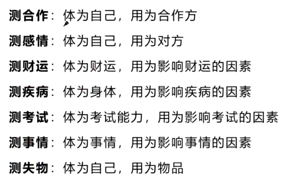

# 辅助工具

```
<font color="#67C23A">**禄**</font>
<font color="#800080">**权**</font>
<font color="#409EFF">**科**</font>
<font color="#FF0000">**忌**</font>

<font color="#F56C6C"> 红色提示色
```


# 梅花易数测算篇

## 认识阴阳


<font color="#F56C6C">**阳**</font>：凡是积极向上的事情都属阳，如天、太阳、上、君王、丈夫、昼等

<font color="#409EFF">**阴**</font>：凡是消极后退的事物都属阴，如地、月亮、下、臣子、妻子、夜等


## 梅花中的阴阳


阴阳的转换与体现：<font color="#FF0000">动</font>与<font color="#409EFF">静</font>、<font color="#FF0000">主</font>与<font color="#409EFF">客</font>、<font color="#FF0000">阳</font>与<font color="#409EFF">阴</font>、<font color="#FF0000">旺</font>与<font color="#409EFF">衰</font>、<font color="#FF0000">外</font>与<font color="#409EFF">内</font>、<font color="#FF0000">上</font>与<font color="#409EFF">下</font>、本质<font color="#FF0000">好</font><font color="#409EFF">坏</font>等


## 五行


五行相生：金生水、水生木、木生火、火生土、土生金。

表示生方与被生方有促进增长的作用；相反，生方与被生方耗泄。


五行相克：金克木、水克火、木克土、火克金、土克水

表示一事物对另一事物的制约和克制作用。


五行反侮(wu)：

土旺木衰，木受土侮；

木旺金衰，金受木侮；(比如用美工刀去砍树，金克木但是现在克不动了)

水衰火旺，水受火侮；

土衰水旺，土受水侮；

金旺火衰，火受金侮。

**由于五行的旺衰太过而导致的逆克现象**。


### 五行反侮


如图，卦象中五个金一个火，本来是火克金，但是现在金太强了，火克不动，反而伤了自己的金


如图，卦象中五个土一个木，本来是木克土，但是现在土太强了，木克不动，反而伤了自己的木


##  八卦


**太极生两仪、两仪生四象、四象生八卦**


<font color="#FF0000">**乾三连，坤六断；**</font>

<font color="#FF0000">**离中虚，坎中满；**</font>

<font color="#FF0000">**震仰盂，艮覆碗；**</font>

<font color="#FF0000">**兑上缺，巽下断。**</font>


### 先天八卦


**伏羲先天八卦取数字：**

**乾一 兑二 离三 震四**

**巽五 坎六 艮七 坤八**


文王后天八卦取方位与应期


## 八卦的五行


乾(阳)卦、兑(阴)卦五行属于金；

震(阳)卦、巽(阴)卦五行属于木；

艮(阳)卦、坤(阴)卦五行属于土；

坎卦五行属于水(阳)； 

离卦五行属于火(阴)。


## 起卦具体步骤 

以报数为例：8  2

1. 求出主卦（也叫本卦）

   将8作为上卦，2作为下卦，即可求出主卦

   

   

2. 求出变卦

   8+2=10，除以6的余数为4，为动爻，求得变卦：

   （主卦4爻如果是阳爻，变卦爻就变成阴爻）

   （主卦4爻如果是阴爻，变卦爻就变成阳爻）

   （除了动爻变化以外，变卦相对主卦其他爻不变）

   

   本卦：原因

   互卦：过程

   变卦：结果

   

3. 求出互卦

   主卦的3、4、5爻直接作为互卦的上卦

   主卦的2、3、4爻直接作为互卦的下卦

   

   

   

4. 明确体卦和用卦

   **不动为体**

   如果动爻在4、5、6爻（上），那用卦就是在上

   如果动爻在1、2、3爻（下），那用卦就是在下

   

## 起卦方式

### 时间起卦法

以时的数字除以8找余数做**上卦**（余数为0取坤卦）

以分的数字除以8找余数做**下卦**（余数为0取坤卦）

时分的数字相加之和除以6做动爻（余数为0取六爻）


距离：

测事情取手机时间：13点15分

时的时间：13除以8的余数，为5->巽

分的时间：15除以8的余数，为7->艮

时+分的数字：13+15=28，除以6的余数，为4爻动


### 随机报数起卦法

二位数：

以前位数字除以8找余数做**上卦**（余数为0取坤卦）

以后位数字除以8找余数做**下卦**（余数为0取坤卦）

两个数字相加之和除以6做动爻（余数为0取六爻）


举例：

测事情报数3、9
上卦：取前位数字（无余数）为3->离

下卦：取后位数字9除以8的余数为1->乾

动爻：3+9=12除以6的余数为0，取六爻


三位数：

以第一位数字除以8找余数 做上卦（余数为0取坤卦）

以第二位数字除以8找余数 做下卦（余数为0取坤卦）

三个数字相加除以6 做动爻（余数为0取六爻）


举例：

测事情报数2、6、1

上卦：取第一位数字为2->兑

下卦：取第二位数字为6->坎

动爻：2+6+1=9除以6的余数为 3爻动


### 年月日时（阳历）起卦法

（如问今年运势如何这种以年为单位的问题、一年只会取一次卦的事情）

以年月日除以8找余数做上卦（余数为0取坤卦）

以年月日时除以8找余数做下卦（余数为0取坤卦）

以年月日时除以6找余数做动爻（余数为0取六爻）


举例：2023年4月9日13点30分，测事情

上卦：卯4+4+9=17除以8的余数为1，乾

下卦：卯4+4+9+未8=25除以8的余数为1，乾

动爻：4+4+9+8=25除以6的余数为1爻动


## 卦盘的解释——主互变


## 体用分辨


## 体用分辨




（不建议测疾病，有病去医院）


## 体用生克——根本


**唯一一个同属性相互冲的卦就是坤艮**


**不变为体**


## 旺衰——（能量）


体卦旺相，主卦用生体，变卦体生用，事先好后坏，可成功有损耗
体卦旺相，主卦用克体，变卦用克体，不成功
体卦旺相，主卦体生用，变卦用生体，能成功
体卦旺相，主卦用克体，变卦体生用，不成功
体卦旺相，主卦体生用，变卦体克用，花钱费力能成功
体卦旺相，主卦体生用，变卦用克体，事情不能成功
体卦旺相，主卦体生用，变卦体生用，花钱能成功
体卦旺相，主卦用生体，变卦用生体，过旺事情不能成功
体卦旺相，主卦体克用，变卦体克用，能成功
体卦旺相，主卦体克用，变卦体生用，不成功
体卦旺相，主卦用生体，变卦体克用，能成功
体卦旺相，主卦用克体，变卦用生体，能成功
体卦旺相，主卦用克体，变卦体克用，费力成功
体卦旺相，主卦体生用，变卦用克体，不成功
体卦不旺，主卦用生体，变卦用生体，能成功
体卦不旺，主卦用生体，变卦用克体，先好后坏
体卦不旺，主卦用生体，变卦体生用，不成功
体卦不旺，主卦用生体，变卦体克用，能成功
体卦不旺，主卦用克体，变卦用克体，不成功
体卦不旺，主卦用克体，变卦用生体，能成功
体卦不旺，主卦用克体，变卦体生用，不成功
体卦不旺，主卦用克体，变卦体克用，不成功
体卦不旺，主卦体生用，变卦体生用，不成功
体卦不旺，主卦体生用，变卦用生体，能成功
体卦不旺，主卦体生用，变卦体克用，体旺时成功
体卦不旺，主卦体生用，变卦用克体，不能成功
体卦不旺，主卦体克用，变卦用克体，不能成功
体卦不旺，主卦体克用，变卦用生体，能成功
体卦不旺，主卦体克用，变卦体生用，不能成功
体卦不旺，主卦体克用，变卦体克用，体旺之年月日时能成功
体卦不旺，主卦体用比和，变卦体用比和，事情能成功
体卦不旺，主卦用生体，变卦体用比和，事情能成功
体卦不旺，主卦用克体，变卦体用比和，事情能成功
体卦不旺，主卦体生用，变卦体用比和，事情能成功
体卦不旺，主卦体用比和，变卦体生用，花钱可成功
体卦不旺，主卦体用比和，变卦用生体，事情能成功
体卦不旺，主卦体用比和，变卦用克体，事情难成功
体卦不旺，主卦体用比和，变卦体克用，事情能成功
体卦旺相，主卦用生体，变卦体用比和，事情能成功
体卦旺相，主卦用克体，变卦体用比和，事情能成功
体卦旺相，主卦体生用，变卦体用比和，事情能成功
体卦旺相，主卦体克用，变卦体用比和，事情能成功
体卦旺相，主卦体用比和，变卦体用比和，事情能成功
体卦旺相，主卦体用比和，变卦体克用，事情能成功
体卦旺相，主卦体用比和，变卦体生用，事情能成功
体卦旺相，主卦体用比和，变卦用克体，事情能成功


## 八卦万物类象

### 乾金


### 兑金


### 离火


### 震木


### 巽木


### 坎水


### 艮土


### 坤土


# 梅花易数化解篇


