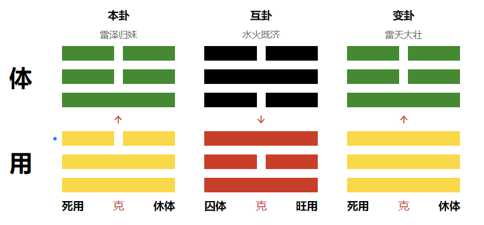

# 辅助工具

```
<font color="#67C23A">**禄**</font>
<font color="#800080">**权**</font>
<font color="#409EFF">**科**</font>
<font color="#FF0000">**忌**</font>

<font color="#F56C6C"> 红色提示色
```


# 梅花易数之测算篇

## 一、基本概念

### 1. 阴阳

#### 1.1 认识阴阳


<font color="#F56C6C">**阳**</font>：凡是积极向上的事情都属阳，如天、太阳、上、君王、丈夫、昼等

<font color="#409EFF">**阴**</font>：凡是消极后退的事物都属阴，如地、月亮、下、臣子、妻子、夜等


#### 1.2 梅花中的阴阳


阴阳的转换与体现：<font color="#FF0000">动</font>与<font color="#409EFF">静</font>、<font color="#FF0000">主</font>与<font color="#409EFF">客</font>、<font color="#FF0000">阳</font>与<font color="#409EFF">阴</font>、<font color="#FF0000">旺</font>与<font color="#409EFF">衰</font>、<font color="#FF0000">外</font>与<font color="#409EFF">内</font>、<font color="#FF0000">上</font>与<font color="#409EFF">下</font>、本质<font color="#FF0000">好</font><font color="#409EFF">坏</font>等


### 2. 五行

#### 2.1 五行相生 && 相克


- 五行相生：金生水、水生木、木生火、火生土、土生金。

  表示生方与被生方有促进增长的作用；相反，生方与被生方耗泄。


- 五行相克：金克木、水克火、木克土、火克金、土克水

  表示一事物对另一事物的制约和克制作用。


#### 2.2 五行反侮(wu)

> Tips：五行反侮是指由于五行的旺衰太过而导致的逆克现象

土旺木衰，木受土侮；
木旺金衰，金受木侮；(比如用美工刀去砍树，金克木但是现在克不动了)
水衰火旺，水受火侮；
土衰水旺，土受水侮；
金旺火衰，火受金侮。


如上图，卦象中五个金一个火，本来是火克金，但是现在金太强了，火克不动，反而伤了自己的金


如图，卦象中五个土一个木，本来是木克土，但是现在土太强了，木克不动，反而伤了自己的木


###  3. 八卦

八卦构成：每卦分为上、中、下三爻。

其中**—**为阳爻， **- -**为阴爻，三个爻组成一卦共有八种方式，共为八卦。

<font color="#FF0000">**《八卦取象歌》**</font>

<font color="#FF0000">**乾三连，坤六断；**</font>

<font color="#FF0000">**离中虚，坎中满；**</font>

<font color="#FF0000">**震仰盂，艮覆碗；**</font>

<font color="#FF0000">**兑上缺，巽下断。**</font>


**易有太极，始生两仪，两仪生四象，四象生八卦**


#### 3.1 先天八卦（取数）


**伏羲先天八卦取数字：**

**乾一 兑二 离三 震四**

**巽五 坎六 艮七 坤八**


#### 3.2 后天八卦（取方位与应期）


文王后天八卦取方位与应期


**乾(阳)卦、兑(阴)卦五行属于金；**

**震(阳)卦、巽(阴)卦五行属于木；**

**艮(阳)卦、坤(阴)卦五行属于土；**

**坎卦五行属于水(阳)；** 

**离卦五行属于火(阴)。**


## 二、起卦方式

### 1. 起卦具体步骤 

以报数为例：8  2

1. 求出主卦（也叫本卦）

   将8作为上卦，2作为下卦，即可求出主卦

   

   

2. 求出变卦

   8+2=10，除以6的余数为4，为动爻，求得变卦：

   （主卦4爻如果是阳爻，变卦爻就变成阴爻）

   （主卦4爻如果是阴爻，变卦爻就变成阳爻）

   （除了动爻变化以外，变卦相对主卦其他爻不变）

   

   

3. 求出互卦

   主卦的3、4、5爻直接作为互卦的上卦

   

   主卦的2、3、4爻直接作为互卦的下卦

   

   

   

4. 明确体卦和用卦

   > Tips：不动为体

   如果动爻在4、5、6爻（上），那用卦就是在上

   如果动爻在1、2、3爻（下），那用卦就是在下

   

### 2. 起卦方式

#### 2.1 时间起卦法

以时的数字除以8找余数做**上卦**（余数为0取坤卦）

以分的数字除以8找余数做**下卦**（余数为0取坤卦）

时分的数字相加之和除以6做动爻（余数为0取六爻）


举例：

测事情取手机时间：13点15分

时的时间：13除以8的余数，为5->巽

分的时间：15除以8的余数，为7->艮

时+分的数字：13+15=28，除以6的余数，为4爻动


#### 2.2 随机报数起卦法

二位数：

以前位数字除以8找余数做**上卦**（余数为0取坤卦）

以后位数字除以8找余数做**下卦**（余数为0取坤卦）

两个数字相加之和除以6做动爻（余数为0取六爻）


举例：

测事情报数3、9
上卦：取前位数字（无余数）为3->离

下卦：取后位数字9除以8的余数为1->乾

动爻：3+9=12除以6的余数为0，取六爻


三位数：

以第一位数字除以8找余数 做上卦（余数为0取坤卦）

以第二位数字除以8找余数 做下卦（余数为0取坤卦）

三个数字相加除以6 做动爻（余数为0取六爻）


举例：

测事情报数2、6、1

上卦：取第一位数字为2->兑

下卦：取第二位数字为6->坎

动爻：2+6+1=9除以6的余数为 3爻动


#### 2.3 年月日时（阳历）起卦法

（如问今年运势如何这种以年为单位的问题、一年只会取一次卦的事情）

以年月日除以8找余数做上卦（余数为0取坤卦）

以年月日时除以8找余数做下卦（余数为0取坤卦）

以年月日时除以6找余数做动爻（余数为0取六爻）


举例：2023年4月9日13点30分，测事情

上卦：卯4+4+9=17除以8的余数为1，乾

下卦：卯4+4+9+未8=25除以8的余数为1，乾

动爻：4+4+9+8=25除以6的余数为1爻动


## 三、认识卦盘

### 1. 主卦 && 互卦 && 变卦

主互变是古人看问题的三个步骤：

一切的事物都可以分成三个步骤来走。

**即:开始→过程→结果**

比如测感情：主卦是刚追求阶段，互卦是交往阶段，变卦是考虑结婚或者分手阶段。
比如测谈判：主卦是开始阶段，互卦是谈判阶段，变卦是谈判的结果。

同时互卦也是对主卦的修饰和补充(可看成一个主体)


### 2. 体用分辨

梅花易数断卦，是以“体”和“用”为主来分析吉凶的。

是指事物或人物之间的关系，由于用卦的变化对体卦产生了**生、克、比和**的关系，以此来分析人事的成败，主互变卦反映运动变化的全过程。

**体**:为事物的主体，为自己，为测卦人，为所测之事的主流。
**用**:为他人，为对方，为事物外因对体的作用关系。


测算事情的不同，体用组合也不同，如：

- **测合作**:体为自己，用为合作方
- **测感情**:体为自己，用为对方
- **测财运**:体为财运，用为影响财运的因素
- **测疾病**:体为身体，用为影响疾病的因素
- **测考试**:体为考试能力，用为影响考试的因素
- **测事情**:体为事情，用为影响事情的因素
- **测失物**:体为自己，用为物品

**（不建议测疾病，有病去医院）**


### 3. 体用状态：生克比合

#### 3.1 概念

生：是一种外界或别人的帮助、助力、推动等类似的力量
克：是外界或别人的阻碍、阻挠、妨碍、把控等类似的力量
比合：是“我”和“外界”或“别人”一样的行为力量，类似于“合作”

> Tips：**体用是“我”和“外界”状态之间的对比关系，并非最终结果**


- 用生体——<font color="#F56C6C">大吉</font>(如体卦为离火，用卦为震木)
- 体用比合——<font color="#F56C6C">中吉</font>(如体为金，用也为金)
- 体克用——<font color="#F56C6C">小吉</font>(如体卦为良土，用卦为坎水)
- 体生用——小凶(如体卦为乾金，用卦为坎水)
- 用克体——大凶(如体卦为巽木，用卦为兑金)


#### 3.2 例子

##### 例1：测感情


体卦震木为我方，用卦巽木和乾金为对方。
**通过五行生克关系可以看出**：
刚开始谈恋爱的时候(本卦)双方关系比较好(比合)
中间关系(互卦)起了冲突(坤艮相冲)
最后(变卦)对方挺烦我(用克体)，要跟我闹分手。

> Tips：唯一一个同属性相互冲的卦就是坤艮，既是比克，又是相冲


##### 例2：测相亲


体卦离火为我方，用震木和兑金为对方。
**通过五行生克关系可以看出**：
刚开始见面的时候，对方对我是有好感的。(震木生离火)
相处着对方发现了我的缺点，比较反感和失望。(良土克坎水)
最后我还是能把控局面的，成不成我方完全可以把握(离火克兑金)


### 4. 能量状态：旺相休囚死

#### 4.1 概念


以月份为例:

- **旺**——<font color="#F56C6C">大吉</font>

  与月令同五行，即：同我我为旺

- **相**——<font color="#F56C6C">中吉</font>

  月令的五行生体/用卦，即：生我我为相

- **休**——<font color="#F56C6C">小吉</font>

  体卦/用卦的五行生月令，即：我生我为休

- **囚**——小凶

  体卦/用卦的五行克月令，即：我克我为囚

- **死**——大凶

  月令克体卦/用卦的五行，即：克我我为死


如：

春天(寅月、卯月)属木，木在春天当令而旺。
木能生火，所以火也沾光开始发展了，叫做“相”，辅助的意思。
木由水而生，这时候水就像老年人一样要退休，叫“生我者休”。
金克木，可是木最旺的时候，金气很弱，克制不了木，处于被动状态，好像成了“囚犯”，有劲无处使。
木克士，木最旺的时候，克士最有劲，土也就最倒霉，土“死”


#### 4.2 例子

##### 例1：测病情？(申金月)


体卦坎水为我方，用卦乾金和离火为病情。
通过五行生克和旺衰关系可以看出
开始阶段病情有利(用卦为旺金生体卦相水)
治疗阶段有些力不从心(体卦为囚火克制用卦旺金)
最后结果虽然有点小问题，但病情可以把控的(体卦为相水克制用卦囚火)


##### 例2：测考试(午火月)



体卦震木为考试能力
用卦乾金和离火为影响考试发挥的因素，
通过五行生克和旺衰关系可以看出
开始阶段没有很好的学习(用卦死金克体卦休木)
考试过程 只发挥出了一小部分(体卦囚水克用卦旺火)
最后考试结果通过不了(用卦死金克体卦休木)


### 5. 库 && 空

#### 5.1 天盘入库与出库（能量的隐藏与释放）

> Tips：天盘库=卦与地支(令)之间，所以产生了外部能量，可以理解为外部环境/第三方


库=禁锢，房间，上锁，存放，储藏，不动，看得到摸不着等等，能量被锁住了，类似紫微天机忌

> Tips：库类似于能量的锁，入库就表示把能量给锁住了，有能量，但是锁住了无法释放，出库则表示能量可以释放出来

> Tips：库的时间到了自然就开了，月库看月，日库看日，时库看时，当然除了时间也有别的开库方法，但一般用于开财库，所谓冲库

> Tips：库开了能来也能去,就跟你钱包打开,不是往里放钱就是往出拿钱


**入库**的含义:起到“限制”、“制止”、“封闭”的作用
**出库**的含义:起到“解除限制”、“解除制止”、“解除封闭”的作用。


**辰戌丑未为四墓库位**，其中：
丑为金库(<font color="#E6A23C">乾兑</font>)和未相冲
辰为水库(<font color="#000000">坎</font>)和戌相冲
未为木库(<font color="#67C23A">震巽</font>)和丑相冲
戌为火库(<font color="#FF0000">离</font>)和辰相冲


#### 5.2 人盘入库（状态的隐藏与释放）

> Tips：人盘库=卦与卦之间，由于只是出现在卦盘中，所以它只有一个想法，没有能量

盘内入库的含义:
起到“限制”、“身旁”、“据为己有”的作用。
但只是对双方状态的描述，
并无实际能量隐藏的作用。


丑为金库(<font color="#E6A23C">乾兑</font>) —> 艮卦
未为木库(<font color="#67C23A">震巽</font>) —> 坤卦


**艮土收金入库，坤土收木入库**

以下八种卦象即为人盘入库情况：


> 其中，**当人盘木库时，一般为ATM现象**，如：
>
> 
>
> 直读为：命主想收人家姑娘入库，姑娘还克命主，克者得财，命主是姑娘的ATM


#### 5.3 空

空=没有，外壳，空有其表，缺，阴性磁场，虚假等等，能量比死还要低，参考紫微里的地空+天空+旬空

> Tips： 空有时候也要结合八卦本身,如巽木空,想多了,或者空想;兑金空,说空话;乾金空,如果处旺地的话可以说看似有钱,其实是个空壳
>
> 测感情,如果遇到什么离火空,坎水空啥的,也代表虚情假意
>
> 在体空,可以延伸 空虚,心里没底,没有安全感,或者事情容易成空


根据上图八宫：

子丑空亡=坎卦、艮卦(子=坎，丑=艮)
寅卯空亡=震卦
辰巳空亡=巽卦(辰巳位于巽宫)
午未空亡=离卦、坤卦(午=离，未=坤)
申酉空亡=兑卦
戌亥空亡=乾卦(戌亥位于乾宫)


## 四、解卦步骤

解卦要一层一层叠加，尤其刚入门，
第一层体用生克，体用分清，然后看对待关系
第二层看旺衰，具体能量的展示，
第三层看八卦的**万物类象**，带入万物类象去解卦
第四层看库和空，有没有隐藏的能量和信息
第五层看卦意，整体卦名代表了什么意思
第六层看爻辞，一般不用，但如果信息不多可以当做一个侧面描述的叠加
第七层看神煞，神煞里有时候能共振一些有用信息


# 梅花易数之万物类象


### 乾金☰

> <font color="#F56C6C">**乾为天、为圆、为君、为父、为金。**</font>
>
> 纯阳，五行属金，方位西北，数为一，金色，味辣。

关键词：<font color="#F56C6C">**1.脑袋 2.圆形 3.首领/长辈/领导 4.贵重 5.坚硬 6.金属 7.权威**</font>


- **性格**：
  - 积极面：性刚果绝、威严、豁达、重义气、正直、霸道、坚恒、威严、有创造性、所向披靡、老成。
  - 消极面：死板、主观、傲慢、愤怒、制裁、冷酷、压抑、专横。
- **人物**：
  - 代表上层人物：领导者、决定者、有权的人、富有者、当官的人、父亲、家长、执法者、管理者。
  - 若是过于傲慢专横不讲理者为恶人
  - 若是过于自谦者，则为乞丐、下人。
- **场所、建筑物**：皇宫、京城、省城、都市、博物馆、寺院、名胜古迹、政府机构；大会堂、广场、车站、人行横道、郊野、远处、学校楼。

- **人体**：头、大肠、胸部、肺、健壮之人或体寒骨瘦之人、骨、脑。

- **物象：**
  - 高档物：金玉珠宝、古董文物、金钱、首饰、玛瑙、钟表
  - 圆形物：钟表
  - 刚硬物：高级轿车、火车、飞机
  - 金属物：实心金属制品、机器
  - 其他：辛辣物、高大物、帽子、镜


### 兑金☱

> <font color="#F56C6C">**兑为泽，为少女，为诬，为口舌，为折毁(申酉金之秋月，主肃杀)，为喜乐，为妾(阴爻附于二阳爻之上)，为雄辩。**</font>
>
> 五行属阴金，其数为二，居西方，色白，味辛辣。

关键词：<font color="#F56C6C">**1.嘴巴 2.缺口 3.破损 4.少女 5开心 6.动嘴/口舌/饮食**</font>


- **性格：**
  - 积极面：喜悦、亲热和乐、温和、善言、音唱歌、活跃、温厚、重感情、感召力强
  - 消极面：吵架、毁谤、拍马屁、卑劣、奉承、色情、破坏性、口谗
- **人物：**
  - 少女
  - 与用口或说/唱有关的职业的人：老师、教授、解说员、翻译、外科牙科医生、饭店人员、口舌类小人、传销者、推销员
  - 欢乐性职业者：妓女、艺妓、非处女、性魅力者、
  - 破坏性职业者
  - 巫师
- **场所、建筑物**：
  - 为泽：沼泽地、坑洼地、凹池、水井、浅沟、湖泊地潭
  - 为口：音乐厅、饭馆、演出厅、门口、路口、山口、工会、公关部、交易所。
  - 为毁：垃圾站、废墟、井坑、旧屋宅、洞穴、巢穴、山洞、墓穴

- **人体：**口、舌、喉、牙齿、肺、气管、口角、肛门。

- **物象：**
  - 饮食用具：食品、盛水器具
  - 破损物/缺口物：开口瓶罐、修理品、无头之物、头有破损之物
  - 废弃物：废物，垃圾箱
  - 其他：刀剑玩具、乐器、玻璃制品、眼镜、金属饰品金属钱币、表


### 离火☲

> <font color="#F56C6C">**离为火为日为电，为中女，为房、为文化场所、文凭、为甲胄、为干燥、为鳖、为蟹、为蚌、为外刚内柔**</font>
>
> 两阳交居外，内包一阴爻居中，其数为三，五行属火，居南方，色红，味苦。

关键词：<font color="#F56C6C">**1.眼镜 2.外刚内柔 3.漂亮 4.婚姻离火卦，六冲卦 离=离婚**</font>


- **性格：**
  - 积极面：重礼、好美、聪明好学、知书达理
  - 消极面：性急、易冲动、内心空虚、外强中干
- **人物：**中女、文人、大腹人、目疾人、戴头盔者、士兵。
- **场所、建筑物**：
  - 为日：朝阳的土地、名胜地、圣地、寺庙、教堂、殿堂、大会堂、阳台
  - 为火：窑炉、冶炼厂、火小、喷火口、火灾场所、
  - 为电：电厂、印刷厂、医院、放射科、检验科、厨房、华丽的大厅
  - 为文化场所：学校、博物馆、展览馆、影剧院、证券交易所、银行、图书馆、书店；
  - 为甲胄：部队、军营、派出所、公安局、法院、检察院
  - 为房：场、仓库、空房屋、桥梁、立交桥、轿子、棚子、火车站、电车站；

- **人体：**眼目、心脏、血液、乳房、头面、小肠

- **物象：**
  - 为文化：文学艺术、美术字画
  - 为文凭：文件文章、文凭、书报杂志、证卷、合同、旗帜广告、奖状
  - 为电：电话、电报、发动机、红绿灯、微波炉、液化气灶
  - 为火：干肉、煎炒、烤箱、火柴、打火机、火炉、锅炉、
  - 为房


### 震木☳

> <font color="#F56C6C">**震为雷，为龙、为长男、为苍竹、其于马也，为善鸣。**</font>
>
> 数为四，五行属木，居东方，色碧青，味酸。

关键词：<font color="#F56C6C">**1.足 2.雷 3.直 大 粗 4.响 5.行动**</font>


- **性格：**
  - 积极面：多动少静、仁慈、直率。
  - 消极面：性急易怒、脾气大、暴躁、倔强。
- **人物：**长男、大男、乘务员、指挥员、当头的、行政人员。
- **场所、建筑物**：
  - 为苍竹：山林野地、林区、东向屋舍
  - 为善鸣：演凑会场、广播电台、邮电局、音像电器乐器店、歌舞厅、音乐茶座、杂技场、花店、闹市、噪声大之场所、喧哗地、游乐场所、大道、机场、发射场一战场靶场、军警公安部门。
- **人体：**足、头、腿部、肝脏、神经、筋、左肋、右肩臂。
- **物象：**
  - 为苍竹：树木、竹子、鲜花、蔬菜、多节物、嫩芽、青绿色物、茶货
  - 为善鸣：鞭炮，音响乐器，大车、飞机、飞船、火箭、大炮，闹钟


### 巽木☴

> **<font color="#F56C6C">巽为木为风，为长女，为顺利，为长，为高，为进退，为多白眼，为利市三倍，为入，为基础不稳</font>**
>
> 其数为五，五行属木，居东南方，色蓝，味酸。

关键词：<font color="#F56C6C">**1.屁股 2.风(天空 草从) 4.柔软 5.思路(想法) 6.连接(线状都是巽木) 7.说的少 想得多**</font>


- **性格：**
  - 积极面：柔和细心，仁慈直率，爱清洁，
  - 消极面：反复无定，心志不定，薄情，爱吃醋，说谎，疑惑隐伏，坚音、轻浮、烦躁、多欲等。
- **人物：**长女、僧尼、仙道之人，气功师、商人、教师、医生、技术人员、手艺人、科技工作者、作家、宗教人员、设计师、公关交际人员、造谣者，优柔寡断之人、产妇
- **场所、建筑物**：
  - 竹林草原，直而宽的道路、过道、长廊、寺观；
  - 各种线路，管道、通风、通气、出入通道；
  - 邮局、商店、码头、港口、机场、发射场、索道、升降机、传送带、工艺工厂、设计院。

- **人体：**头发、神经、气管、呼吸器官、食道、肠道、左肩、血管、胆、腰腿

- **物象：**木材、床、桌、绳子、邮件、标枪、管形物、皮带、气球、汽艇、帆船、飞机，草药，救生圈、索道、传送带。


### 坎水☵

> **<font color="#F56C6C">坎为水、为沟读、为中男、为隐忧为娇柔、为血卦、为床、为月、为盗、为外柔内刚、为车、为智</font>**
>
> 外柔而内刚，五行属水，居北方，色黑，味咸。数六

关键词：<font color="#F56C6C">**1.水，2.曲折、劳累 3.智慧(脑子灵光 脑子活，衰的时候代表小聪明)4 肾**</font>


- **性格**：
  - 积极面：外柔内刚、足智多谋
  - 消极面：多心计、城府深、奸诈、功于心计、多欲、多奉迎

- **人物**：中男、江湖之人、船上工作人员、思想家、发明家、数学家、书法家、心理学家、安全保安人员、自来水公司工人、劳苦者、劳务者、印刷工人、贫困者、水货商、冒险者、酒鬼病人、多情轻浮者、诱惑者、诈骗者、有犯罪历史者、失败破产者、中毒者、妇女、受灾者、流亡者。

- **场所、建筑物**：
  - 大川、江湖海河、溪涧泉水、湿泥泞地、水道。
  - 酒吧、冷饮店、浴所。
  - 澡池、鱼市、鱼塘；
  - 水厂、自来水公司、漆脂厂、冷库、水族馆、
  - 车站、车库、地下室、暗室、黑暗场所、牢狱。

- **人体：**肾脏、膀胱、泌尿系统、性器官、血液、耳、背、腰、免疫系统。

- **物象：**带核之物，油、盐、酒、酱、醋、饮料、波体物质、染料、涂料、汤药、汤、车、排水供水设备、潜水艇、黑色物、变形之物。

### 艮土☶

> **<font color="#F56C6C">艮为山,为经路、为门、为小石、为狗、为寺庙、为坟地、为指、为节之木</font>**
>
> 五行属土，居东北方，色黄，味甘，数为七。

关键词：<font color="#F56C6C">**1.山(凸起的)2.停止，阻碍，阻挡 3.门，房子 4不会变通 慢性子 死心眼,执拗**</font>


- **性格：**
  - 积极面：憨厚、诚实、守信用。
  - 消极面：固执、迟滞、死心眼儿。

- **人物**：小儿子、门卫、领头的、同性恋。
- **场所、建筑物**：山、土包、土墩、假山、丘陵、坟墓、堤坝、最高点、境界、山路、小路、矿山、采石场、阁、寺、房屋、门闩、贮藏室、宗庙、祠堂、帐蓬、影壁、城墙、围墙、大修、仓库、银行、车站、岗位、监狱。

- **人体：**鼻、背、脾胃、手背、关节、趾、皮、手脚、左足、乳房左下腹、肿瘤结石、气血不通。

- **物象：**场所，岩石、门、凳子、床、柜子、假山、坟墓、公墓、交叉点、最高点、矿山、采石厂、宝藏室、土包、大楼、仓库、停车场、监狱、房子、医院、学校、山路。

### 坤土☷

> **<font color="#F56C6C">坤为地、为母、为方、为布为吝啬、为子母牛、为众、为阴虚能容之物、为方型之物、为锅、为布软弱无力的、勤劳忍耐、吝啬、优柔寡断、穷困、逆来顺受、思想狭小 。</font>**
>
> 三个阴爻，其数为八，五行属土，居西南方，色黄，味甘。

关键词：<font color="#F56C6C">**1.包容 谦让2本分老实 3女性 女性用品**</font>


- **性格：**
  - 积极面：温厚柔顺、贞节勤俭、诚实、恭敬谦让、贞节、简约、守信诚实、
  - 消极面：吝啬、懦弱、小气、固执迟钝。感情暧昧不断改进、固执迟钝、邪恶

- **人物**：皇妃、大臣、大众、祖母、老母、后母、妻子。女主人、妇女、阴气盛之人、忠厚之人、大腹之人、农夫俗子、小气者、消极者、胆怯者、房地产者、泥瓦工、小人、尸体。

- **场所、建筑物**：城市、乡村田野、平原平地、郊外、牧场、庄稼地、原籍、老家故乡、操坪广场空地、平房农舍。旧屋粮库、贮藏室、农贸市场、市场、肉类加工厂、鸡窝猪舍兔笼等。

- **人体：**腹部、胃、肉、右肩、脾、肉、消化器官、女性生殖器、右肩、肌肉

- **物象**：城市居民点、国邦、田、土、窖、方形物、柔软之物、布帛丝棉、衣服被褥、妇女用品、文章、书报、纸张、箱包袋子、轿子大车、车轮、土中之物、陶器制品，石灰水泥、砖砂、五谷杂粮、牛肉野味、甘美之物、柄把。


# 梅花易数之64卦卦意


# 梅花易数之修行篇

## 一、金光神咒

> Tips：被动技能，提升能量值上限，类似蓝条

> Tips：修习金光神咒时，需要观想头顶有金色万丈照耀在自己身上(体有金光、覆映吾身)，在自己身上化为金色的外衣(形状不限)，需要时随念出现，不需要时就收入体内


## 二、剑指

> Tips：开剑指第15步的时候 手掌握成剑指状时 观想天上万丈金光照到剑指上，同时用丹田发力念：剑开

> Tips：每次用剑指的时候开一遍


## 三、金光水

**操作步骤**

1. 先开右手剑指

   开剑指第15步的时候 手掌握成剑指状时 观想天上万丈金光照到剑指上，同时用丹田发力念：剑开

2. 左手掐三山诀，右手剑指

   

3. 准备一碗水

4. 开始修炼

   每天午时之前（包括午时）右手先开剑指，开后左手持三山诀，把小碗架在三山诀上,右手剑指对着碗中的水，念一遍金光咒，在水中虚空画一遍金光篆，一共49遍咒，49遍篆，边念边观想万丈金光照到碗里，越来越浓厚，最后功毕把碗里的水喝掉。

   


金光篆：


从1开始画，由内到外，然后2345是✓的顺序


## 四、道家四灵防护法

> Tips：被动技能，提升防护能力，类似护盾值

任何的修行者都要注视防范外道邪魔的干扰，这干扰里有的是自身的习气和业障所化现，也有的是真的外界干扰，所以历代都有很多防御的法门，比如漫天华盖法，28宿护身法，大小金光法等等。现在介绍一种最常使用的，方法简单有效，不仅专业的灵修者可以使用，就算是一般人也一样可以使用:

**在每次静修前，左手大指点卯诀，念咒语“青龙孟章侍吾左”.**

**再点酉诀，念咒语“自虎监兵卫吾右”.**

**再点午诀，念咒语“朱雀灵光导吾前”.**

**最后点子诀，念咒语“玄武持明从吾后，翁，翁，翁”.**

**最后收法时，双手合十，默念“护体灵光速归身，固若金汤卫真人”三遍**

**即可收回护体灵光，自由活动了。**

在念咒语时，要同时观想四灵神兽分别从所属方向飞来身边守护住自己的前后左右，四种颜色的灵光充满周围的空间。如此护身法修持完毕，接下来就可以再去修习其他的法门了。如果是一般的人只想用来做一下护身，到现在就可以去做其他的事情啦，只要时刻保持这个意念就可以了。


# 梅花易数之风水化解篇

## 一、概念

1. 在天成象
   比如紫微和四柱所展现出来的垂象，即是天垂象，它有生辰带来，无法被改变。举个例子就像你出生的时候身上就带着个炸弹，这个是无法改变的事实.

2. 在地成形
   它是可以由人捕捉到的东西，相当于一种能量磁场的影响，即是风水和行运，比如说这第1点中的炸弹爆炸的威力，是可以进行计算和测量的。可以作为主要化解的部分。关于化解，需要掌握八宫的知识，在后文中会提到。比如说乾宫（西北方）放了一盆花，当这盆花枯萎了，财运就会收到影响，当我们把这盆花搬到别的宫或者直接扔掉，即可改变这个不好的能量磁场。 
3. 在人应事
   它指的是人的行为，就如第 2 点中说的扔花的这个行为，或者是上面炸弹的例子中， 引爆炸弹的行为，即是应事在人的表现。


## 二、原理


由于天垂象是无法改变的能量，所以我们只能改变行运（风水）和行为，当改变的行运能量加上行为的能量大于天垂象能量的时候，就可以达到改运或者化解的目的。

**梅花化解主要是从本卦和互卦进行化解**，因为变卦已经是结果了。本卦为事情的起因或者开始的状态，互卦是发展的过程，变卦是事情的结果或者最终的状态。 

<font color="#F56C6C">测感情</font>：本卦是刚追求阶段，互卦是交往阶段，变卦是感情的最终状态或者结果。 
<font color="#F56C6C">测谈判</font>：本卦是谈判开始阶段，互卦是谈判的过程，变卦是谈判的结果。


## 三、取像与分类

1. 取象

   人（行为） —— 阳 

   地（风水） —— 阴

2. 分类

   阴面磁场能量是大于阳面的磁场的，阴面的能量会影响到阳面的行为、思想和风水。
   好的磁场能量会对人有积极的影响，比如乐观、有干劲儿、思维活络、沟通顺畅等等。
   不好的磁场能量会对人产生消息的影响，比如消极、懒、脑子短路、产生误会等等。
   比如说家里一对的摆件，嘴对嘴摆放主口舌是非，比较好的摆放方式是并排摆放。（此处希望加入更多比较常见的例子）

   

   关于物件儿能量磁场大小： 

   开光的 > 未开光的 

   老旧的 > 新的 

   体积大的 > 体积小的 

   化解原则就是**大事大办，小事小办，无事不办。**

   

## 四、八宫

八宫为八卦方位所在宫位，需要以圆形发散方位来看。
比如说山水蒙卦问财运的化解方法，首先艮土克坎水，假如体卦是坎水，用“金”（ 金属制品）可以形成土生金，金生水的通关化解法。而化解的地方，就是我们要“立太极”的地方。

以下是常用的太极点：

1. 房子 
2. 卧室
3. 客厅
4. 书房/办公室
5. 工位/书桌

比如说乾位有东西阻挡了财运，需要看太极点的西北位（乾卦位），通常需要每个太极点都检查或者布局。但是从影响力来看，由上到下是从大到小。而太极点在方位上，只有第 5 点是卦主面前的位置为离位，其他方位按照八宫以此类推。其他 4 个太极点都需要取绝对地理位置上的方位。太极点中缺角代表该宫位能量不足而突角代表能量过剩，**在化解中一 般化缺不化突。**


缺角补角（无论什么方法都达不到 100%能量） 
例如：巽木=东南方缺角 用☴**卦图**，或者加数字（数量）。 
1.先天数字 卦的类象 画
2.卦图(颜色 同五行)

> Tips：优先补六亲相关的位置


> Tips：买罗盘的时候一定要买方的，圆的那种叫罗经，罗盘是看阳宅的，而罗经是看阴宅的。福禄寿喜财，皆从西北来。


## 五、思维转变

​	在梅花中分为<font color="#F56C6C">测算思维</font>和<font color="#F56C6C">环境思维</font>，解卦需要用测算思维，而化解需要用到的是环境思维，其中：

- <font color="#F56C6C">测算思维</font>：针对事情，比如情绪、关系、状态、吉凶。
- <font color="#F56C6C">环境思维</font>：针对宫位、物品与能量，比如乾代表西北、圆的、白色或金色。

上面说的能量指的是五行的月令能量（旺相囚休死）。

比如说火风鼎测财运，巽木生离火，离火是体，测算思维来看，是有收获的。环境思维的话，离火代表宫位，巽木代表物品，可以解释为在正南方（离宫）有 3～5 盆花

> Tips：在梅花卦中，动为物品，不动为宫。但是在论六亲或者居住关系的时候，上挂为物品，下卦为宫位。


宫位定像：

1. **不动为<font color="#F56C6C">体</font>，即为<font color="#F56C6C">宫</font>。克、生、比即为<font color="#F56C6C">作用物</font>。**
2. **受克、泄、耗者为<font color="#F56C6C">宫</font>。另一方为<font color="#F56C6C">作用物</font>。**

以上是两个不同的定宫概念，一般情况下以第一点定宫，需要<font color="#F56C6C">本卦</font>和<font color="#F56C6C">互卦</font>同参。

梅花卦盘可以用时间取动爻。化解完了以后可以再起一卦问问事情是否解决。
比如说之前有空，看空有没有补上；
之前耗泄，看看还有没有耗泄；
之前是山水蒙或者山风蛊，看看是否还有蒙或者蛊的能量。
总之就是检验上一个卦盘上对自己不利的部分有没有改善或者消失。

> Tips：时间是最符合动爻感觉，可以用时+分和 6 取余数动爻


配合卦盘五行生克辅助判断：

- **物生宫 —— 对应顺利**

  比如东南方放一个小鱼缸或者六瓶矿泉水，属于水（物）生木（宫），对应顺利。

- **宫生物 —— 对应消耗**

  对卦主来说是耗泄，流财。

- **宫克物 —— 对应获得**

  克者为妻财，对应着得财。比如乾位摆发财树，会利得财。

- **物克宫 —— 对应不顺**

  比如震位放了金属，金属物克到了震木宫。

举例：西北乾位是厨房，代表离火克着乾金，符合物克宫的象，此时可以在厨房里放五方财土（五个银行门口的土）或者铜铃。用五方财土的目的是用火生土，土生金的原理实现 通关的化解方法。


<font color="#F56C6C">**注意**：在化解的时候一定要考虑旺衰问题，比如说在乾宫已经缺角了，代表乾位能量不 足，此时再放草本植物，宫位克不动，会出现反侮的情况。一定要大对大，小对小，阴对阴， 阳对阳。多大的能量，办多大的事儿。在化解之前需要起卦接磁场能量去看哪些地方需要调整，在没有起卦之前调整不一定有用，比如说在乾宫放金蟾催财，也许你本身乾位能量就不缺，再补也是无济于事，此时就需要从卦盘去找其他宫位进行化解。</font>

> Tips：草本植物属木，但是会开花的，特别是艳丽的那种属火（如玫瑰），所以要注意植物摆放，另外，**中宫一定不要放绿植**， 特别是木本植物，会形成“困”局。


## 六、自我保护

​	在动风水之前，需要对自身进行保护，以免被不好的磁场能量干扰到自己正常的能量。 帮别人处理的时候也一样（别人作为执行人没有影响）。可以念金光咒或者护身咒。或者通过自己出生年的年干来找自己的一些护身物。

### 1. 天干

| 生年天干 | 护身物代表                                                   |
| -------- | ------------------------------------------------------------ |
| 甲       | 龟甲、棍                                                     |
| 乙       | 桃木棍                                                       |
| 丙       | 圆镜子                                                       |
| 丁       | 火机（符合丁的象就行）                                       |
| 戊       | 大象                                                         |
| 己       | 貔貅（别买手串、貔貅本身就是光进不出的象,手串会把屁股给掏开，破宫） |
| 庚       | 麒麟、狮子                                                   |
| 辛       | 五帝钱                                                       |
| 壬       | 水晶                                                         |
| 癸       | 金蟾                                                         |

> Tips：护身物尽量开光

开光步骤：

1. 盐水泡一小时，然后用盐（最好海盐）搓。其原理是净化，因为盐属辛。金曰从革。 
2. 太阳晒三小时（或三天、三个月）。
3. 剑指对着物品念金光咒至少三遍，念三天。

<font color="#F56C6C">**注意：物品开光后不能碰水，不能沾污秽。如果碰水或者沾了污秽，需要重新开光。**</font>


### 2. 地支（怎么用？？）

**甲戊庚牛羊，乙己鼠猴乡，丙丁猪鸡位，壬癸蛇兔藏，六辛逢虎马，此是贵人方。**

可以找对应的象放在房间里，也可以在房间里摆相应的阵。也可以用上述口诀催贵人，比如甲年生人，贵人属牛或者羊，其中属牛的为昼贵人，属羊的为夜贵人。假如是摆阵放家里面看家宅，需要在地支对应的方位摆对应的阵法。比如甲年生人可以摆牛阵或者羊阵。当然，阵法只是临时应急用，平时就找到对应的象放在相应位置上就可以了。

十二生肖/地支对应的阵法见下图：


### 3. 能量符

带在身上加强自身的能量，在对应宫位烧掉增强宫位能量。需要用红笔、黄裱纸。 在画到**罡符胆**的时候需要念诀：

1. 先四字头 —— 开天门
2. 一横 —— 塞鬼路
3. 一竖 —— 闭地府
4. 一横 —— 留人路
5. 一竖 —— 杀鬼卒
6. 一横 —— 破鬼肚


## 七、化解

### 1. 时间选择、库、空

#### 1.1 时间选择

拆补通关三种选择本宫的时间，例如:坤宫:13-17点之间.未日申日或未月申月.
填空选择空亡的时间,冲空选择空亡对宫的时间,例如:戌亥乾金空,选19-22点,冲空选择辰巳时7-11点
库的时间选冲库的时间来开库,原理与冲空相同.
时间选择里日月时,叠加越多,能量越大,
冲=开和动.例如空的地方填实了之后没有动,那就需要冲空.
当然本身短时间的事情化解,就不需要考虑月了,能量可以通过别的方法来找补.


拆的话也可以用**对宫（后天八卦取对宫，如拆离宫物品取坎宫时间）**的时间表：

乾宫 —— 19-23 点之间，戌日亥日，戌月亥月 
兑宫 —— 17-19 点之间，酉日，酉月 
离宫 —— 11-13 点之间，午日，午月 
震宫 —— 5-7 点之间，卯日，卯月 
巽宫 —— 7-11 点之间，辰日巳日，辰月巳月 
坎宫 —— 23-1 点之间，子日，子月 
艮宫 —— 1-5 点之间，丑日寅日，丑月寅月 
坤宫 —— 13-17 点之间，未日申日，未月申月


填空选择空亡的时间：

子丑坎水、艮土空 —— 选 23-3 点之间 
寅卯震木空 —— 选 3-7 点之间 
辰巳巽木空 —— 选 7-11 点之间 
午未离火、坤土空 —— 选 11-15 点之间 
申酉兑金空 —— 选 15-19 点之间 
戌亥乾金空 —— 选 19-23 点之间


#### 1.2 冲库

**辰戌丑未为四墓库位**，其中：
丑为金库(<font color="#E6A23C">乾兑</font>)和未相冲
辰为水库(<font color="#000000">坎</font>)和戌相冲
未为木库(<font color="#67C23A">震巽</font>)和丑相冲
戌为火库(<font color="#FF0000">离</font>)和辰相冲


冲空选择空亡对宫的时间（后天八卦取兑宫），例如：戌亥乾金空，冲空选择辰巳时（7-11 点） 
库的时间选冲库的时间来开库，原理与冲空相同。 
时间选择里日月时，叠加越多，能量越大。 
冲=开和动。例如空的地方填实了之后没有动，那就需要冲空。


### 2. 拆

指**拆除**，就是把不好的能量或者物品拆掉，比如说乾宫有一盆枯萎的植物，将植物移除，兑宫有个空箱子，把空箱子去掉的过程，就叫拆。对体卦产生负面磁场的时候就可以使用拆（例如：克、耗、泄、库、空）。比如在东南方巽木位方了金蟾，就可以将金蟾移动到其他宫位。卦盘内也是一样的道理。主要是不让它产生不好的磁场能量输送。

**注意：拆除风水件，老物件的时候要念净天地神咒和盐水拖地。**

> Tips：扔的时候，风水物或者年代久远的，可以扔到桥中或者从桥中扔下，桥是斩断磁场最快的，扔完再扔两个硬币，念:恩恩怨怨，钱币了断，但是关于比如佛牌，古曼童，狐仙什么的带灵性磁场的东西，最好还是送观里或者庙里。


### 3. 补

指**补益**，就是为宫位增加能量，比如在乾宫放金蟾，或者五方财土。补益的时候可以用宫位一样的能量，也可以用生宫位的能量。当卦逢空、处囚死地（衰弱的状态）时， 表示卦主对所问事情状态无力，映射出磁场能量无力，此时需要在卦盘内定宫位，用生 宫位或同宫位的五行去补益宫位能量。

> Tips：在补益的时候如果想要起效快，可以念下面的补时口诀，其中红色部分可以改成需要催发的事情，比如感情。 适用于放风水物或者针对比较急，比较大的事情的时候念。主要为了更快的接磁场。

**昆仑九天，吾命通仙，放上此物，镇守凡间，<font color="#F56C6C">催财发财，催官发官。</font>急急如律令。**


### 4. 通关

通关是指用一个中间属性的能量，化解掉物和宫之间的相克能量。当体卦受克（衰 弱的状态），代表此事对卦主不利。需要在卦盘内定宫位，使用通关的手法使其五行流 通。比如说西北乾位有个厨房，形成了离火（物品）克乾金（宫位）的情况，可以用五 方财土形成火生土，土生金的通关局面从而达到化解目的。

> Tips：大事大办，小事小办，对应之事用对应之法对号入座（财对财，感情对感情，疾病对疾病）。大事小办没用， 小事大办过旺。<font color="#F56C6C">在化解时一定要收取佣金来置换磁场能量。如果有被冲的情况可以用盐水洗澡净化。</font>


### 5. 检测是否化解完毕

化解完了起卦问是否解决，主要看变卦，但同时要综合进行参考，如：之前空,看空有没有补上.比如说之前耗泄,看看有没有耗泄、之前是蒙或者蛊,看看是否还蒙或者蛊


## 八、综合运用

依据事情综合考虑化解办法。大事大办，小事小办，无事不办。拆、补、通关可以综合 灵活运用。使用的方式越多，共振越多，效果越好。

| 宫位 | 注意事项                                                     |
| ---- | ------------------------------------------------------------ |
| 乾宫 | 尽量不见水。比如乾宫是厕所（属水），代表流财。<br />这个宫位在家里是可以安床的，但是在公司不要有床（卧龙）。<br />这宫位适合放草本和木本植物（不要放绿箩，它和水晶的效果差不多，库库吸）。 |
| 兑宫 | 这个宫位如果有火（所有红色的，花卉）会形成火泽睽，容易有口舌，骂人，而且骂得贼难听。<br />也不易见水，会对宫位有耗泄，主损财。<br />如果兑宫有厕所可以用土来补兑宫的能量。<br />容易招阴。<br />兑卦的小人是口舌是非。 |
| 坤宫 | 缺角或者被克代表受窝囊气。<br />坤宫养植物容易把植物养枯萎。<br />坤宫可以补水，但是不能补多了，容易出阴事儿。特别容易招阴。<br />坤宫如果有厕所需要特别注意处理。 |
| 离宫 | 不要放金有关的东西，也不要放猫窝（猫是白虎象（兑卦），属金）或招财猫。 <br />可以用木去补离宫能量，离火主市场，所以可以招人气。<br />最好不要见水和金，水多了容易头疼。 |
| 巽宫 | 主思路，如果精神和思想有问题，巽宫很可能有问题。<br />精神上主要看巽宫和对宫。 当巽宫被克，精神面儿就容易出问题。所以巽宫不宜见金属。<br />巽宫可以见水，但是不能是脏水，脏水容易生活不检点。<br />这个宫位可以催桃花。 |
| 震宫 | 不能放金。主迁动。如果该宫位被金克容易动不了。<br />比如测升职能不能升或者换 工作能不能换，需要参考该宫位。<br />如果这个宫位有厕所，容易懒（山雷颐）。也容易出烂桃花。<br />厕所有山象，也有水象。 |
| 艮宫 | 厕所适合在这个宫位。<br />主房子，房间，也主小人。如果艮宫有问题容易有小人搞事情。<br />艮也主怀孕，如果婚后不宜怀孕可以查看艮宫情况。<br />艮卦的小人是阻挡。<br />如果厨房在这个宫位，身体容易长东西。<br />常年不用的东西可以放在艮宫，艮卦代表不动。所以适合用来做储藏室什么的。 |
| 坎宫 | 主欲望，下半身之事。<br />所以如果坎宫脏乱差，脑子里想的都是些乌七八糟的东西。<br />坎卦的小人是背地里搞事情。<br />坎宫比较适合放神像，神坛，需要祭拜的东西。<br />坎宫不要放一 些象意不好的画，不如说瀑布（下流）。也不要放落日图。适合放鱼缸（生肖马的人除外）。 <br />坎宫主流动，如果坎宫不好工作会比较累，主要是身累，离宫不好主心累。 |
| 中宫 | 是所有宫位里面能量最大的一个宫位。<br />如果要净化整个家里也是需要从中宫开始。<br />如果觉得家里又点“阴”，可以从中宫着手。<br />中宫有阴有阳，但是中宫的化解办法比较不太适合公开，<br />所以如果有需求的可以私下联系 DJ Se7en。 |

<font color="#F56C6C">**注意：家里九个宫位都不可放石头，特别是大石头，石头主“镇”，会镇住所在宫位。**</font>


## 九、六亲

六亲和宫位可以组卦，根据卦意去解释意思。比如说乾为父/男主，父亲/男主主到乾宫为得位，组成乾为天的卦象。但是如果父亲/男主住到了坤宫，则会形成天地否卦。其他六亲以此类推。乾宫心里年龄会比较大，坤宫会比较显老。

| 宫位 | 事项                                                         |
| ---- | ------------------------------------------------------------ |
| 乾宫 | 父亲住乾宫 乾为天卦正位,心高气傲,但是有干劲,<br/>母亲住乾宫,地天泰.虽然为泄,但是通泰之象,夫妻感情会好.夫妻一条心,坤土生乾金.<br/>儿子(长子)住乾宫=大壮卦 脾气大.莫名烦躁.毕竟金克木,长子在这里不利运势.损行动.做事不利.子在父位,心理年龄大.觉得自己是一家之主.<br/>长女住乾宫 风天小蓄卦 不爱说话,不利运势.心里乱想.想不开,思路受克.女孩不喜欢女性打扮,大概率偏中性打扮.<br/>次子(坎)住乾宫 需卦,感觉都需要自己,但是不动弹.<br/>中女二女儿(离) 住乾宫 火天大有,不亚于火烧天门,对于儿女财运好,但是损她爹.独立,女强人.<br/>不管大女儿二女儿住乾宫,都女强人,偏中性.<br/>小儿子(艮)住乾宫,山天大蓄, 大阻碍.<br/>不管谁住到乾宫都有这方面的宫性,这就是原始宫的能量.不管谁住乾宫都有一家之主的象,独立自强. |
| 兑宫 | 父亲住兑宫 履卦,担惊受怕,心慌,哆嗦.但整体运势还可以,毕竟比合<br/>母亲住兑宫,临卦,君王驾临,家里她是老大.但对于母亲流小财.<br/>长子住兑宫,归妹 容易性取向不正常.同性恋基本上10个里有八个.有点娘娘腔,或有点娘们.有时候厕所在正西也算,属相是酉鸡的也算.兑金克震,克的是缺陷,有缺陷之事.东宫太子,西宫娘娘.<br/>长女住兑宫,中孚,讲诚信,一讲诚信就损财,动不动还受气,<br/>次子住兑宫 水泽节卦,会节约.如果摊上桃花位有烂桃花.利财运<br/>中女住兑宫,睽卦,瞪眼,生气 吵架 骂人,靠嘴吃饭,律师,销售.<br/>小儿子住兑宫,损卦,不要住!尤其小孩,尤其命里有坎的,容易夭折的更不能住<br/>少女住兑宫,兑为泽,愉快,傻乐呵,傻白甜. |
| 坤宫 | 父亲住坤宫 否卦, 抑郁 郁闷,想不开,想不通.但脾气好.收敛,收进去了.<br/>母亲住坤宫 ,坤为地,不好,消极,受欺负,包容过度,十个母亲住坤宫八个难受,也容易招阴事.<br/>长子住坤宫 豫卦,得财,容易犹豫不决,,但是母亲难受.震巽都这个意思.直接克.尤其母亲身体有暗疾的<br/>长女住坤宫,风地观,时刻盯着人看,适合做金融,瞅准时机就下手,但母亲不舒服.看人家咋咋咋<br/>次子住坤宫,水地比卦,家人都捧着.愿意没事找事.<br/>中女住坤宫 晋卦,利考试,考试升职.人没有那么飘<br/>小儿子住坤宫,剥卦,坐不住,闲不住.震宫偏多动症,但这种偏闲不住<br/>少女住坤宫,萃卦,利考试,惹人爱,讨喜.宫生兑.说话好听,大家容易喜欢.<br/>坤宫有个象,别管谁住坤宫,谁显老.住乾宫心理年龄大,住坤宫显老. |
| 离宫 | 父亲住离宫,天火同人,有知己,有合作伙伴,易破耗,人际关系多花钱,易发火.无名火.说漂亮话 虚情假意<br/>母亲住离宫 明夷卦,受伤害,父母同住离宫,父亲越挣钱,母亲越难受,越旺越旺.<br/>长子住离宫 丰卦,泄,家里谁懒,泄一泄,也能动.一动就有丰收之像,泄为流通,一个宫位过旺就堵了不动了,这个时候要流通,泄一泄.虽然可能累点,但是有收获.运势挺好<br/>长女住离宫 家人卦,不孤独,不舒服,思路可以表达出来.<br/>次子住离宫 既济卦,得财,路路通.但是水火只要在一起,脾气时好时坏,不平静,要么干水火的工作.<br/>厨房在坎宫,次子脾气绝对不好.<br/>次女住离宫 离为火,如日中天,吉凶参半.执行力快.风风火火的.持久力不行.<br/>小儿子住离宫,山火贲,爱打扮,爱臭美.也爱活动,跑.三心二意.<br/>少女住离宫 泽火革,改变 变革,干着干着就变,干啥都坚持不下去,三分钟热度.损钱,爱说脏话. |
| 巽宫 | 父亲住巽宫,天风姤, 姤卦,不正之象.赚偏财,不正当的钱,不正常路子,在古代东为上首,住东不住西.<br/>母亲住巽宫 ,升卦,不太好,克坤土,1身体不舒服,暗疾.2招阴.容易消极.<br/>长子住巽宫 恒卦,鱼来撞网,坚持不懈.财运挺好,尤其适合开店的,门店的.复合鱼来撞网,如果上班的就是摸鱼了,不爱动.飘忽不定.<br/>长女住巽宫 巽为风,长女住利婚嫁,<br/>次子住巽宫 水风井 脑子聪明,虽然累,但是策划思路灵光.乏得慌.如果很脏,乱,就投机取巧,正事不干.<br/>次女住巽宫 火风鼎,感情代表三角恋,玩的比较花,有贵人帮助.活动家,交际好.天天想的吃喝玩乐.<br/>小儿子住巽宫,蛊卦,有时候也主孤寡,受克不好,难受,失眠<br/>少女住巽宫,泽风大过,克者得财.哪怕有损失,容易犯错,想法过大.大动作,也会导致大失败,大起大落. |
| 震宫 | 父亲住震,无妄卦,喜忧参半.<br/>母亲住震,地雷复,反反复复小毛病.母亲住震宫巽宫,身体都不大好,被克.<br/>长子住震 震为雷,不错,学生的时候主容易成体育生.<br/>长女住震 风雷益,长女脾气大,长女一股长子感觉.<br/>次子住震 水雷屯,干不出头,烂桃花.烂桃花也不容易发展下去.<br/>中女住震,火雷噬嗑 狠,受阻.办事果断.喜欢咬人.<br/>小儿子住震 山雷颐 主玩乐<br/>少女住震,泽雷随,随卦.说啥听啥,让干啥干啥.但整不好容易唱反调. |
| 艮宫 | 艮宫遇到讨债什么的,让父亲住艮卦=遁卦,找不着.有时候调大限的时候也会用<br/>母亲住艮宫,地山谦,谁母亲脾气大,可以住艮宫.<br/>除了母亲,其他不要住艮宫,艮宫有停止象.<br/>震卦住艮宫.雷山小过,老犯小错.多动症住艮宫可以治.不动,有好处是得财.<br/>如果自己没办法调整住的宫位,移当事人照片也可以<br/>长女住艮宫,风山渐,带斩字,凶,停,不爱说话.不愿意想,思路不动了.也得财,但不一定在家,克艮,不在家.艮=家庭.<br/>次子住艮宫 水山蹇, 拌脚之象.<br/>中女住艮宫,旅卦,在家待不住,小人多,赚的钱能给家里.离火生艮土.<br/>小儿子住艮宫,艮为山,停止,小孩子不能单独睡.<br/>少女入艮宫,咸卦,闲了. |
| 坎宫 | 坎宫本身属于凶险之宫.坎卦在下卦几乎无吉,容易铤而走险,犯险事.但也代表智慧.没智慧不敢铤而走险<br/>凶险,流动,智慧,投机取巧.<br/>乾卦父亲住这里,讼卦,官司口舌是非,流财破财.吵不完的诉讼之事.<br/>学习的孩子最好不要太生他,学校可以生他,宫位不要生他.吃饱了犯困,懒.<br/>比如厕所在震,水汽大,懒了.<br/>母亲在坎 师卦, 争吵,兴师动众.<br/>大儿子 雷水解卦 子卯刑,烂桃花多,也容易分手 刑也有分裂之意<br/>大女儿住坎宫,风水涣卦 想法多,涣卦,注意力不集中.心里想的多.在家里布集中性聚集性的东西.<br/>1是五行2是卦.<br/>二儿子中男坎水在坎宫 坎为水,出门就被坑.水中捞月.门前有坑.如果这个人八字里边非常非常喜水可以住.<br/>一个人土多,特别多,也可以<br/>摆的多不牛逼,共振多牛逼.<br/>中女在坎宫,火水未济,头 眼 学习,学历.皆不吉.朱雀投江,主消息夭折.没信儿了.鬼心眼不少,不用在正道上.<br/>小儿子到坎宫,山水蒙卦,学习容易蒙.出门就容易被骗，一个糖就忽悠跑了。<br/>小女儿在坎宫，泽水困，天天犯困，不愿意动弹 |


## 十、神咒


# 梅花易数之雷法篇

## 一、五雷总摄符

> Tips：该符咒可以对他人进行使用

> Tips：练习雷法或祝由最好的方位为东方。

**步骤：**

1. 开剑指
2. 观想：自己即是五雷使者，五部雷神从天上、地下而来环列自己身前，雷气电光布满全身，然后叩齿五次，吸气五口吹入手中，存想电光火光万丈。
3. 开始画咒：先写一个雷字，再在雷字下从左下至左上，再至右上右下画圆圈。画的过程中，默念一雷、二雷、三雷、四雷、五雷、六雷，最后吐气入符。
4. 画完符之后开始念咒：<font color="#F56C6C"> 电母雷公，速降神通，随我除病(痛)，轰轰轰轰轰，吾奉太上老君急急如律令。</font>


以下两符咒均为**五雷总摄符**，原则：大事大办，小事小办。


## 二、五雷护身法

> Tips：自我护身使用。应急使用。

**使用场景**：

1. 看卦时遇到邪门的事情
2. 走夜路、去陌生的地方、去阴森的地方等


**步骤**：

1. 开剑指
2. 观想：自己即是五雷使者，五部雷神从天上、地下而来环列自己身前，雷气电光布满全身，然后叩齿五次，吸气五口吹入手中，存想电光火光万丈。
3. 开始画咒：在左手手心先写一个雷字，再在雷字周围画五个圆圈。画的过程中念咒，最后吐气入符。
4. 将雷符捏住（方拳握法，阳五雷；握固法，阴五雷。）
5. 一般会出现麻、打哆嗦、打寒颤、手臂手心、一股气沿着脊柱冲脑门等现象


咒语：

<font color="#F56C6C">天雷令、地雷令、五雷原是辅合星</font>
<font color="#F56C6C">天雷神、地雷神、五百蛮雷紧随身</font>
<font color="#F56C6C">左雷神、右雷将、雷祖即来护吾护身</font>
<font color="#F56C6C">五雷五雷、步步相随，吾身披金甲，头戴紫金盔</font>
<font color="#F56C6C">五雷一道，五雷相威，逢天天开，逢地地裂，顺我者生，逆我者亡</font>
<font color="#F56C6C">谨请南斗六星、北斗七星。吾奉太上老君急急如律令！</font>


# 梅花易数之祝由篇（前提金光）

“祝”者咒也，“由”者病的原由也，“术”就是法术。

综合运用神秘咒语与符号，具有链接上古能量之功能。

古时候，在缺医少药的环境中，以图示意，<font color="#F56C6C">以咒代药</font>，以符接通信息是最简单的医疗保健方法。

通过声音的频率，引动身体内的能量，通过剑指的能量传输，给自己或者给他人达到一个治病保健的作用。


## 一、祝由术治病原理

人食天地之气以生,之所以生病，内伤于喜怒忧思悲恐惊七情，外伤于风寒暑湿燥火六淫。

除此之外,还有尚未被认识的致病因素，那就是“鬼神致病说"。鬼神致病皆由心生,所谓鬼神致病，其实是一种心理因素所致的疾病。

人体患病无非是心病和身病，很多器质性病变是间接由心理因素所致,其源在于心。

在古代祝由治疗肿瘤是大家公认的，大多是心理原因所致的肿瘤。心病以及由心病所致的身病(器质性病变)是祝由治疗的主要范围。

根据传统中医理论,人有三魂七魄,三魂藏于心,七魄藏于头部、眉心、喉部、心脏神阙、会阴等部位，人受到内伤七情或者外感六淫等因素影响的时候就会失魂落魄,尤其是负面情绪严重的人。

一旦魂魄掉落，人体气机和精神就会失常,有的人会疯癫有的则高烧不退昏迷不醒。时间一长，人的整个身体生理系统平衡就会被打破，进而导致阴阳失调。

祝由疗法的奥秘，从现代医学来讲，可以理解为利用声波的穿透性、折射性产生共鸣现象发生音谐、带动内气行走达到意到声到气到。以意领气，以意催声,声气结合,形成一股强大的混沌气流直，祝由治病不用药或少用药主要是靠祝由师的意念和符咒产生的击病灶点，从而达至到特效

祝由治病不用药，主要是靠祝由师的意念和符咒产生的场因此，祝由疗法对祝由师的要求很高。祝由师必须常年坚持练气功，以此来提高自己的人体场只有这样,才能更好地借助咒语和符图使大自然的能量冲射患者的病变部位，从而排出病邪、浊气，达到补充元气、疏通经络、调和脏功能的目的。为了提高疗效，祝由师在治疗之前往往还会清净斋戒，目的是使自己内心平静,心无杂念，意念专一，以达到祝由场纯正,没有邪念浊气干扰。

“画符念咒”，功力深厚的祝由师只需看一看，就可以手到病除，咒出病愈符进病出。


## 二、祝由符法

第一种：

尚字头为“将”——首
食字旁为“兵”——辅
旁边的字为“主神”——主


第二种：

雨字头为“君”——首
鬼字旁为“辰”——辅
旁边的字为“先锋”——主


> Tips：以上两种祝由总法简化了传统符篆的复杂化，我们利用这一个字(符)再配合这个字的语言(咒)来释放它的能量


## 三、祝由术画符禁忌

心术不正、举止轻浮、酒后，色后，心乱,生气，不可画符、用符，身有污秽之气(丧事中)，女性例假中，不可画符、用符。

画符禁忌日(农历)：三月初九，六月初二，九月初六，十二月初二。此四日不可画符

**每月农历初一、十五，要斋戒，禁欲(不可行房事)**


### 1 祝由术五不治

(1)不诚不敬者不治

(2)毁谤天医者不治

(3)疑信不决者不治

(4)重财轻命者不治

(5)无福德者不治


### 2 祝由术九不灵

(1)心不诚不灵

(2)心不静不灵

(3)心不专，神不聚不灵

(4)身手不净不灵

(5)有邪念者不灵

(6)欺师灭祖者不灵

(7)符咒记不全者不灵

(8)功力、念力不到者不灵

(9)自己不相信自己者不灵


### 3 祝由术十戒

一、戒贪财无厌。
二、戒迟疑不决。
三、戒鲁莽从事。
四、戒假公济私。
五、戒亵渎三光。 
六、戒无故杀生。
七、戒好色酗酒。
八、戒铺张扬厉。
九、戒朋比为奸。 
十、戒滥收学徒。


## 四、书符流程

1. 先念书符真言：<font color="#F56C6C">天圆地方，律令九章，捻笔(剑指)在手，万病除殃，吾奉太上老君急急如律令 敕</font>
2. 右手剑指，念**书符咒**七遍打底（剑指为七的倍数遍，若是捻笔写在纸上则是三遍；若书符咒有遍数要求则按照要求念即可）
3. 向东方吸气一口咽入丹田
4. 叩齿三次
5. 画符
   1. 画符过程中不可出气不可呼气可以画一道符去呼吸一次
   2. 画符时边念金光咒(心里默念)边画符，咒毕符毕（默念一遍金光时可以画很多遍符）

> Tips：若祝由是对自己使用，则对自己左手手心画符，画完后握着（握姿不限），握一会儿十来分钟或者症状消失、减轻即可松开


**谨记于心**

先天道妙工夫到，咒诀符图可有无
莫将玄门做市井，少用心机奉神明
但使半分真心在，何愁太上法不灵


### 1 书符真言

<font color="#F56C6C">天圆地方，律令九章，捻笔(剑指)在手，万病除殃，吾奉太上老君急急如律令 敕</font>


### 2 书符咒（7遍/21遍/49遍）

#### 2.1 九龙化骨水咒

左手三山指端水一碗，右手剑诀，对碗虚写九个龙字，边写边念咒

语咒：<font color="#F56C6C">此碗化为东洋大海，咽喉化为万丈深潭，九龙归洞，诸肉诸骨万物化成水，金银铜铁锡万物化成水。吾奉太上老君急急如令。</font>

写九个龙字，念9遍咒语，念毕嘱患者喝下，再用剑指对准患者病灶处画符三遍以上骨化之愈。
(注:“龙”用时写繁体龙字)


#### 2.2 祝由厌梦咒

<font color="#F56C6C">赫赫阳阳，日出东方，断释恶梦，拔除不样，急急如律令</font>

此咒须于清晨日出之时，手执刀，面向东方，口含净水一口面东喷之念此咒一遍，诵咒后用刀背剁自己三下。切忌刀刃冲自己。


#### 2.3 禁一切肿咒

<font color="#F56C6C">吾口如天雷，唾山崩，唾木折，唾金缺，唾水竭，唾火灭，唾鬼杀，唾肿消，唾风停，池中大鱼化鳖，雷起西南不闻其音大肿如山，小肿如气，浮游如米，吾唾一肿百肿皆死，急急如律令</font>


#### 2.4 禁万痛咒

<font color="#F56C6C">一根柱，二根柱，北方真武玄天柱，谨请南斗六星北斗疼也住，痛也住，七星，吾奉太上老君急急如律令</font>
(念一遍吹一口气，共念7遍)


#### 2.5 受惊吓禁咒

使用方法:其法是盛一杯米用红布包住在病孩身上下作抚摸

状口中念禁咒日：<font color="#F56C6C">“天灵灵，地灵灵，灵霄大殿请神灵，男请陈法清，女请陈夫人，开岩破洞斩蛇精，上收天堂吓，下收地府吓，中收三叉路头吓，四又路头吓，风吹草动吓，鸡鸣狗叫吓，猎扑老鼠吓，千吓万吓都收清，XX小儿(叫小儿小名)全身轻，太上老君急急如律令</font> 


#### 2.6 禁水肿咒

<font color="#F56C6C">天阳在上，人阳在中，阴阳在地，水从下流，肿消化，急急如律令</font>


### 3 祝由总符


## 五、祝由断病法

摸手心
1.摸手心，如果是手心在跳，那就是惊吓，<font color="#F56C6C">以手心跳的快慢定时期</font>，一般跳得急、快为得病不久，手心跳得较沉、缓，说明得病已经很长时间了。
(1)食指与中指交汇处的下方跳，是在路口被吓
(2)无名指及小指交汇处下方跳，是被动物吓到，一般是带毛的动物。

2.如果手心不跳，则看中指，<font color="#F56C6C">中指和中指底两侧跳得厉害为冲撞了鬼魂</font>
(中指有三节，根部为鬼，靠食指一侧为内鬼，靠无名指一侧为外鬼:中节内为内仙，外为外仙;未节内为内神，外为外神。)
(1)<font color="#F56C6C">内侧为门槛内的家亲作祟，外侧为门槛外的外鬼;</font>
(2)靠手掌底部的多是二十岁以下，少亡年轻之鬼魂，中部为死时二十岁到四十岁之间，上部为四十在四十岁以上的。
(3)<font color="#F56C6C">中指中节</font>跳得厉害为狐、黄、白、柳之类的仙家附了身，此时需要看香或用天目来沟通仙家，知晓仙家的来意。
(4)<font color="#F56C6C">中指上节</font>跳得厉害，说明很厉害，一般认为是神佛或修为高深的异类众生，说明此人灵觉方面缘分很


## 六、鬼上身的八种灵异症状

1.言行不一(这是典型的低等灵体上身的表现)

2.不定位的跳动或无端发热、发冷、发抖、肢体不由自主的颤动，浑身酸疼，背部沉重，睡觉经常鬼压床，白天眼睛酸痛畏光，睁不开眼，天黑后立刻精神，目光炯炯。(这是<font color="#F56C6C">灵体上身串脉</font>的附体现象)

3.喜黑，害怕光亮，喜欢独处，自责乃至自暴自弃，绝望，严重时想自杀。(这是<font color="#F56C6C">自杀身亡的灵体上身</font>的征兆)

4.频作鬼交之梦，或喜好鬼交。(这是一种专门<font color="#F56C6C">服食人类精气的淫鬼上身</font>的征兆)

5.暴躁，乃至对他人大打出手实施暴力，直至杀人，自己意不能自控或并不自知。(这是<font color="#F56C6C">与人怨气极深的冤亲债主</font>找来报仇的征兆)

6.心脏无端发闷，像压着一块大石头，喘不上气来，气短或突然心跳过速，嗓子像被人掐着说话费劲(这是<font color="#F56C6C">被灵体袭击或欲寄生在被附体者心脏内的反应</font>)

7.经常无端恶心、干呕、从前爱干净的人，突然变得不爱洗澡、理发、懒床、想哭、眼睛发直、发呆、自觉浑身无力，发软。(这是<font color="#F56C6C">非正常死亡的灵体上身</font>的征兆)

8.眼睛瞳仁比正常人的大，不聚光、发散、眼圈发黑。从前爱读书的人，不再爱读书，因为看文字都是双影，自觉看不清文字。(这是<font color="#F56C6C">动物灵体上身</font>的症状)


# 梅花易数之头像风水篇

## 四象

太极生两仪，是宇宙根本力量的第一变。在这一变完成以后， 就产生了一个一级的"阴"和一级的"阳"。

然而这两个一级的"阴"和"阳"内部仍然存在阴阳的力量的作用，还是会继续演变。

这样的结果，一级的"阴"就产生了"阴中之阴"--老阴和"阴中之阳"--少阳;

一级的"阳"就产生了"阳中之阴"--少阴和"阳中之阳"--老阳。

**老阴、少阳、少阴、老阳是第二级的阴阳组合，统称为"四象"。**这个过程就叫做"两仪生四象"。

在中国传统文化中，青龙、 白虎、朱雀、玄武是四象的代表物，青龙代表木，白虎代表金，朱雀代表火，玄武代表水，它们也分别代表东、西、南、北四个方向。在二十八宿中，四象用来划分天上的星宿，也称四神、四灵。


1. 青龙

   一般代表阳男人、哥姐、主管、领导、贵人、思考能力、事业，为身体的左边，为左腿，拥有镇压的力量。有事业顺利得心应手，得贵人生扶。

2. 白虎

   白虎为阴，女人，下属、小人、压力、财富， 血光，为身体的右边，为右腿，一般白虎图不能压青龙，**即白虎的图不可多于青龙方。**

   **如果白虎， 青龙不协调就会阴阳失和，多犯小人，事业阻隔不顺，是非多。**

   白虎方为财方，为女人方。要想财运旺可选择白虎方为吉的，但白虎方如果过于多，也容易妻夺夫权，女人当家。

   要想有贵人生扶，发展事业追求官贵名气， 就要选择青龙势旺之格局。

3. 朱雀

   为南方，为头像的上部分，为头部，为子女，为前途，为学历文昌，为表现力，相对低陷一些， 要宽大，明亮， 上部分见水为朱雀水。

4. 玄武

   为图像的下半部分， 为健康，为祖上， 贵人， 靠山， 为信心， 为身体的下半部分，好像站在你身后的长者，做你的坚强后盾， 支持你，就像一个人后背墙位而座位背后摆放大型的高柜，以作靠山。

当然以上四像只是对图片的定位。其吉凶，一定要活学活用，既要合四像阴阳，也需合九宫生克，达到更精准的预测效果。


## 八宫颜色代表


### 乾卦白色代表

白色（金色）多的人性刚讲义气，爱交朋友， 图片白色的过多适合做建筑、钢铁、加工行业、技术工人、修理工、当兵等等，

图片中不宜有白色的光环， 异常的白色代表肺不好，也损伤四肢，白色发动必出凶事。

白色代表白虎，易静不易动。

白色旺白色多的图片交火流年流月会有成就， 需要参考旺衰组合。

男人的图片白色过多太刚会开支大，太少会优柔寡断，白色为体过重,遇微火练方成器。


乾为头部，这是从人身上最坚硬的部位得出的相同五行的归类法，乾为金为硬，人身体里最硬的组织为骨头，骨就是人体五行里的金行，而头骨无疑是骨头里面最坚硬的部分，所以乾为头，乾为中心，为枢纽，为帝王，为首脑，而人的头部除了坚硬的头骨这个金象上的吻合外，更包含了眼睛的视觉，耳朵的听觉，鼻子的 嗅觉，舌头的味觉，嘴唇的触觉， 神经反应的脑神经元桥，这些与 外界的交换感受都要在脑子里形成神经细胞，所以人的大脑为中枢神经处理中心， 这一点上，类同于乾为宇宙的中心北极星。

头部是乾，那么与头部相关的也是乾如镜子，帽子，头盔，太阳帽，也可以归属于乾金的引申强化方面得到的象意，古代多为铜镜，多为金属制品， 现代变通为玻璃制品的镜子，而食品中的牛头，羊头， 猪头，当用神卦旺相时测食品可变通为各类动物的头部，乾在宇宙中为北极星， 在太阳系中为太阳， 在地球上为天空。在地球表面为高山雪原，风景名胜区， 首都， 在人事上，为一把手，总统，做人做到当了总统了，富贵肯定来说都不是问题了，权力到了赖峰，名望也会到一个赖峰的，所以乾由官推导出贵，为巨富，豪门，贵族， 为有权势的人， 权势上的首脑人员，为乾，乾为首，目前的经济社会除了皇权，贵族，就是富翁，财富值高的人，现金钞票多的人，也可以代表乾卦，开公司的大老板， 企业的老总， 单位的一把手，银行的行长， 集团的老大，这些人，就是财富上的首脑人员，为乾由富足多金，引申出来，凡是经商暴富的个体户，当地的首富为乾，同行业最有钱的人为乾， 一单位中最有钱的老百姓也可以看成乾， 乾三阳金属，为贵重金属，黄金钥金，也等于人中的富人排行榜的上榜之人，为开金矿的老板，为世界 500 强上榜的公司， 都是乾。


### 坤卦艮卦黄色代表

黄色为主色的图片，土弱木旺脾胃虚弱土旺水弱肾不好容易腰疼，土旺的图片适合搞土建、工程、土产品、土旺有水搞建筑。

土旺的男人坚强， 干事干事业有动力，土旺的女性会有事业压力，生克区分图片中什么颜色该多些什么颜色该少些，

土的颜色分少黄、淡黄、老黄， 少黄淡黄颜色中含有金土生金为体用的有朋友相助， 事业有成，黄色为主色为坦诚，有木为人民服务，子女在外发展比较好，男女图片断法相反。土旺有红生出生地地基在高处。

黄色为主色圆腰廓鼻，眉清目秀，口才声重。为人忠孝至诚，度量宽厚，言必行、行必果。

头脑僵化，呆笨不明， 内向好静。是非常能信守承诺之人， 有相当强的亲和力。

务实的态度会为自己赢得大众的支持。具有精打细算的能力，以非常有自知之明的眼光衡量自己，并充分发挥自己的能力。

个性沉稳、工作投入，做事认真丝毫不马虎，天生具有组织能力。

但太务实的性格，比较迟缓， 比较保守，句句都是不顺耳的实言。不喜欢夸大其词，客观且凡事小心翼翼；

缺点是缺乏丰富想象力， 无法对事情做大胆之假设，或去追寻更大的梦想，但是严以律己， 自爱自重，颇受同事间及上司的喜爱，对于上级交付之任务，均能圆满达成。


### 震卦異卦绿色代表

绿色为主的头像为人正直，木旺金克损钱财。

木旺水生有贵人相助，图片中绿色树木旺盛旺子女，同时也会为子女操心，

图片中荷花为女儿荷骨朵儿代表儿子，绿色水木旺泌尿系统容易有问题会类风湿关节炎，严重的会偏瘫四肢麻木。

女性用的图片绿色多的人喜欢较真， 爱讲究， 容易挑刺， 情商低，转牛角尖谈恋爱直来直去，容易失恋受挫折。肝火旺盛。

为阳木，代表自然界高大的修长的树木， 如白杨树，松柏，原始森林，热带雨林的高大乔木，这些天然的高大树种是震.

震在人事上为长形的木柄，比如铁锹的木头部分，斧头的木柄，矛的木柄，所以，修长的木棍为震，震为木，树木有的会结果实，木果也归属于震， 如桂圆，荔枝等震为木， 人工种植的蔬菜，木类食品当然也是震，如白菜，豆角等。

震为阳，交在下，代表果实在下部，根部结果，所以，震果在地代表种植的庄稼为花生，土豆，红萄等地下结果的农产品，花生，土豆等为震。

木主仁， 仁义，仁慈的人，为好心人，慈祥的人，人品质上心好心直的人为震，木的口味为酸味，这是木的本质，木酸，因为蔬菜放久后自然发酵了，基本都带酸味， 这是由植物的本质的化学变化，对于人的味蕾来说，就是酸，人事上凡是做的食品为泡菜，酸菜，醋，酸汤，酸辣味的，都可以归于震， 比如著名的酸菜鱼，酸辣粉。

震为车，震跑的快的， 跳的快的，如兔子，狐狸， 这是自然界中机灵擅长跑的，都是震 ，震有大动不止，对比于人事上的事物， 为田径运动员，  人跑的再快， 也比不上机械，所以，车也为震为车，古代为马车，近代为汽车， 摩托车，凡是跑的快，要用到电的车，是震，陆地上的跑的快的是车，那么对应于水上跑的快的就是船， 天上跑的快的就是飞机， 同理，船，飞机也是震车为震，船为震，那么聚集了大量车子的车站，码头也为震，所以汽车站，出租车站，码头，飞机场也为震。


### 离卦红色代表

火多的图片女性容易肝火旺盛、妇科容易出现问题，容易熬夜。

红色火也分紫色和大红色、暗红色。

火为主色的人事业心强，女性会喜欢钱财迷心窍，火弱火少的图片女性挣钱少，工作进步慢。 

火旺确图片中火的颜色不清楚模糊看对应的宫位的六亲身体不好或者高血压心脏病，火太旺太多太少自己血压心脏都容易不好。

离卦在象数中属火，其义理代表了丽，象征了太阳和火，所以说这类人的火气非常重。他们是多阳少阴的，也可以说他们是太阳之人， 这类人的阳气很旺， 也就是火气旺。所以他们的外形特征往往是面色比较偏红、头偏小，他们还有一个特点就是眼睛非常厉害或出问题近视。这是因为在八卦中，离卦是在眼睛， 因此离卦人眼睛最厉害，什么东西只要他一扫心里就全明白了。

通常离火之人的思维是非常快的， 就像闪电般，是爆发式的。他们善于创新，什么事情总是想在前、做在前。

但是这类人的缺点也十分明显，就是有时候会过于自信。

离卦一般表示中年妇女， 也可引伸为中间层次， 中间人物。

离为文， 表示为文学， 艺术，医学等职业。

离为兵戈， 故引伸为军队， 法警等职业。

中女、美人、贵族、文人、学者、艺术家、演员、明星、 博士、判官、猎人、革命者、军人、美容师、引人注目之人、女主人公、多情者、幻想者、说假话者、抗上的人、被软禁的人、 中层干部、虚伪者、想法很多的人、编辑、画家、财务人员、银行职员、记者、作家、监查人员、纪检人员、警卫、侦察员、分析人员、战士等。


### 坎卦水（黑色）代表

黑色水的头像为人聪明， 适合从事旅游业、艺术专业水利、 体育、水产养殖、厨师、运输， 水旺水多女性用之体怕寒， 易有关键炎冷宫寒， 容易流产，脾胃虚，腰疼。如果水太少而受克泌尿系统有问题。

水多的男女有桃花，同样也有异性缘。他们的记忆能力较强，他们言行谈吐，都会三思而后行。 

水有两种类型， 流动水和静止水。

流动水型的人，比较积极、进取、主动、不安、急躁、繁忙。

静止水型的人，比较平静、冷静、 沈默、安宁、无争。  

水太多的人是比较聪明、狡猾、复杂、足智多谋。喜欢到处活动或旅游，喜欢有感性的生活。可能有太多的梦想，经常改变他们的主意。也倾向只关心自己， 对外面世界发生的事务，可没有兴趣。平时总是手脚发凉，肚子、腰部或膝关节怕冷，严重时手冷过肘、脚冷过膝，上半身发热、下半身发冷，衣服总比别人穿的多，冬季耐受不了寒冷。

管理上讲，头像水多人“政善治”，这样的人管理风格是柔性管理。上下级对他的管理一般都接受。如果过于柔性，就会让人感觉到他没有魄力，遭遇别人出难题， 不过头像水多人善于化解各种难题。由于不宜搞刚性管理。所以，在选择管理岗位时， 一定要有所选择。不过，现代企业多为刚性管理， 缺的恰恰是柔性管理，头像水多人可以充分发挥自己的柔性管理才能。

在创业选择上， 由于水多的人， 善于谋略，工于心计，有参谋家的素质。所以，适合从企划公司、健康咨询等产业开始。

加上头像水多人“事善能”，善于发挥才能、善于发挥效能， 一般起始创业时，都会小有成功。但是， 等到事业做到一定规模时， 由于做事不够魄力，不够狠，往往受到很大的制约。       

在处理纠纷时， 要想大事化小， 小事化了，选择他最适合不过啦。

水是最柔的，也是最有生命力的，最有战斗力的，往往能以柔克刚。 

头像水多人在事业上往往最容易走下坡路， 稍不努力，就会水往低处流。别人往高处走， 不喜欢低处， 而头像水多人偏偏流向人们不喜欢的低处， 表现出低态。如果从做人的角度看，让人容易接受， 并受人遵重，从事业追求上分析，会误入歧途或大倒退。

流动性强的职业、中年人物、冒险性职业、心狠手辣之人物等。

中年男子、思想家、创造发明者、数学家、书法家、逃亡者、亡命徒、盗贼、黑社会（黑帮势力）、印刷工人、水货或水产品工作者、送水工、贫困者、诈骗者、诱惑者、有犯罪历史者、 恶人、病人。多情轻浮者、酒鬼、劳务人员、劳苦者、失败破产者、蜗妇、姜、沉默者、思考者、受灾之人、中毒者、江湖之人、 船上工作人员、安全人员、自来水公司工人、冒险者、黑教、流亡者、尸体（死亡的人）、阴鬼。中等的、狠毒的、狡诈的、偷偷模模的、守信誉的、劳碌的、辛苦的、忍耐的。 从身体类象而言：肾脏、膀脱、泌尿系统、生殖器（性器官） 、血液、体液、 背脊骨、耳、腰（臀部）、肛门、血液循环系统、水份体液循环系统。


## 宫位颜色的相克与比合


如上图为颜色宫位相克


如上图为颜色宫位比合


### 金(白)色

- 金白色在木宫： 色克宫。入三伤长男， 入四伤长媳、长女，主癱狂、喘咳、筋骨疼痛、腰腿生痛。
- 金白色在火宫： 宫克色。主资财速退、家业空虚、子孙败绝。伤男，伤女。主肺疾，咳嗽、哮喘，妇人产膀、血崩。
- 金白色在土宫： 宫生色。家业兴隆，人丁旺盛。阴见阴， 初虽福，久破败。
- 金白色在金宫： 宫色比和。资财茂盛、六畜繁衍、人口平安、 多添男丁；形态不好尖煞反之多凶事， 财尾退散、损伤、田产虚耗、人丁衰败、寡妇当家、多生女儿，阴见阴，哭声吟吟，男孤女寡。


### 木绿色

- 木绿色在金宫： 宫克色。伤男， 伤女。人财退散、男女生痛 滞、咽喉病痛、心胃膨闷，或自缘、或吐血。寡妇，筋骨疼痛、腰腿之灾，瘦膀黄肿。
- 木绿色在木宫： 宫色比和。其家兴旺、广进田庄、子孙繁衍、人口平安、百事顺利。
- 木绿色在水宫： 宫生色。木水养根身茂盛， 主生五子，钱财旺。
- 木绿色在火宫：色生宫。田产兴旺、人口平安、资财茂盛、六畜盈栏。
- 木绿色在土宫： 色克宫。财物渐渐消退，脾胃损伤，噴嘱症，人多瘦弱、面黄，六畜不旺，田产不收。


### 水黑色

- 水黑色在金宫：宫生色。资财顺利。阴人主事，胡作非为，官司、口舌，阴症相随，妇人多病。
- 水黑色在木宫：色生宫。六畜亦旺、资财亦兴、田产盛
- 水黑色在水宫： 宫色比和。水太重，家业飘零，男早丧、子孙稀，水盅疾病、腹肿，子孙飘蓬，六畜死，田宅虚耗。
- 水黑色在火宫：色克宫。水火相煎，邪鬼为殃、盗贼火光、 六畜倒死、家业空虚、人口灾害。先伤中男中女，后死小儿老母， 眼目昏旺。火遭水克， 产膀肾；水来克火， 多主肾冷。因火被水克，火连心痛血崩疮；吐脓血。咽喉暗哑，伤妻损子。
- 水黑色在土宫：宫克色。六畜倒死、钱财不旺、田产不收、 官司盗贼、人财离散、百灾竞起。土克水，风狂灾，面色贏黄， 或瘦膀、腹肿， 或噴食、水盅灾， 人口逃移。伤妇女， 伤男子。从阴入阳，哭声忙忙，家业败。


### 火红色

- 火红色金宫： 色克宫。多伤家长， 官司刑狱，血光横死。先 伤少女，心痛、咳嗽、血光、肺膀之患， 面色黄干产膀死。金被火伤，口舌是非。
- 火红色木宫： 宫生色。木虽生火， 反招凶。主田宅退败， 盗 贼连连，件逆凶徒，上下不顺， 资财耗散，老幼不安。木能生火 反不生，身根受克祸频频， 官司口舌年年见， 酗酒行凶而且严重打死人。
- 火红色在水宫：宫克色。资财大散家业破，火光事去又复来。 人口灾害，官司叠见。火遭水克眼疾病，心痛吐血产难紧。水制火伤，瘦膀病吐脓。先伤中男、少男， 次亡家长。水火交战， 出寡妇。
- 火红色在土宫：色生宫。吉凶参半。


### 土咖啡色黄色

- 土咖啡色黄色在金宫： 色生宫。资财大旺， 六畜兴， 田产茂盛，子孙振振。
- 土咖啡色黄色在木宫：宫克色。伤妇女，伤男子。肿盅残，噴病盲，脸面黄色。脾土不和， 胃气冲心。风病勤动履， 耳聋兼聋瞎。博奕亡家，田园废尽，寒户遭瘟，乳痛疮毒。
- 土咖啡色黄色在水宫： 色克宫。家业飘零， 子孙亡败、六畜 倒死、田产虚耗。土克水宫，风病灾面色黄，瘦膀腹肿病难当。 失言暗哑噴食病， 水盅病生黄肿灾。脚痛腿疼难医治，耳聋伤肾病。
- 土咖啡色黄色在火宫： 宫生星。星宫相顺， 富贵资财，钱尾大旺，田蚕倍收，米谷盈仓。火能生，人口平安，后代儿孙旺。
- 土咖啡色黄色在土宫： 宫色比和。伤少男， 伤老母，疾病死亡。土多必主噴嘱、膨胀之灾，有残疾之病。


## 头像看流年流月


头像流年流月只需要将图片套入以上九宫图，看其生克形态，即知其流年财运事业婚恋情况！

2022 年看艮宫寅，2034年也看艮宫寅处， 以此流年为基础，加12或减12，就可以直接铁口直断流年！


## 一眼占断

还有两种情况，一个是阴阳，一个是64卦类象，就是所谓的一眼占断

### 阴阳头像论

| 阳（图片亮）                                                 | 阴（图片暗）                                                 |
| ------------------------------------------------------------ | ------------------------------------------------------------ |
| 生意盎然<br />生机勃勃<br />生龙活虎<br />欣欣向荣<br />龙腾虎跃<br />蒸蒸日上<br />生气勃勃<br />风华正茂 | 有气无力<br />昏昏欲睡<br />老气横秋<br />暮气沉沉<br />萎靡不振<br />日薄西山<br />半死不活<br />死气沉沉<br />人命危浅 |


### 64卦类象头像论


如上图头像，带着墨镜，可以直读山水蒙(把眼睛蒙住)，一是容易被蒙骗，二是容易迷茫，看不清方向


如上图，蒙着脸，蒙卦，不看不听不相信


# 梅花易数之技巧篇

## 拯救恋爱脑/焦虑

拯救恋爱脑方法:
忘不了前对象,有缘无份的,影响到正常生活的.
起卦,问,我怎么能忘记ta?,2我为什么忘记不了ta?
起完,看盘,谁克你,你就拆谁.如果没有,就造个象(造像需要放够卦象的时间 例如临离火就三个小时,坎水60分钟等等之类的.)然后再拆.体弱就补体.有象拆象,无象造象拆.如果神煞桃花共振,拆掉能量更大

拆的时候 :
**天圆地方 律令九章 吾今拆物,忘掉对方,急急如律令,敕!**
脑袋里想着对方的模样,想着他被扔出去的感觉.
**EMO的时候也是一个原理**


## 斩断是非（口舌/社交）

封百口

先写九个口字 然后外边画个井字把九个口包起来，最好是黄裱纸、红笔，然后每一个口放九粒米


然后开剑指 剑指着中间的口念：

```
天上雷公吼，
地下封百口，
天地赤口、年月赤口、日时赤口、家内家外诸亲百口、是非赤口，
掩收押在万丈深谭，
天地官符、四季官符，
掩收押在深郊旷野、万丈深坑之中，
永无动作，
天白虎、地白虎，
弟子手指四大名山，
一切白虎赶出南川，
金佛寺、山王天子，
案下收管，
千年不逢、万年不遇，
瑾请南斗六星、北斗七星，
急急如律令
```

共念7遍

念完团起来,出门找个土埋了

埋哪个方位看卦盘里**本卦**被生 被克 被泄的方向，以家宅为中宫（中心）,出门找那个方向埋了就行

所有一切口舌是非,人际交往是非,包括蜚廉,都可以用这个办法去化

封百口很柔和,说人话就是:住嘴,别逼逼


## 催桃花

> Tips：容易招阴桃花的人慎用（就是做春梦的人），三年内没做过春梦的就可以用，还有一个判断方法就是25岁之前没做过春梦的人,就可以用

> 催桃花主要是用子午卯酉四正桃花位,具体你自己是哪一个要看你月支的三合,合到哪个就是哪个,也就是坎震离兑

> Tips：桃花位看出生月份的 **月支**  寅午戌在卯 申子辰在酉 巳酉丑在午 亥卯未在子

往自己桃花位也来点花 or 找张卡纸,竖着写自己名字 然后底下横着写桃花开

月支桃花位 能量很大


## 放生

旬空之处为方位，体用取数量，根据所求测事情来选择：
放生雀鸟(天神),以放生观音雀等为佳。化解牢狱，飞得高，看得远，有利于收集信息，增强测算灵感，经商者有利于提升业务及生意成交量，扩展人脉，提升人气财运。
麻雀、鸽子、观音雀（最好）
放生乌龟(玄武),化煞消灾，增福延寿。（巴西龟不算）
放生蛇类(地龙),解一些难缠的小人是非，口舌官司，有利于仕途升迁，腰疼腿疼等病痛，化解命带阴差阳错。
放生青蛙、蟾蜍(地藏王化身),有利于超度冤亲债主，阴气重，减少被骗、因小鬼偷钱而破财。
放生泥鳅、黄鳝(土龙),有利于钻营通关，用于转运!”泥鳅浪里跳龙门，渤海便翻身。”
放生黑鱼(水神),化解水路冤魂，淹死车祸等，减少意外的发生。
放生鲤鱼、链鱼等鱼类(化龙),鲤鱼跳龙门，利于学业、事业，特别是提升财运最好，用于转运。
放生田螺，繁殖快，有利旺丁，求子孙昌盛。
放生蚯蚓，能提升个人意志力，忍耐力，对戒色也有很大帮助。


## 四象

站到你阳台位置,正前方是朱雀,左青龙右白虎,后方玄武
青龙比白虎高,正常,如果白虎高不利男性利女主.
如果白虎位有白色高建筑,利女主事业.
青龙主延绵不绝,主源远流长.若断开主事业有损,中途被劫之象.
白虎延绵的话乱子不断,
女性做偏财类的,白虎位得高.
白虎方位,如果能看到银行,发如猛虎,利横财.(火贪铃贪)
朱雀=主平台,如果有高楼挡住了,有能力发挥不出来.
玄武=贵人,靠山,但不宜太近.你看到对面楼有人在阳台衣服裤子鞋都能看清,那就近,太近贵人变小人.
玄武也为人的底气.
阳台不能堵,尽量不要长时间晾衣服.破花盆破纸箱子.
老一辈都那样,但是老一辈都上班,铁饭碗,就没事,对于现在来说不行.


## 固定财位

> Tips：可以直接参考紫微盘中禄存的方位，如看流年禄位、流月禄位直接找禄存方位

根据一首歌诀就可以确定一个人的固定禄位:

“甲禄在寅,乙禄在卯,丙戊禄在巳,丁已禄在午,庚禄在申，辛禄在酉,壬禄在亥,癸禄在子。


找到财位后可在财位布财局（自家风水的禄位），实际用起来能量很大,比流年九宫飞星要好用，当然最直接的还是一月一布,起卦接磁场,问我这个月财运怎么样,然后根据象一月一调.


比如丁年生人，财位在正南，则可以住在公司正北方


## 风水物

> Tips：所有的猛兽,石头,水晶,都不适用于家里

> Tips：最简单的办法,起卦,问这个东西放在这里对我怎么样(所有物品都可以这么看)

风水物：

龙龟:瑞兽一种，主吉祥招财，化三煞。龙龟放在财位可催财，放在三煞位或水气较重之地最有效，风水学有云:“要快发，斗三煞”。水气重的风水位主是非口舌，龙龟在位不仅能化解口舌还能加强人缘。
金蟾:旺财的最佳用具，尤其适合偏门，如彩票、股票、赌场等。
麒麟:乃吉祥之宝，能够消灾解难，驱除邪魔，镇宅避煞，催财升官。催财可放一对于
财方，化解三煞可放三只于三煞方，注意在放的时候要让它的头向门外或窗外。
若要使你设的局更加灵验，最好是和风水物品一起摆设。如:和貔貅一起摆放可以旺财;和龙一起摆放显灵通:和凤一起摆放可产生威仪;和麒麟一起摆放可以产生祥瑞;和狮子一起摆放可辟邪等等。
铜狮:狮子本就是守财的,如银行门前喜欢放狮子,有个是辟邪镇宅,另一个就是守财库使钱财不外流.所以可以在聚宝盆旁放一对狮子,头冲外,守住财库,可以减小钱财外流。
九鱼图一幅绘上了九条活鱼的图画。“九”取长长久久之意。“鱼”取其万事如意。九条可爱的鱼在嬉戏，寓决吉祥;

三羊图一三羊图的意思即招来吉利之谓，可以带来好运
除了鱼、羊此等动物有吉祥之意外，还可考虑“百鸟朝凰”“蛙戏水”、“猴王献瑞”、“百骏图”等等;

柔和的风景画一例如:日出、湖光山色、牡丹花等等。


植物：

菊花:适合放在家中
功效:菊花有延年益寿，增加福分的象征，有助于气场磁场的稳定
金桔:适合放在家中
功效:桔子金澄澄的模样，有金银财宝的涵义，对增加财源颇有帮助。
注意:不要把金桔拔下来，枯枝落叶更要时常清理。
水仙花:适合放在家中
功效:避邪除秽、带来吉祥如意，同时也可招财。
注意:水仙在没有开花前，宛如一跟大葱，要维持它的新鲜，非常重要
富贵竹:适合放在家中
功效:又称“万年竹”“万年青”，是广受欢迎的“摇钱树”，象征招财
松柏:适合放在办公室
功效:所谓的“迎客松”，利用松柏长青的特质，促进人际间的和谐气氛
兰花:适合放在办公室
功效:聚合人气、掌握权力，也可拓展人际关系。
仙人掌:适合放在办公室
功效:放在办公室则有防小人、增加自我防御能力的效果。
注意:带刺的仙人掌不适合放在卧室，否则会遭致纠纷


# 附录

技术指导： DJ Se7en

如果大家有疑问，可以添加DJ Se7en进行咨询：


